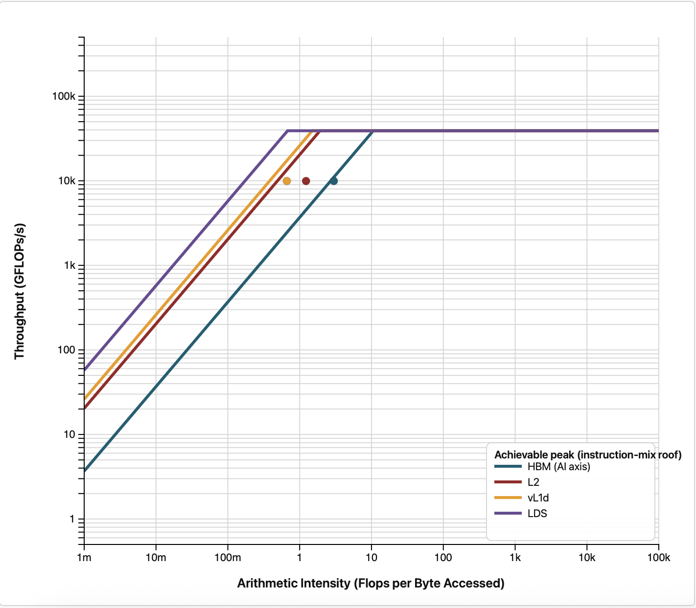

# Stage 5: Vectorized loads, beyond the case study

Stages 1 through 4 changed only constants. This stage changes the kernel.

```bash
diff ../4_block_64x4/shallow.hip shallow.hip
```

## The idea

We have been memory bound since the first roofline, and every step so far has attacked that
indirectly, by adding parallelism or improving cache reuse. The direct attack is to make each memory
request move more bytes.

`compute_rhs` reads `h`, `hu` and `hv` at five points per cell. In the x direction those points are
adjacent in memory, so instead of one thread issuing scalar loads for one cell, a thread can issue
`float4` loads and handle four consecutive cells at once. Fewer, wider requests generally use the
memory system better than many narrow ones.

## What changed

A new kernel, `compute_rhs_vec4x4`, replaces `compute_rhs` at all four RK4 call sites. The original
`compute_rhs` is left in the file for reference but is no longer launched.

The new kernel:

- Assigns four cells in x to each thread, so `i0 = 1 + 4*t`.
- Loads the centre row through two overlapping `float4` windows, `[i0-1 .. i0+2]` and
  `[i0+2 .. i0+5]`, which together cover every x-neighbour the four cells need.
- Keeps the vertical neighbours at `j-1` and `j+1` as scalar loads, since those are a full row apart
  in memory and cannot be coalesced into the same request.
- Falls back to scalar loads near the domain edges, where a `float4` window would run off the end of
  the row.
- Factors the per-cell arithmetic into a `__device__ __forceinline__` helper, `compute_cell`, so the
  four cells share one copy of the flux and viscosity code.

The block stays at 64x4, unchanged from stage 4. What does change is that there are now two grids:

```c++
    dim3 grid((NX + block.x - 1)/block.x, (NY + block.y - 1)/block.y);
    dim3 gridVec(((NX + 3)/4 + block.x - 1)/block.x, (NY + block.y - 1)/block.y);
```

This is the part that is easy to get wrong, and it is worth understanding before you read the
timings. Only `compute_rhs_vec4x4` covers four cells per thread, so only it needs a grid a quarter as
wide. `init_gaussian`, `update_stage` and `final_update` are untouched and still do one cell per
thread, so they must keep the full `grid`. Launching all of them from the narrow grid would leave
three quarters of the domain never initialised and never updated, while the code ran happily and
printed a plausible-looking time.

## Build and run

```bash
module load rocm
make
./shallow
```

## Expected output

```
Domain: 2048x2048, steps=500, dt=0.0728643
Elapsed: 0.366 s  |  Throughput (including RK4 stages): 22948.19 MCUPS
Mass: initial=4.194806655e+06, final=4.194806458e+06, rel.err=4.678e-08
Min(h) after run: 0.981776
```

**22948.19 MCUPS, which is 0.66x of stage 4's 34551.31.** The optimization made the code 34 percent
slower on this GPU. The rest of this stage works out why.

Check the accuracy lines especially carefully here. This is the first stage that changes the
arithmetic rather than the launch configuration, and the vectorized path and the scalar edge
fallback have to agree. The mass error moves in the last digit, from 4.681e-08 to 4.678e-08, which
is exactly what reassociated single-precision arithmetic should do, and `Min(h)` is unchanged at
0.981776. A `Min(h)` of exactly 1, or a wildly different mass, means part of the domain is not being
updated.

## Two traps worth knowing about

Both of these were present in the original version of this optimization, and both are the kind of
mistake that does not announce itself.

**A grid that does not match the kernel.** Described above. If every kernel shares the quarter-width
grid, the solver silently evolves only the left quarter of the domain, and since the Gaussian bump
starts at x = 1023.5 it sits in the region that is never touched. The uninitialised memory then feeds
straight into the mass calculation.

**Launch bounds that do not match the block.** `compute_rhs_vec4x4` is declared
`__launch_bounds__(256,1)`, so it cannot be launched with more than 256 threads. At 64x4 that is
exactly 256 and all is well, but the same kernel with a 32x32 block asks for 1024 threads and the
launch is rejected. None of the launches inside the RK4 loop call `hipGetLastError()`, and the
synchronizations were removed back in stage 2, so a rejected launch would go unnoticed until the
final `hipMemcpy` returned an error.

Both traps share a moral. The accuracy checks that this code prints on every run are not decoration.
They are the only reason either problem is visible at all, and a "3x speedup" that fails them is not
a speedup.

If you change the block shape here, check `block.x * block.y` against the declared launch bounds and
adjust one or the other. Confirming that the kernel ran at all is a good habit:

```bash
rocprofv3 --kernel-trace --stats -S -T -d outdir -o shallow -- ./shallow
```

`compute_rhs_vec4x4` should appear with 2000 calls, and `compute_rhs` should not appear at all.

## Finding out where it went wrong

Start by asking whether the loss is really in the kernel we changed, rather than somewhere else:

```bash
rocprofv3 --kernel-trace --stats -S -T -d outdir -o shallow -- ./shallow
```

| Kernel | Stage 4 total | Stage 5 total |
|---|---|---|
| `compute_rhs` / `compute_rhs_vec4x4` | 93.1 ms | 219.9 ms |
| `update_stage` | 80.9 ms | 81.5 ms |
| `final_update` | 55.6 ms | 55.6 ms |

The two untouched kernels are identical to within noise, and the rewritten one is 2.4 times slower.
The whole regression lives in the kernel we vectorized, so that is where to look.

Now re-check the counters, since four cells per thread means more registers per thread, which can
reduce how many wavefronts fit on a compute unit:

```bash
rocprofv3 --pmc VALUBusy -T --output-format csv -d outdir -o shallow -- ./shallow
rocprofv3 --pmc OccupancyPercent -T --output-format csv -d outdir -o shallow -- ./shallow
```

| Metric | `compute_rhs` at stage 4 | `compute_rhs_vec4x4` |
|---|---|---|
| `VGPR_Count` | 52 | 84 |
| Occupancy | 74.4 percent | 51.1 percent |
| `VALUBusy` | 65.5 percent | 26.8 percent |
| Grid size | 4194304 | 1048576 |

That is the entire story in three rows. Holding four cells' worth of neighbour data live at once
pushed the register count from 52 to 84, a 62 percent increase. Registers are a fixed resource per
compute unit, so more registers per thread means fewer wavefronts resident, and occupancy fell from
74 to 51 percent. This kernel is memory bound, and the only way a memory-bound kernel hides load
latency is by having other wavefronts ready to run. With a third of them gone, the stalls are no
longer covered, and `VALUBusy` collapses from 65 to 27 percent.

So the wider loads did arrive as intended. They just cost more in latency hiding than they returned
in memory efficiency. Note that the grid also shrank by a factor of four, which removes parallelism
at the same time as register pressure removes occupancy, and on a 304-CU GPU that matters.

This is stage 3's lesson inverted. There, occupancy fell and the code got faster because the trade
bought cache reuse worth more than the occupancy. Here occupancy falls and the code gets slower
because the trade bought less than it cost. Neither outcome is predictable from the counter alone,
which is precisely why the wall clock is the arbiter.

## The roofline

The Roofline Extractor profiles every kernel, so `compute_rhs_vec4x4` appears alongside
`update_stage` and `final_update`, which this stage did not touch and which therefore act as fixed
reference points:

```bash
module load rocm roofline-extractor
AMD_SERIALIZE_KERNEL=3 roofline-extractor-profile -o roofline_out --arch MI300A -- ./shallow
```

The equivalent in `rocprof-compute`, restricted to the vectorized kernel:

```bash
rocprof-compute profile -n vectorized_roof --roof-only --device 0 -k compute_rhs_vec4x4 --iteration-multiplexing -- ./shallow
rocprof-compute analyze -p workloads/vectorized_roof/0
```

Both are explained in [Roofline plots](../README.md#roofline-plots).

`AMD_SERIALIZE_KERNEL=3` is needed for the same reason as in
[stage 2](../2_no_device_sync/README.md#step-2-check-the-roofline-again): with no synchronization in
the time loop, counter collection stalls on the queued backlog.

<p>

</p>

## Things to try

- Two cells per thread instead of four, which halves the register pressure. This is the obvious next
  experiment given the diagnosis above. Remember to widen `gridVec` to match.
- Keep four cells per thread but look for ways to shorten the live ranges, so fewer values are held
  simultaneously and the register count comes down.
- Vectorize the vertical neighbours too by staging a row of the grid in LDS.
- Re-run this stage on a different GPU. This optimization is reported as a gain elsewhere, and the
  register file and CU count are exactly the parameters that decide it.

## Closing thoughts

Across all six stages:

- Profiling is iterative. No single measurement told us what to do; each answer suggested the next
  question.
- The tools do not tell the whole story. The trace found the synchronization problem, the counters
  found the stalls, but choosing 64x4 or `float4` came from knowing the hardware.
- Optimizing toward a metric can mislead. Stage 3 got faster while occupancy fell, and stage 5 got
  slower for the same reason. The counter did not change its meaning; the trade did.
- An optimization can be correct, do exactly what it intended, and still cost 34 percent. Measure
  every one of them.
- Always validate. Every stage checked mass conservation and positivity, and a stage that had broken
  them would not have counted as an optimization however fast it ran.
