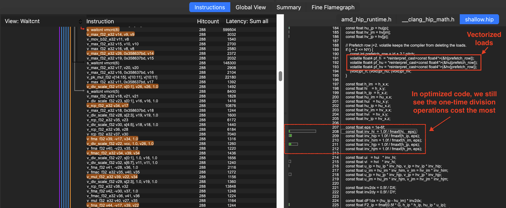
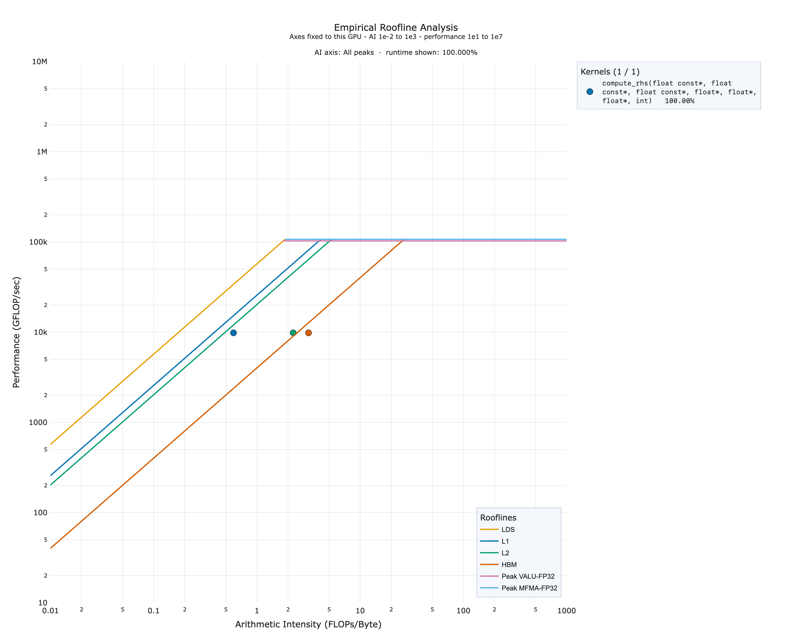

# Stage 5: Vectorized loads

In stage 4 we traced `compute_rhs` and saw where its time goes. This stage changes the loads and
the divisions. We then trace the kernel again and set the two rooflines side by side.

## What changed

```bash
diff ../4_block_64x4/shallow.hip shallow.hip
```

The stencil computation stays as it was. Two parts of the kernel change: the memory reads, and
the conversion from depth to velocity.

- The x-neighbours of each array are one `float4` load. That request covers `i-1`, `i`, `i+1`,
  and one cell past `i+1`. The y-neighbours stay scalar loads, because they are a row apart.
- `pitch` is rounded up to a multiple of 16 floats, so each row starts on a 64-byte cache line.
- One reciprocal is computed per depth and reused for both velocity components. The pressure
  terms in the fluxes use `fmaf`.
- Row `j+2` is prefetched, and `compute_rhs` carries `__launch_bounds__(256, 1)`.

## Build and run

```bash
module load rocm
make
./shallow
```

The domain and the step count stay as they were in stage 4. So does the 64x4 block. The run
prints throughput, mass error, and minimum depth. Mass error can move in the last digits: the
flux expressions were reassociated, and the divisions became reciprocals. Minimum depth must
stay positive.

## Expected output

```
Domain: 2048x2048, steps=500, dt=0.0728643
Elapsed: 0.250 s  |  Throughput (including RK4 stages): 33494.23 MCUPS
Mass: initial=4.194806655e+06, final=4.194806459e+06, rel.err=4.660e-08
Min(h) after run: 0.981777
```

The median of three runs is 33494.23 MCUPS. That is 0.97x stage 4's 34551.31 MCUPS: the
application is 3.1 percent slower. The mass error moves only in its last digits, and the minimum
depth stays positive. The optimization is correct, but it is not an application-level speedup.

## Thread trace

We collect the same trace as in
[stage 4](../4_block_64x4/README.md#where-the-time-goes-inside-the-kernel), on this binary:

```bash
rocprofv3 --att --att-activity 8 --kernel-include-regex compute_rhs \
    -d att -o att -- ./shallow
rocprof-compute-viewer att/ui_output_agent_*_dispatch_*
```

We open this capture next to the stage 4 capture. The source asks for a 16-byte load, but the
fourth component is unused. The compiler narrows each of those three loads back to
`global_load_dwordx3`, the same instruction stage 4 already emitted for the x-neighbour reads.
The y-neighbour reads stay single-value `global_load_dword` instructions. The hotspot view shows
that the division operations remain the bottleneck and that the compiler continues to use
`global_load_dwordx3` for the vectorized loads:

<!-- SNAPSHOT: hotspot view of compute_rhs after vectorization -->


## Roofline

We collect a `rocprof-compute` roofline for `compute_rhs`. The `analyze` step needs its
[Python environment](../README.md#rocprof-compute-analyze). The flags match the collection in
[stage 4](../4_block_64x4/README.md#roofline).

```bash
rocprof-compute profile -n 5_vectorized_loads --roof-only --device 0 -k compute_rhs \
    --iteration-multiplexing -- ./shallow
rocprof-compute analyze -p workloads/5_vectorized_loads/0
```

Stage 4's plot is on the left, from the collection in that stage. This stage's plot is on the
right.

<p>


</p>

A roofline summarizes arithmetic intensity and achieved bandwidth. The thread traces show that
the load instructions did not change. These two plots show whether the arithmetic change moved
the kernel relative to the ceilings.

The counter data explains why the source-level optimization can look useful even though the
application is slower:

| Metric | Stage 4 | Stage 5 | Change |
|---|---:|---:|---:|
| Mean `compute_rhs` dispatch | 55.66 us | 54.10 us | -2.8 percent |
| FP32 rate | 12208 GFLOP/s | 9923 GFLOP/s | -18.7 percent |
| HBM bandwidth | 3052 GB/s | 3140 GB/s | +2.9 percent |
| HBM arithmetic intensity | 4.00 FLOPs/byte | 3.16 FLOPs/byte | -21.0 percent |

`compute_rhs` is faster, but only by 2.8 percent. The lower FP32 rate does not contradict that
result: reusing reciprocals removes arithmetic, so the kernel performs fewer FLOPs while moving
slightly more data per second. The complete application still loses 3.1 percent. We therefore
keep this stage as a profiling result rather than calling it an optimization win: improving the
target kernel did not improve time to solution.
