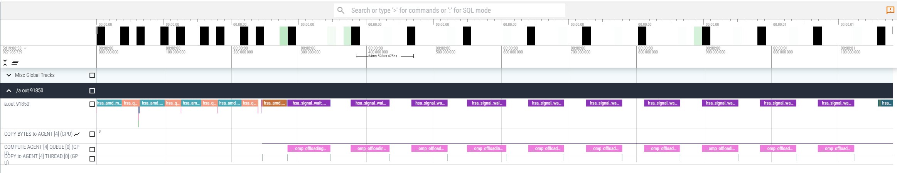
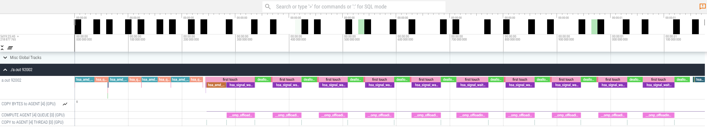
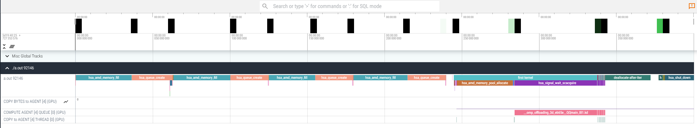
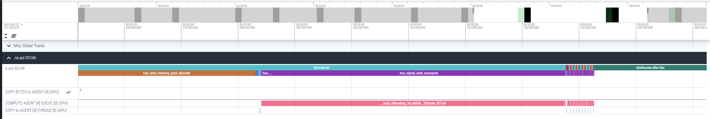
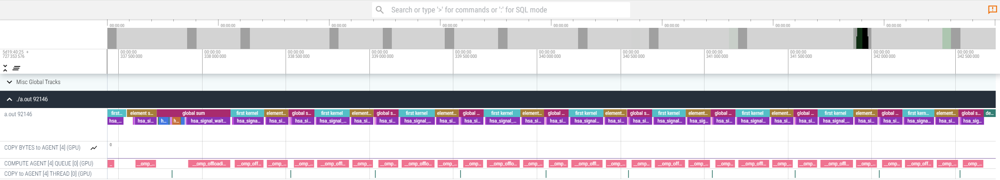
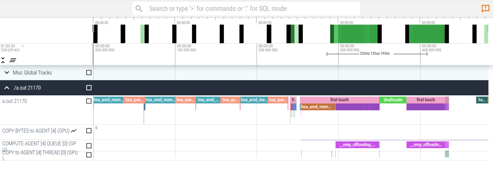

# Excercise application of rocprofv3 for detection of performance bugs: Dynamic memory allocations and memory pool on MI300A
This excercise highlights the importance of the reduction of dynamic memory allocations on MI300A with unified memory and shows a way to discover such an issue with rocprofv3. 

```
module load rocm-afar-drop-<version>
```
set
```
export HSA_XNACK=1
```
to get the latest Next Generation Fortran Compiler beta release.

## version 1
The first version is an OpenMP offload example with three kernels in an iterative loop as an example of a "dwarf" of an application with an iterative solution or multiple time steps.
Compile the code with:
```
amdflang -fopenmp --offload-arch=gfx942 -o test_mempool test_mempool.f90
```
and run the example with rocprofv3
```
rocprofv3 --sys-trace --output-format pftrace -- ./test_mempool
```
The total execution time is roughly: 1s 180ms 740mus
Download the trace file from the subdirectory which is automatically created.

Copy generated `<some-auto-generated-name>.pftrace` file to your local machine, and using the Chrome browser open the web page [https://ui.perfetto.dev/](https://ui.perfetto.dev/):

```
scp -i <path/to/ssh/key> -P <port_number> <username>@aac6.amd.com:~/<path/to/pftrace/file> .
```
Click `Open trace file` and select the `<some-auto-generated-name>.pftrace` file. Below, you can see an example of how the trace file would be visualized on `Perfetto`: [https://ui.perfetto.dev/](https://ui.perfetto.dev/).
If there is an error opening one trace file, try using an older Perfetto version, e.g., by opening the web page [https://ui.perfetto.dev/v46.0-35b3d9845/#!/](https://ui.perfetto.dev/v46.0-35b3d9845/#!/).

<p></p>
With zooming in and out (asdw keys or press ctrl+scroll with mouse) one can see that the first kernel in each iteration is extremely long compared to all other kernels.
Additionally, there are large gaps in between despite all computations are offloaded to the GPU. Why are there gaps? One possiblility to explore this is manual instrumentation with roctx markers. Using rocprof-sys (formerly omnitrace) is also an option, but we will use rocprofv3 here to demonstrate the usage of roctx markers for manual instrumentation. 

## version 2
This version is instrumented with roctx markers to better understand what is going on in the observed "gaps".
Either use version 1 and try to instrument the code yourself with roctx markers or have a look at version2 to see how you can implement roctx markers in Fortran.

compile with roctx markers:
```
amdflang -fopenmp --offload-arch=gfx942 -L${ROCM_PATH}/lib -lrocprofiler-sdk-roctx -o test_mempool test_mempool.f90
```
Note the added linking option for rocprofiler-sdk-roctx. In a true app you would add this in a Makefile, but for education purposes it is shown here what needs to be in the command.
Run rocprof tracin again. Don't forget to include the `marker-trace` option now:
```
rocprofv3 --sys-trace --marker-trace --output-format pftrace -- ./test_mempool
```
The total execution time is roughly: 1s 175ms 254mus, so the overhead of the roctx markers is lower than the runtime differences observed for different runs in this case.

Explore the trace again in perfetto after download. 
Now you can see the annotated regions in the trace.
<p></p>

With zooming in and out (asdw keys or press ctrl+scroll with mouse) one can see that the first kernel in each iteration is extremely long compared to all other kernels and deallocations take a significant amount of time. The following kernels are almost insignificant compared to the first one, but is this really unavoidable that this first kernel takes so much time? Comparing the amount of arrays which need to be loaded, the first and second kernel should not be too different, at least in the same order of magnitude, but why isn't this the case?

## version 3
In this version the allocations are moved outside the iteration loop. If you compile and run again with rocprofv3 you get a trace which shows only a long time for the "first_touch" region in the first iteration. 
<p></p>
The first iteration's first kernel is still costly:
<p></p>
but the subsequent ones are almost vanishing compared that first one, we need to zoom in to find them:
<p></p>
This is the case, because allocations (especially with system allocators, i.e. 'allocate') with unified memory are costly on MI300A. We see the penalty in the first kernel, as the memory is allocated at first touch. Subsequent iteration work on already allocated memory and we do not see that penalty. The deallocation is also only done once at the very end and we do not pay the high price of it in each iteration. 
The total execution time is roughly: 399ms 160mus, so we have a speedup of almost a factor 3 in this example. The gain improves the more iterations we do not have to do dynamic allocations.
We can learn from this that dynamic allocations and deallocations on MI300A should be avoided. 
But what if that is very hard to do in a true app which uses different temporary arrays in each subroutine?

## version 4
A possible solution is to use a memory pool. An example pool you can use in C/C++ and Fortran is the library Umpire (developed by LLNL).

For the trainings we usually provide a module for umpire, but if you need it on another system here are the steps to install it.

How to install umpire:

Adapt the UMPIRE_PATH to your favorite installation location:
```
export UMPIRE_PATH=$HOME/Software/Umpire/install
```
And check that ROCM_PATH is set to the rocm-afar-drop-<version> location.
Clone the umpire repository and its dependencies (--recursive) fmt and camp:
```
git clone --recursive https://github.com/LLNL/Umpire.git
```
```
cd Umpire
```
There is a fix which needs to be applied in the current camp version:
```
sed -i 's/memoryType/type/g' src/umpire/tpl/camp/include/camp/resource/hip.hpp
```
Build directory:
```
mkdir -p build && cd build && rm -rf ./*
```
Installation directory:
```
mkdir $UMPIRE_PATH
```
Configure cmake, make sure the target is gfx942 (for MI300A), Fortran is enabled and the ROCM_PATH is set to the rocm-afar-drop-<version>. The Fortran compiler needs to be set through the `FC` variable. Our module for the compiler takes care of that but if you install on another system you have to set it right, too:
```
cmake -DCMAKE_INSTALL_PREFIX=${UMPIRE_PATH} -DROCM_ROOT_DIR=${ROCM_PATH} -DHIP_ROOT_DIR=${ROCM_PATH}/hip -DHIP_PATH=${ROCM_PATH}/llvm/bin -DENABLE_HIP=On -DENABLE_OPENMP=Off -DENABLE_CUDA=Off -DENABLE_MPI=Off -DCMAKE_CXX_COMPILER=${ROCM_PATH}/llvm/bin/amdclang++ -DCMAKE_C_COMPILER=${ROCM_PATH}/llvm/bin/amdclang -DCMAKE_HIP_ARCHITECTURES=gfx942 -DAMDGPU_TARGETS=gfx942 -DCMAKE_HIP_ARCHITECTURES=gfx942 -DGPU_TARGETS=gfx942 -DBLT_CXX_STD=c++14 -DUMPIRE_ENABLE_IPC_SHARED_MEMORY=On -DENABLE_FORTRAN=On ../
```
Note: for older versions of the Next Generation Fortran compiler -DCMAKE_Fortran_COMPILER_ID=GNU may be needed as the Next Generation Fortran Compiler was not yet detected correctly and the GNU flags are the same. Flags for the Next Generation Fortran Compiler are mostly compatible with gfortran.
Build:
```
make -j 32
```
Install:
```
make install
```

With umpire installed, you can now use it to explore the effect of a memory pool:
Have a look how the memory pool is set up by looking at version4.
Compile and run with roctx markers and umpire:
```
amdflang -fopenmp --offload-arch=gfx942 -I${UMPIRE_PATH}/include/umpire -L${UMPIRE_PATH}/lib64 -L${UMPIRE_PATH}/lib -lumpire -lcamp -lfmt -L${ROCM_PATH}/lib -lrocprofiler-sdk-roctx -lamdhip64  -lrt  -lstdc++ -o test_mempool test_mempool.f90
```
As you can see, the compilation line becomes a little long and in a true app you would set all this in Makefile / through the build system.

```
rocprofv3 --sys-trace --marker-trace --output-format pftrace -- ./test_mempool
```
now only in the first two iterations when the memory pool still 'warms up' you see a longer first_touch kernel. In the following the kernel times are in the order of microseconds again:
<p></p>

The total execution time is roughly: 485ms 524mus, so the speed up is a little less than moving the allocation outside, but also for the memory pool we only pay the price in the first 2 iterations until the library figured out the size of the pool. This is usually negligible if hundreds to thousands of iterations / time steps are run in production applications which do more iterations than this training example.

Conclusion: The usage of memory pools is recommended if you have frequent allocations and deallocations in your application and cannot move the allocations outside the loop!

Further reccomendations especially for MPI parallelization: if you use unified memory on MI300A (export HSA_XNACK=1), which is highly reccomended to avoid unneccessary memory copies, make sure you know how to set the affinity of CPU cores and GPU correctly ("close to each other") such that the memory is allocated and initialized where it is used and not on another APU on the same node! On MI300A an MPI processes pinned to CPU cores 0 to 23 should offload to GPU 0, an MPI process on cores 24 to 47 to GPU 1 etc. In SPX mode (see rocm-smi and default on most systems) it is usually best to use 1 MPI process per APU to offload and use e.g. OpenMP on the the CPU cores to parallelize across CPU cores. In TPX or CPX mode one APU shows 3 or 6 (smaller) GPUs and one MPI process to drive the offload to each of those may be optimal. This is especially a good option for codes where part of the code (still) run on the CPU. How to set this up properly may strongly depend on your HPC center's configuration, so please consult the respective documentation how to run in your environment. 
If you use GPU aware MPI with cray MPICH you need GPU allocated buffers i.e. omp_target_alloc or hipmalloc allocated memory. You can also achive this through using the Device instead of Host allocator pool in umpire.
