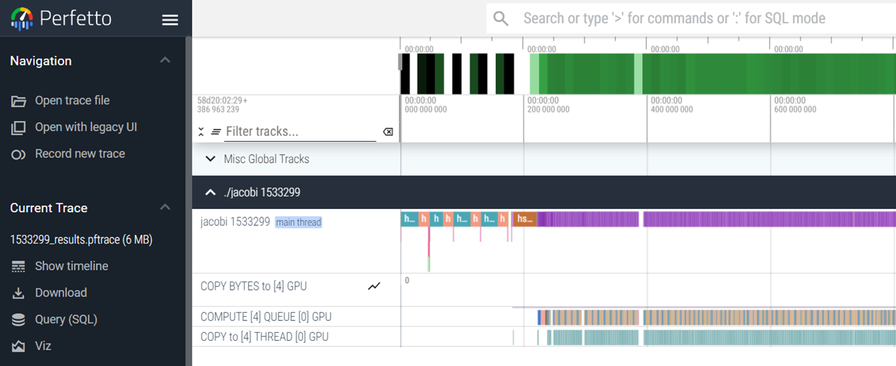

# rocprofv3

In this series of examples, we will demonstrate profiling with rocprofv3 on a platform using an AMD Instinct&trade; MI300 GPU. ROCm releases (6.2+) now include rocprofv3.

Note that the focus of this exercise is on rocprofv3 profiler, not on how to achieve optimal performance on MI300A.

The examples are based on [Fortran+OpenMP Jacobi porting example from HPCTrainingExamples](https://github.com/amd/HPCTrainingExamples/tree/main/Pragma_Examples/OpenMP/Fortran/7_jacobi). 


## Setup environment

Download examples repo and navigate to the Fortran+OpenMP Jacobi example exercises:

```
git clone https://github.com/amd/HPCTrainingExamples.git
cd HPCTrainingExamples/Pragma_Examples/OpenMP/Fortran/7_jacobi/1_jacobi_usm
```

Load the necessary modules, including flang-new compiler:

```
module load rocm/6.2.1
module load amdflang-new
module load openmpi
```

For now unset HSA_XNACK environment variable:

```
export HSA_XNACK=0
```


## Build and run

No profiling yet, just check that the code compiles and runs correctly.

```
make clean
make
./jacobi -m 1024
```

This run should show output that looks like this:

```
Domain size:  1024 x  1024
Starting Jacobi run
Iteration:    0 - Residual: 4.42589E-02
Iteration:  100 - Residual: 1.25109E-03
Iteration:  200 - Residual: 7.43407E-04
Iteration:  300 - Residual: 5.48292E-04
Iteration:  400 - Residual: 4.41773E-04
Iteration:  500 - Residual: 3.73617E-04
Iteration:  600 - Residual: 3.25807E-04
Iteration:  700 - Residual: 2.90186E-04
Iteration:  800 - Residual: 2.62490E-04
Iteration:  900 - Residual: 2.40262E-04
Iteration: 1000 - Residual: 2.21976E-04
Stopped after 1000 iterations with residue: 2.21976E-04
Total Jacobi run time: ***** sec.
Measured lattice updates: 0.087 LU/s
Effective Flops:   1.5 GFlops
Effective device bandwidth: 0.008 TB/s
Effective AI=0.177
```

## Basic rocprov3 profiling
### Available options

Inspect rocprofv3 available options:

```
rocprofv3 -h
```

NOTE: When profing OpenMP offloading, do not forget to use `--kernel-trace` option.


### First kernel information

Collect first profiles (do not forget `--` between rocprofv3 options and application binary).

```
rocprofv3 --kernel-trace -- ./jacobi -m 1024
```

rocprofv3 should generate 2 output files (XXXXX numbers are corresponding to the process id): 

  1. `XXXXX_agent_info.csv` with information for the used hardware APU/GPU and CPU.
  2. `XXXXX_kernel_traces.csv` with information per each call of the kernel.

Check those output files using (adapt file paths if needed):

```
cat *_agent_info.csv
echo
head *_kernel_trace.csv
```

The output should be:

```
"Node_Id","Logical_Node_Id","Agent_Type","Cpu_Cores_Count","Simd_Count","Cpu_Core_Id_Base","Simd_Id_Base","Max_Waves_Per_Simd","Lds_Size_In_Kb","Gds_Size_In_Kb","Num_Gws","Wave_Front_Size","Num_Xcc","Cu_Count","Array_Count","Num_Shader_Banks","Simd_Arrays_Per_Engine","Cu_Per_Simd_Array","Simd_Per_Cu","Max_Slots_Scratch_Cu","Gfx_Target_Version","Vendor_Id","Device_Id","Location_Id","Domain","Drm_Render_Minor","Num_Sdma_Engines","Num_Sdma_Xgmi_Engines","Num_Sdma_Queues_Per_Engine","Num_Cp_Queues","Max_Engine_Clk_Ccompute","Max_Engine_Clk_Fcompute","Sdma_Fw_Version","Fw_Version","Capability","Cu_Per_Engine","Max_Waves_Per_Cu","Family_Id","Workgroup_Max_Size","Grid_Max_Size","Local_Mem_Size","Hive_Id","Gpu_Id","Workgroup_Max_Dim_X","Workgroup_Max_Dim_Y","Workgroup_Max_Dim_Z","Grid_Max_Dim_X","Grid_Max_Dim_Y","Grid_Max_Dim_Z","Name","Vendor_Name","Product_Name","Model_Name"
0,0,"CPU",48,0,0,0,0,0,0,0,0,1,48,0,0,0,0,0,0,0,0,0,0,0,0,0,0,0,0,3700,0,0,0,0,0,0,25,0,0,0,1763021218530103933,0,0,0,0,0,0,0,"AMD Instinct MI300A Accelerator","CPU","AMD Instinct MI300A Accelerator",""
1,1,"CPU",48,0,64,0,0,0,0,0,0,1,48,0,0,0,0,0,0,0,0,0,0,0,0,0,0,0,0,3700,0,0,0,0,0,0,25,0,0,0,1763021218530103933,0,0,0,0,0,0,0,"AMD Instinct MI300A Accelerator","CPU","AMD Instinct MI300A Accelerator",""
2,2,"CPU",48,0,128,0,0,0,0,0,0,1,48,0,0,0,0,0,0,0,0,0,0,0,0,0,0,0,0,3700,0,0,0,0,0,0,25,0,0,0,1763021218530103933,0,0,0,0,0,0,0,"AMD Instinct MI300A Accelerator","CPU","AMD Instinct MI300A Accelerator",""
3,3,"CPU",48,0,192,0,0,0,0,0,0,1,48,0,0,0,0,0,0,0,0,0,0,0,0,0,0,0,0,3700,0,0,0,0,0,0,25,0,0,0,1763021218530103933,0,0,0,0,0,0,0,"AMD Instinct MI300A Accelerator","CPU","AMD Instinct MI300A Accelerator",""
4,4,"GPU",0,912,0,2147487744,8,64,0,64,64,6,228,24,24,1,10,4,32,90402,4098,29856,256,0,128,2,10,8,24,3700,2100,19,150,1013424768,9,32,141,1024,4294967295,0,1763021218530103933,53730,1024,1024,1024,4294967295,4294967295,4294967295,"gfx942","AMD","AMD Instinct MI300A","ip discovery"
5,5,"GPU",0,912,0,2147487784,8,64,0,64,64,6,228,24,24,1,10,4,32,90402,4098,29856,256,1,136,2,10,8,24,3700,2100,19,150,1013424768,9,32,141,1024,4294967295,0,1763021218530103933,17599,1024,1024,1024,4294967295,4294967295,4294967295,"gfx942","AMD","AMD Instinct MI300A","ip discovery"
6,6,"GPU",0,912,0,2147487824,8,64,0,64,64,6,228,24,24,1,10,4,32,90402,4098,29856,256,2,144,2,10,8,24,3700,2100,19,150,1013424768,9,32,141,1024,4294967295,0,1763021218530103933,47963,1024,1024,1024,4294967295,4294967295,4294967295,"gfx942","AMD","AMD Instinct MI300A","ip discovery"
7,7,"GPU",0,912,0,2147487864,8,64,0,64,64,6,228,24,24,1,10,4,32,90402,4098,29856,256,3,152,2,10,8,24,3700,2100,19,150,1013424768,9,32,141,1024,4294967295,0,1763021218530103933,11782,1024,1024,1024,4294967295,4294967295,4294967295,"gfx942","AMD","AMD Instinct MI300A","ip discovery"

"Kind","Agent_Id","Queue_Id","Kernel_Id","Kernel_Name","Correlation_Id","Start_Timestamp","End_Timestamp","Private_Segment_Size","Group_Segment_Size","Workgroup_Size_X","Workgroup_Size_Y","Workgroup_Size_Z","Grid_Size_X","Grid_Size_Y","Grid_Size_Z"
"KERNEL_DISPATCH",4,1,2,"__omp_offloading_32_2f3c6__QMnorm_modPnorm_l26",1,5329321973213203,5329321973322123,0,4360,256,1,1,233472,1,1
"KERNEL_DISPATCH",4,1,4,"__omp_offloading_32_2f3c3__QMlaplacian_modPlaplacian_l23",2,5329321976381800,5329321976429320,0,0,256,1,1,233472,1,1
"KERNEL_DISPATCH",4,1,1,"__omp_offloading_32_2f3c0__QMboundary_modPboundary_conditions_l24",3,5329321979189038,5329321979199278,0,0,256,1,1,4096,1,1
"KERNEL_DISPATCH",4,1,3,"__omp_offloading_32_2f3c7__QMupdate_modPupdate_l23",4,5329321985289126,5329321985337166,0,0,256,1,1,233472,1,1
"KERNEL_DISPATCH",4,1,2,"__omp_offloading_32_2f3c6__QMnorm_modPnorm_l26",5,5329321987888094,5329321987980254,0,4360,256,1,1,233472,1,1
"KERNEL_DISPATCH",4,1,4,"__omp_offloading_32_2f3c3__QMlaplacian_modPlaplacian_l23",6,5329321990242479,5329321990289479,0,0,256,1,1,233472,1,1
"KERNEL_DISPATCH",4,1,1,"__omp_offloading_32_2f3c0__QMboundary_modPboundary_conditions_l24",7,5329321992966432,5329321992976272,0,0,256,1,1,4096,1,1
"KERNEL_DISPATCH",4,1,3,"__omp_offloading_32_2f3c7__QMupdate_modPupdate_l23",8,5329321997343879,5329321997389119,0,0,256,1,1,233472,1,1
"KERNEL_DISPATCH",4,1,2,"__omp_offloading_32_2f3c6__QMnorm_modPnorm_l26",9,5329321999929225,5329322000021345,0,4360,256,1,1,233472,1,1
```

So the kernel trace file shows each kernel call, with its start and end timestamp. This can lead to a very large output file.

### Create statistics

One can create kernel statistics file using `--stats` option:

```
rocprofv3 --stats --kernel-trace -- ./jacobi -m 1024
```

This creates two additional output files:

  1. `XXXXX_kernel_stats.csv` with statistics grouped by each kernel.
  2. `XXXXX_domain_stats.csv` with statistics grouped by domain, such as KERNEL_DISPATCH, HIP_API, etc.


The content of kernel stats file should resemble the following:

```
"Name","Calls","TotalDurationNs","AverageNs","Percentage","MinNs","MaxNs","StdDev"
"__omp_offloading_32_2f3c6__QMnorm_modPnorm_l26",1001,87995483,87907.575425,43.77,80200,108480,3547.283930
"__omp_offloading_32_2f3c7__QMupdate_modPupdate_l23",1000,52197887,52197.887000,25.96,48320,69880,3052.411702
"__omp_offloading_32_2f3c3__QMlaplacian_modPlaplacian_l23",1000,51095558,51095.558000,25.41,43720,60640,3253.741764
"__omp_offloading_32_2f3c0__QMboundary_modPboundary_conditions_l24",1000,9759423,9759.423000,4.85,7640,13080,673.670901
```

In this file, all the calls to a specific OpenMP block are in the same row, and you can see in the column Calls how times this OpenMP block was called. The column Percentage means how much percentage of the execution time this OpenMP block takes. 

**In many cases, simply checking the kernel stats file might be sufficient for your profiling!**

If it is not, continue by visualizing the traces.

### Visualizing traces using `Perfetto`

Create trace file suitable for `Perfetto`. If the application execution is short (such as this example), consider using `--sys-trace` option to collect as much information as possible:

```
rocprofv3 --sys-trace --output-format pftrace -- ./jacobi -m 1024
```

This should generate a pftrace file.
 
Download the trace to your laptop:

```
scp -P <port> aac6.amd.com:<path_to_file>/XXXXX_results.pftrace jacobi.pftrace
```

Now on your laptop:

  1. Open a browser and go to [https://ui.perfetto.dev/](https://ui.perfetto.dev/).
  2. Click on `Open trace file` in the top left corner.
  3. Navigate to the `jacobi.pftrace`, inspect kernels and event flows.
  4. Use the keystrokes W,A,S,D to zoom in and move right and left in the GUI.

Below, you can see an example of how the trace file would be visualized in `Perfetto`:


## Additional features

### Hardware Counters

Read about hardware counters available for the GPU on this system (look for gfx942 section):

```
less $ROCM_PATH/lib/rocprofiler/gfx_metrics.xml
```

Create an `input_counters.txt` counters input file with the counters you would like to collect, for example:

```
echo "pmc: VALUUtilization VALUBusy FetchSize WriteSize MemUnitStalled" > input_counters.txt
echo "pmc: GPU_UTIL CU_OCCUPANCY MeanOccupancyPerCU MeanOccupancyPerActiveCU" >> input_counters.txt
```

Execute with the counters you just added:

```
 rocprofv3 -i input_counters.txt --kernel-trace -- ./jacobi -m 1024
 ```
 
You'll notice that rocprofv3 runs 2 passes, one for each set of counters we have in that file. Now the data is in two different folders: pmc_1 and pmc_2. Explore the content of the pmc_* directories.

```
head pmc_1/*_counter_collection.csv
echo
head pmc_2/*_counter_collection.csv
```

## Next steps

Try to add `export HSA_XNACK=1`, and check the performance. Is it better or worse? Repeat the profiling commands and compare the outputs. What is the overhead of profiling?


**Explore the example with roctx markers which discusses a common performance optimization for applications on MI300A in 
```
cd Example_Allocations_and_MemoryPool_MI300A/Fortran/README.md
```
**Finally, try to profile your own application!**
