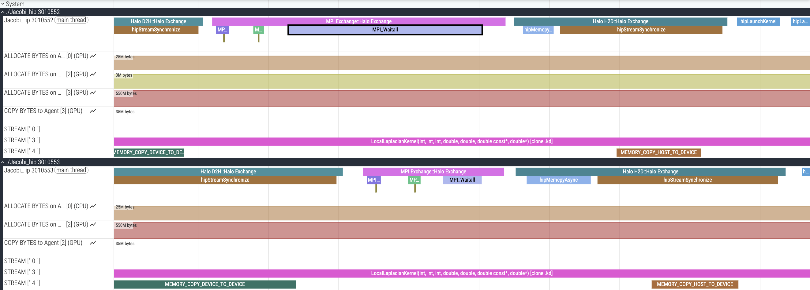
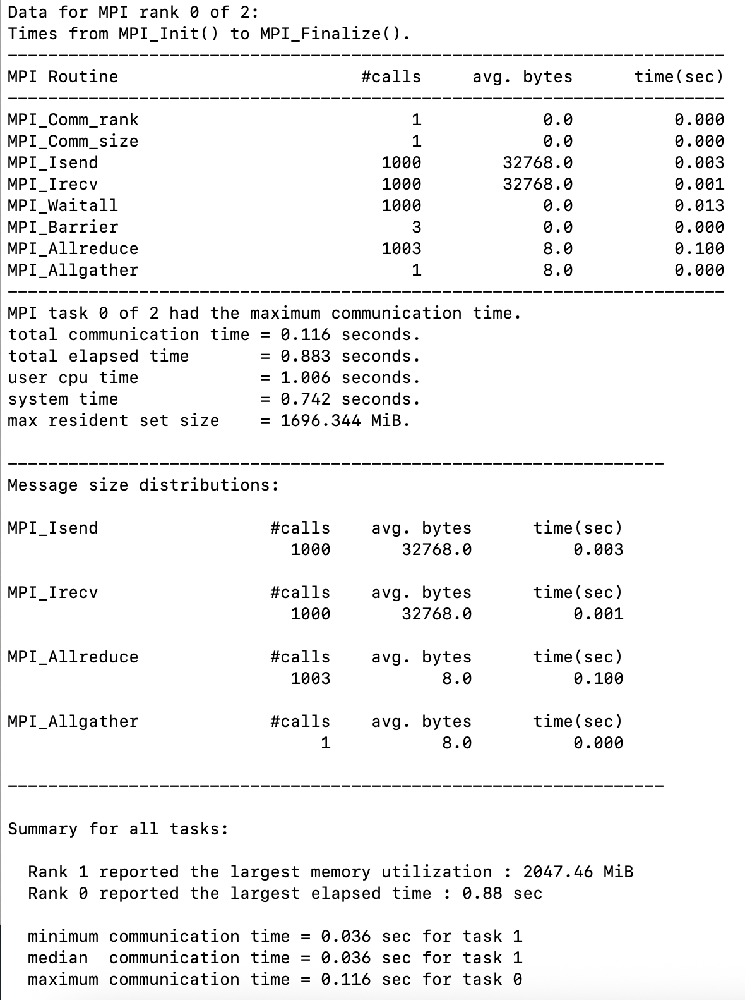

# Quick Start Guide: Using `mpitrace` with `rocprofv3`

When we profile multi-process applications, we often want to characterize whether our bottleneck is GPU compute kernels or host activity such as MPI communication. We recommend the [ROCm Systems Profiler](https://rocm.docs.amd.com/projects/rocprofiler-systems/en/latest/index.html) to collect a holistic application trace showing CPU, GPU, and system activity such as network communication. To get a quick start with `rocprof-sys`, refer to this [Jacobi-based tutorial](https://github.com/amd/HPCTrainingExamples/tree/main/rocprofiler-systems/Jacobi). 

Sometimes, we may just want insight into the timelines for MPI calls along with GPU kernel execution. `mpitrace` is a low overhead tool that can be used with `rocprofv3` for just this purpose.

This guide demonstrates how to use [`mpitrace`](https://github.com/sfantao/mpitrace) with `rocprofv3` to profile MPI communication alongside GPU kernel execution. `mpitrace` allows us to look at MPI activity in all ranks and quickly spot load imbalance among ranks. This tool adds ROCTx range markers around the entry and exit of each MPI function for graphical display using Perfetto.

This tutorial was tested on a system with ROCm 7.1.1 and MI355X GPUs on a HIP-C++ application, but `mpitrace` can be used on Fortran applications as well.

## Installation

### Prerequisites

Load required modules:
```bash
module load rocm gcc openmpi
```

If these are natively installed on your system, ensure that `ROCM_PATH` is set up to point to the ROCm installation directory and `mpicc` can be found in your `PATH`.

```
export ROCM_PATH=/opt/rocm-<ver>
export PATH=<path_to_mpi_installation>/bin:$PATH
```

### Build `mpitrace`

To build `mpitrace`, we use this helper repository and script as shown below:

```bash
git clone git@github.com:sfantao/mpitrace-install.git
cd mpitrace-install
./create-for-env-gcc-and-mpi
```

This downloads and installs `mpitrace` and its dependencies. Important libraries:
- `mpitrace/src/libmpitrace.so`
- `mpitrace/roctx/libmpitrace-legacy.so` (for legacy `rocprof` v1)
- `mpitrace/roctx/libmpitrace.so` (for `rocprofv3` - **default**)

## Helper scripts

To use `mpitrace` and `rocprofv3` for a multi-process job, create the following helper scripts in your working directory:

### `helper_mpitrace.sh`

```bash
#!/bin/bash
export LD_PRELOAD=$HOME/software/mpitrace-install/mpitrace/roctx/libmpitrace.so
export TRACE_ALL_EVENTS=yes
export TRACE_ALL_TASKS=yes
export TRACE_BUFFER_SIZE=48000000
$*
```

### `helper_rocprofv3.sh`

```bash
#!/bin/bash
if [[ -n ${OMPI_COMM_WORLD_RANK+z} ]]; then
  # ompi
  export MPI_RANK=${OMPI_COMM_WORLD_RANK}
elif [[ -n ${MV2_COMM_WORLD_RANK+z} ]]; then
  # mvapich2
  export MPI_RANK=${MV2_COMM_WORLD_RANK}
elif [[ -n ${SLURM_PROCID+z} ]]; then
    # mpich via srun
    export MPI_RANK=${SLURM_PROCID}
fi
outdir="rank.${MPI_RANK}"
outfile=${outdir}
eval "rocprofv3 -d ${outdir} -o ${outfile} $*"
```

Make them executable:
```bash
chmod +x helper_mpitrace.sh helper_rocprofv3.sh
```

Let us look at a simple example to illustrate usage of these helper scripts.

## Example 1: Jacobi MPI application

### Build the example

```bash
module load rocm openmpi
git clone git@github.com:amd/HPCTrainingExamples.git
cd HPCTrainingExamples/HIP/jacobi

make clean
make
```

### Profile with `mpitrace` + `rocprofv3`

```bash
mpirun -np 2 ./helper_mpitrace.sh ./helper_rocprofv3.sh --runtime-trace --output-format pftrace -- ./Jacobi_hip -g 2 1
cat rank*/*pftrace > ranks_all.pftrace
```

Note that the `helper_rocprofv3.sh` script sets up some `rocprofv3` arguments such as the path to the output directory and the filename, so in this command, we only add the required tracing options for `rocprofv3`.

In addition, this example run does not set up CPU or GPU affinity for the processes spawned. For reduced variability from run to run and improved performance, setting affinity is highly recommended. Our blog posts on Affinity ([Part 1](https://rocm.blogs.amd.com/software-tools-optimization/affinity/part-1/README.html) and [Part 2](https://rocm.blogs.amd.com/software-tools-optimization/affinity/part-2/README.html)) can help you understand how to set up affinity for CPU cores and GPUs properly.

### View results

Open `ranks_all.pftrace` in [Perfetto UI](https://ui.perfetto.dev/). The timeline will show:
- **MPI calls** from `mpitrace`: `MPI_Isend`, `MPI_Irecv`, `MPI_Waitall`
- **User-defined ROCTx markers**: `MPI Exchange::Halo Exchange`, `Halo H2D::Halo Exchange`
- **GPU kernels**: `LocalLaplacianKernel()`
- **Overlap** between computation and communication

<div style="text-align: center;">

</div>
<p style="text-align:center">
Figure 1: Jacobi trace showing MPI calls and GPU kernels.
</p>

### Additional output files

`mpitrace` also generates some additional output files:

- `mpi_profile.<pid>.<rank>` - Summary files (rank 0 has main summary)
- `<pid>.trc` - Trace files viewable with `traceview` app

The summary file for each process shows MPI calls, their durations, the message size distribution, and the CPU memory used by this process. Figure 2 shows a snapshot of the summary file generated for Rank 0 from the above run that additionally shows a comparison of communication times between ranks.

<div style="text-align: center;">

</div>
<p style="text-align:center">
Figure 2: Snapshot of mpi_profile.<pid>.0 file
</p>

To visualize the traces collected in `<pid>.trc`, you would need the `traceview` tool that is also distributed as part of the [`mpitrace` repo](https://github.com/sfantao/mpitrace). It is based on OpenGL. The README file in the traceview directory provides installation instructions that you may follow. Once installed, you can run the tool as shown below:

```
traceview <pid>.trc
```

You will see all the MPI calls in the trace as colored boxes, with a legend for colors assigned to each MPI call. Clicking on one of those boxes prints information about the MPI call to the console (i.e., source, destination, bytes transferred, etc.). We leave exploring this tool as an exercise for the reader.

## Key points

1. **`mpitrace` library**: Use `roctx/libmpitrace.so` for `rocprofv3` (default)
2. **Legacy support**: Use `roctx/libmpitrace-legacy.so` for legacy `rocprof` v1
3. **Trace merging**: Combine per-rank traces with `cat rank*/*pftrace > ranks_all.pftrace`
4. **Visualization**: View merged traces in [Perfetto UI](https://ui.perfetto.dev/)

## References

- [`mpitrace` repository](https://github.com/sfantao/mpitrace-install)
