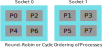
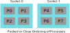
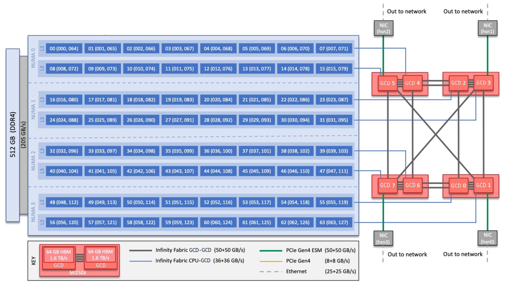
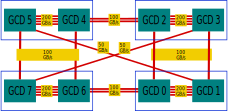
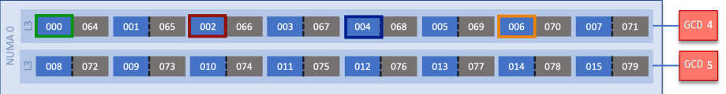

# Affinity part 1 - Affinity, placement, and order

Modern hardware architectures are increasingly complex with multiple sockets,
many cores in each Central Processing Unit (CPU), Graphical Processing Units
(GPUs), memory controllers, Network Interface Cards (NICs), etc. Peripherals such as
GPUs or memory controllers will often be local to a CPU socket. Such designs present
interesting challenges in optimizing memory access times, data transfer times, etc.
Depending on how the system is built, hardware components are connected,
and the workload being run, it may be advantageous
to use the resources of the system in a specific way. In this article,
we will discuss the role of affinity, placement, and order in improving performance for
High Performance Computing (HPC) workloads. A short case study is also presented to
familiarize you with performance considerations on a node in the
[Frontier](https://www.olcf.ornl.gov/frontier/) supercomputer. In a
[follow-up article](./Affinity_Part2.md), we also aim to equip you with the tools you
need to understand your system's hardware topology and set up affinity for your
application accordingly.

## A brief introduction to NUMA systems

In Non-Uniform Memory Access (NUMA) systems, resources are logically partitioned into
multiple *domains* or *nodes*.  Even though all processor cores can read or write from
any memory on the system, each processor core has *local* memory that is attached to it,
and *non-local* or *remote* memory that is attached to other processor cores or that it
shares with other processors. Accessing data from *local* memory is faster than
accessing data from *remote* memory. This latency is higher especially for data accesses
that cross a socket-to-socket interconnect. With local accesses, memory contention from
CPU cores is reduced resulting in increased bandwidth. Therefore, in such systems, it is
important to spread the processes and their threads across multiple NUMA domains so that
all resources of the system are used uniformly.

NUMA systems can be configured with multiple *domains* per socket. The NUMA domains Per
Socket (NPS) configuration is performed at boot-time and typically by administrators of
large compute clusters. In dual-socket nodes, for instance, it is common to find NPS1
or NPS4 configurations where each socket is set up to have 1 or 4 NUMA domains. All the
memory controllers, processor cores, NICs, GPUs, and other similar resources are
partitioned among the various NUMA domains based on how they are physically connected
to each other.

Consider a dual socket node where there are 16 memory channels in all. In the NPS1 case,
there is one NUMA domain per socket, each with 8 memory channels. In this case, memory
accesses will be interleaved across all 8 memory channels resulting in uniform
bandwidth. In contrast, in a NPS4 configuration, each of the 4 NUMA domains in a socket
will have memory accesses being interleaved across 2 memory channels. This reduced
contention may potentially increase achieved memory bandwidth if all the processes are
spread across the various NUMA domains.

## Affinity, placement and order - introduction and motivation

Scheduling processes and their threads on processor cores is controlled by the Operating
System (OS). The OS manages preemption of processes when resources are scarce and are
shared between many processes. When the OS decides to reschedule a process, it may
choose a new processor core. In this case, any cached data has to be moved to the caches
closer to the new core. This increases latency and lowers performance for the workload.
The operating system is unaware of parallel processes or their threads. In the case of
a multi-process job, such process movement and associated data movement may
cause all the other processes to wait longer at synchronization barriers. OS schedulers
need assistance from the software developer to efficiently manage CPU and GPU affinity.

### Affinity

Affinity is a way for processes to indicate preference of hardware components so that a
given process is always scheduled to the same set of compute cores and is able to access
data from *local* memory efficiently. Processes can be pinned to resources typically
belonging to the same NUMA domain. Setting affinity improves cache reuse and NUMA memory
locality, reduces contention for resources, lowers latency and reduces variability from
run to run. Affinity is extremely important for processes running on CPU cores and the
resulting placement of their data in CPU memory. On systems with CPUs and GPUs, affinity
is less critical unless there is a bottleneck with the location of data in host memory.
If data in host memory is not in the same NUMA domain as the GPU, then memory copies
between host and device, page migration and direct memory access may be affected.

For parallel processes, affinity is more than binding; we also have to pay attention to
placement and order. Let us look at these two ideas more closely.

### Placement

Placement indicates where the processes of a job are placed. Our goal is to maximize
available resources for our workload. To achieve this goal for different types of
workloads, we may do different things. Consider some scenarios to illustrate this point:

- We may want to use all resources such as CPU cores, caches, GPUs, NICs, memory
controllers, etc.
- If processes have multiple threads (OpenMP&reg;), we may require each thread to run on
a separate CPU core
- In some cases, to avoid thrashing of caches, we may want to use only one Hardware
Thread (HWT) per physical core
- In cases where there is not enough memory per process, we may want to skip some CPU
cores
- We may want to reserve some cores for system operations such as servicing GPU
interrupts, etc. to reduce jitter for timing purposes
- Message Passing Interface (MPI) prefers "gang scheduling" whereas the OS does not know
that the processes are connected

On today's hardware, controlling placement may help avoid oversubscription of compute
resources and thereby avoid unnecessary contention for common resources. Proper
placement can help avoid non-uniform use of compute resources where some resources are
used and some idle. When processes are placed too widely apart, this may result in
sub-optimal communication performance. And most importantly, using process placement,
we can prevent migration of processes by the operating system. We must note that
affinity controls in the OS and MPI have greatly improved and changed over the years.

### Order

Order defines how processes of a parallel job are distributed across the sockets of the
node. There are many ways to order processes and we can choose the right one for our
application if we understand the communication pattern in our application. For instance,
if processes communicating with each other are placed close together, maybe on the same
socket, we can lower communication latency. If we had a heavy workload, it may be better
balanced if scattered across all available compute resources.

In many job scheduling systems, the default ordering mechanism is *Round-Robin* or
*Cyclic* where processes are distributed in a round-robin fashion across sockets as
shown in the figure below. In this example, 8 MPI ranks are being scheduled across two
4-core sockets. Cyclic ordering helps maximize available cache for each process and
evenly utilize the resources of a node.

Another commonly used ordering mechanism is called *Packed* or *Close* where consecutive
MPI ranks are assigned to processors in the same socket until it is filled before
scheduling a rank on a different socket. Packed ordering is illustrated in the figure
below for the same case where 8 MPI ranks are scheduled across two sockets. Closely
packing processes can result in improved performance due to data locality if ranks that
communicate the most are accessing data in the same memory node and sharing caches.

Choosing rank order carefully helps optimize communication. We know that intra-node
communication is faster than inter-node communication. The application or domain expert
may know the best placement for the application at hand. For example, stencil
near-neighbors are best placed next to each other. Tools such as HPE's CrayPat profiler
or `grid_order` utility can be used to detect communication pattern between MPI ranks
and generate an optimal rank order in a file that can further be supplied to Cray MPICH
when running the workload. Slurm binding options may also be available at large
computing sites.

## Case study: Placement considerations on a Frontier node

Oak Ridge National Laboratory (ORNL)'s
[Frontier supercomputer](https://www.olcf.ornl.gov/frontier/)
is a system based on HPE Cray's EX architecture with optimized 3rd Gen AMD EPYC&trade;
CPUs and AMD Instinct&trade; MI250X GPUs. In the figure depicting the topology of a
Frontier node below, we see that the 64-core CPU is connected with 4 MI250X GPUs via
high speed Infinity Fabric&trade; links. We also observe that each MI250X GPU consists
of two Graphics Compute Dies (GCDs), each with 64 GB of High Bandwidth Memory (HBM).
The CPU is connected to 512 GB of DDR4 memory. The two GCDs in each GPU have four
Infinity Fabric&trade; links between them. GCDs between different GPUs are also
connected via Infinity Fabric&trade; links, but fewer of them. We see that there are 4
NICs connected directly to odd numbered GCDs. Lastly, we see that the CPU is configured
in NPS4 mode, so every 16 cores belong to a NUMA domain. Simultaneous Multi-Threading
(SMT) is enabled, so there are two HWTs per physical core.

On this complex architecture, it is important to choose rank order and placement
carefully to optimize communication. Let us look at a few aspects of this architecture
and attempt to prescribe best practices for each.

### Consideration 1 - Each GCD is connected to 8 CPU cores in a NUMA domain

In the simplified figure below, we see that each GCD is connected to 8 CPU cores and
they belong to the same NUMA domain. For instance, we see that CPU cores 0-7 are closest
to GCD 4 and CPU cores 48-55 are closest to GCD 0. Therefore, pinning a process and its
threads on cores closest to the GCD it uses would improve the efficiency of
Host-to-Device (H2D) and Device-to-Host (D2H) transfers.

### Consideration 2 - Memory bandwidth is highest between GCDs of the same MI250X GPU

As seen in the figure below, we have four Infinity Fabric&trade; links between the two
GCDs of a MI250X GPU for a combined 200 GB/s peak bandwidth in each direction. This can
be advantageous for reducing communication latency if we place pairs of ranks that
communicate the most on GCDs of the same GPU. Note that even though bandwidths are
different between different pairs of GCDs, communication using device buffers will be at
least as fast as communication using host buffers.

### Consideration 3 - NICs are attached to odd-numbered GCDs

In the figure below, we see that there are four NICs on a Frontier node and they are
directly connected to odd-numbered GCDs. Hence, inter-node MPI communication using
device buffers (GPU Aware MPI) is expected to be faster. HPE Cray's MPI implementation,
for instance, provides environment variables to pick the ideal mapping between a process
and the default NIC. You can find more information about this using `man mpi` on Cray
systems.

### Consideration 4 - Multiple processes on the same GCD

AMD GPUs natively support running multiple MPI ranks on the same device where processes
share the available resources improving utilization. Depending on the application's
communication pattern, packing ranks that communicate most on the same device can
improve performance. In the figure shown below, 4 MPI ranks are running on GCD 4. These
4 ranks are pinned to CPU cores 0, 2, 4 and 6 respectively.

In this case study, we examined the topology of Frontier nodes and this helped us
understand how we may want to bind, place and order the processes when running our
workloads. Such an analysis is required on any system that you have in order to extract
a little more performance from your jobs. We hope these ideas help you ask the right
questions when optimizing your runs for a new system.

## Conclusion

In parallel applications, affinity involves placement, order and binding. Setting
affinity is a critical piece of the optimization puzzle for hybrid applications on the
complex hardware architectures of today. Choosing the right binding, placement and order
can help improve achieved memory bandwidth, improve achieved bandwidth of data transfers
between host and device, optimize communication, and avoid excessive thread or process
migration. To achieve proper affinity for a given application, we need to know the
hardware topology. Understanding the performance limiters of the application can help
design the best strategy for using the available resources. Knowing the communication
pattern between processes can guide placement of the processes. We also need to know how
to control placement for the processes and threads of our application. The tools to
understand system topology and techniques for setting affinity will be discussed in [Part
2](./Affinity_Part2.md) of the Affinity blog series.

### References

- [Frontier, the first exascale computer](https://www.olcf.ornl.gov/frontier/)
- [Frontier User Guide, Oak Ridge Leadership Compute Facility, Oak Ridge National Laboratory (ORNL)](https://docs.olcf.ornl.gov/systems/frontier_user_guide.html#id2)
- Parallel and High Performance Computing, Robert Robey and Yuliana Zamora, Manning
Publications, May 2021
- [OpenMP® Specification](https://www.openmp.org/)
- [MPICH](https://www.mpich.org/)
- [OpenMPI](https://www.open-mpi.org/)
- [Slurm](https://slurm.schedmd.com/)
- Performance Analysis of CP2K Code for Ab Initio Molecular Dynamics on CPUs and GPUs,
Dewi Yokelson, Nikolay V. Tkachenko, Robert Robey, Ying Wai Li, and Pavel A. Dub,
*Journal of Chemical Information and Modeling 2022 62 (10)*, 2378-2386, DOI:
10.1021/acs.jcim.1c01538

### Disclaimers

The OpenMP name and the OpenMP logo are registered trademarks of the OpenMP Architecture
Review Board.

HPE is a registered trademark of Hewlett Packard Enterprise Company and/or its
affiliates.

Linux is the registered trademark of Linus Torvalds in the U.S. and other countries.

### Acknowledgements

We thank Bill Brantley and Leopold Grinberg for their guidance and feedback.
