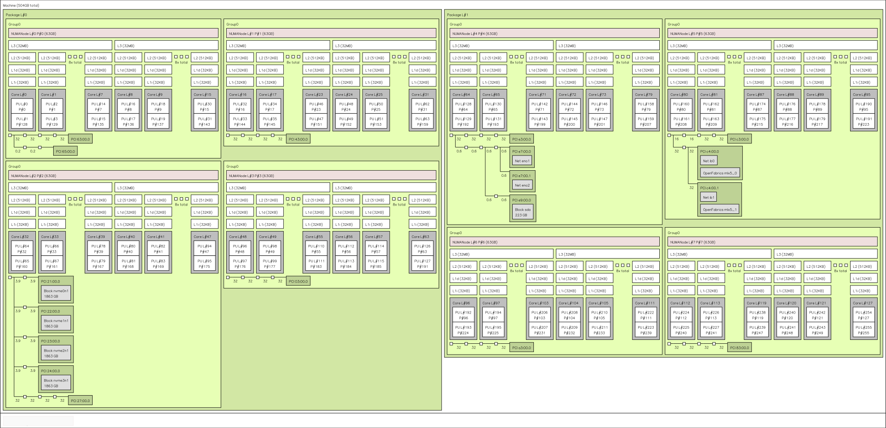

# Affinity part 2 - System topology and controlling affinity

In [Part 1](./Affinity_Part1.md) of the Affinity blog series, we looked at the
importance of setting affinity for High Performance Computing (HPC) workloads. In this
blog post, our goals are the following:

1) Point to tools that can help you understand the topology of your system
2) Discuss ways to verify if affinity is set up correctly for your run
3) Show you how to set affinity for different types of applications

Please note that these tools and techniques provided here may not work on your system.
This may be due to a different Message Passing Interface (MPI) implementation or kernel
version or a new system configuration. These notes are here to serve as a reference and
we expect you to take away the ideas therein and apply on your system setup.

## Understanding system topology

On heterogenous systems, we have different types of resources such as CPUs, GPUs, memory
controllers, NICs, etc. There are many tools that you can use to progressively
understand the Non-Uniform Memory Access (NUMA) configuration on your system. In this
section, we will show examples of tools and what information they can provide to us.

### CPU information - `lscpu`

The `lscpu` tool, part of the Linux&reg; distribution, can be used to display
information about the CPU architecture in an easy-to-read text format. A snippet of the
`lscpu` output is shown below. Some key items to note are the number of sockets on the
system, the number of physical cores per socket, the number of hardware threads (HWTs)
on each physical core and the NUMA domains configured on the system. Alongside each NUMA
domain is a list of physical cores and HWTs that belong to that domain. In this case,
there are 2 sockets and 8 NUMA domains, which indicates a NPS4 configuration. The first
4 NUMA domains are in socket 0 and the next 4 NUMA domains in socket 1.

```bash
Thread(s) per core:  2
Core(s) per socket:  64
Socket(s):           2
NUMA node(s):        8
NUMA node0 CPU(s):   0-15,128-143
NUMA node1 CPU(s):   16-31,144-159
NUMA node2 CPU(s):   32-47,160-175
NUMA node3 CPU(s):   48-63,176-191
NUMA node4 CPU(s):   64-79,192-207
NUMA node5 CPU(s):   80-95,208-223
NUMA node6 CPU(s):   96-111,224-239
NUMA node7 CPU(s):   112-127,240-255
```

### CPU NUMA configuration - `numactl`

The `numactl` tool, part of the Linux distribution, can be used to control NUMA
policy for processes or shared memory. It can also be used to display information about
which CPU cores or HWTs belong to each NUMA domain. A sample of `numactl -H` output is
shown below. Here, observe that distances between NUMA domains in different sockets are
larger.

```bash
numactl -H
available: 8 nodes (0-7)
node 0 cpus: 0 1 2 3 4 5 6 7 8 9 10 11 12 13 14 15 128 129 130 131 132 133 134 135 136 137 138 139 140 141 142 143
node 0 size: 64306 MB
node 0 free: 59767 MB
node 1 cpus: 16 17 18 19 20 21 22 23 24 25 26 27 28 29 30 31 144 145 146 147 148 149 150 151 152 153 154 155 156 157 158 159
node 1 size: 64502 MB
node 1 free: 61327 MB
node 2 cpus: 32 33 34 35 36 37 38 39 40 41 42 43 44 45 46 47 160 161 162 163 164 165 166 167 168 169 170 171 172 173 174 175
node 2 size: 64502 MB
node 2 free: 61605 MB
node 3 cpus: 48 49 50 51 52 53 54 55 56 57 58 59 60 61 62 63 176 177 178 179 180 181 182 183 184 185 186 187 188 189 190 191
node 3 size: 64447 MB
node 3 free: 61272 MB
node 4 cpus: 64 65 66 67 68 69 70 71 72 73 74 75 76 77 78 79 192 193 194 195 196 197 198 199 200 201 202 203 204 205 206 207
node 4 size: 64502 MB
node 4 free: 52763 MB
node 5 cpus: 80 81 82 83 84 85 86 87 88 89 90 91 92 93 94 95 208 209 210 211 212 213 214 215 216 217 218 219 220 221 222 223
node 5 size: 64502 MB
node 5 free: 54458 MB
node 6 cpus: 96 97 98 99 100 101 102 103 104 105 106 107 108 109 110 111 224 225 226 227 228 229 230 231 232 233 234 235 236 237 238 239
node 6 size: 64502 MB
node 6 free: 57521 MB
node 7 cpus: 112 113 114 115 116 117 118 119 120 121 122 123 124 125 126 127 240 241 242 243 244 245 246 247 248 249 250 251 252 253 254 255
node 7 size: 64492 MB
node 7 free: 55638 MB
node distances:
node   0   1   2   3   4   5   6   7 
  0:  10  12  12  12  32  32  32  32 
  1:  12  10  12  12  32  32  32  32 
  2:  12  12  10  12  32  32  32  32 
  3:  12  12  12  10  32  32  32  32 
  4:  32  32  32  32  10  12  12  12 
  5:  32  32  32  32  12  10  12  12 
  6:  32  32  32  32  12  12  10  12 
  7:  32  32  32  32  12  12  12  10 
```

### GPU information - `rocm-smi`

The `rocm-smi` tool is distributed as part of the ROCm&trade; stack. `rocm-smi` can be
used to display details about the GPUs on the system. Look at this output of `rocm-smi`
below. It shows that there are 8 AMD Instinct&trade; MI210 GPUs on the system.

```bash
====================================== ROCm System Management Interface ======================================
================================================ Concise Info ================================================
Device  [Model : Revision]    Temp    Power  Partitions      SCLK    MCLK     Fan  Perf  PwrCap  VRAM%  GPU%  
        Name (20 chars)       (Edge)  (Avg)  (Mem, Compute)                                                   
==============================================================================================================
0       [0x0c34 : 0x02]       34.0°C  43.0W  N/A, N/A        800Mhz  1600Mhz  0%   auto  300.0W    0%   0%    
        Instinct MI210                                                                                        
1       [0x0c34 : 0x02]       39.0°C  42.0W  N/A, N/A        800Mhz  1600Mhz  0%   auto  300.0W    0%   0%    
        Instinct MI210                                                                                        
2       [0x0c34 : 0x02]       33.0°C  41.0W  N/A, N/A        800Mhz  1600Mhz  0%   auto  300.0W    0%   0%    
        Instinct MI210                                                                                        
3       [0x0c34 : 0x02]       38.0°C  42.0W  N/A, N/A        800Mhz  1600Mhz  0%   auto  300.0W    0%   0%    
        Instinct MI210                                                                                        
4       [0x0c34 : 0x02]       33.0°C  43.0W  N/A, N/A        800Mhz  1600Mhz  0%   auto  300.0W    0%   0%    
        Instinct MI210                                                                                        
5       [0x0c34 : 0x02]       35.0°C  42.0W  N/A, N/A        800Mhz  1600Mhz  0%   auto  300.0W    0%   0%    
        Instinct MI210                                                                                        
6       [0x0c34 : 0x02]       33.0°C  40.0W  N/A, N/A        800Mhz  1600Mhz  0%   auto  300.0W    0%   0%    
        Instinct MI210                                                                                        
7       [0x0c34 : 0x02]       39.0°C  42.0W  N/A, N/A        800Mhz  1600Mhz  0%   auto  300.0W    0%   0%    
        Instinct MI210                                                                                        
==============================================================================================================
============================================ End of ROCm SMI Log =============================================
```

### GPU NUMA configuration - `rocm-smi --showtoponuma`

`rocm-smi --showtoponuma` can help understand the NUMA binding for each GPU. For
instance, here we see that GPU 0 is closest to NUMA node 3 and from the `lscpu` or
`numactl` output, we know that NUMA node 3 contains the CPU cores/HWTs 48-63,176-191.
So, on this system, it is good to run the process that uses GPU 0 on, say, core 48.

```bash
============================ ROCm System Management Interface ============================
======================================= Numa Nodes =======================================
GPU[0]      : (Topology) Numa Node: 3
GPU[0]      : (Topology) Numa Affinity: 3
GPU[1]      : (Topology) Numa Node: 2
GPU[1]      : (Topology) Numa Affinity: 2
GPU[2]      : (Topology) Numa Node: 1
GPU[2]      : (Topology) Numa Affinity: 1
GPU[3]      : (Topology) Numa Node: 0
GPU[3]      : (Topology) Numa Affinity: 0
GPU[4]      : (Topology) Numa Node: 7
GPU[4]      : (Topology) Numa Affinity: 7
GPU[5]      : (Topology) Numa Node: 6
GPU[5]      : (Topology) Numa Affinity: 6
GPU[6]      : (Topology) Numa Node: 5
GPU[6]      : (Topology) Numa Affinity: 5
GPU[7]      : (Topology) Numa Node: 4
GPU[7]      : (Topology) Numa Affinity: 4
================================== End of ROCm SMI Log ===================================
```

### Node topology - lstopo

`lstopo`, part of the `hwloc` package on Linux, can be used to show the topology of
the system in various output formats. In the figure below, we see the two packages
representing the two sockets on the node. Each package has 4 NUMA domains.



Zooming in to NUMA node 1 as shown in the figure below, we see that it has 16 CPU cores,
2 HWTs per core, and one GPU connected via the PCIe interface. Observe that 8 physical
cores share an L3 cache. Placing threads of the same process close together in the same
L3 cache region would improve cache reuse if the data being read by all those threads
fits in cache.


## Verifying affinity setup

It is always a good idea to check if you have the correct affinity set up before you
measure performance. Below is a list of some ways you could do that.

- A look at `top` or `htop` can tell us the CPU HWTs on which processes and their
threads are running
- If using OpenMPI, `mpirun --report-bindings` can be used to show the selection of
cores where each rank may be placed
- For MPI + OpenMP&reg; programs, you can use the following simple "Hello, World" program
from Oak Ridge National Laboratory's Leadership Computing Facility (OLCF) to check
mappings: [hello_mpi_omp](https://code.ornl.gov/olcf/hello_mpi_omp)
- For MPI + OpenMP + HIP programs, a simple "Hello, World" program with HIP from
OLCF can be used to verify mappings: [hello_jobstep](https://code.ornl.gov/olcf/hello_jobstep)
- Example code from Chapter 14 of Bob Robey's book, Essentials of Parallel Computing,
can be used to [verify mappings for OpenMP, MPI, and MPI+OpenMP cases](https://github.com/essentialsofparallelcomputing/Chapter14)

When running jobs using the Slurm batch command, it is good practice to run one of the
above hello world programs just before your job with the same slurm configuration to
verify affinity settings.

## Setting affinity

In simple terms, setting affinity means selecting which CPU cores, GPU(s), and/or other
resources a process and its threads will use for this run. For different scenarios,
affinity setup may be different. Identifying the different cases and applying the right
methods is key. In the sections below, a representative set of techniques are shown for
different cases. Please note that each one of these tools may offer more features that
you may be able to exploit for your use case. Since the features change often, it is
always a good idea to refer to man pages for the respective tools.

### Serial, single-threaded applications

If your application runs only on a single CPU core, then a quick way to pin the process
is to use the Linux based `numactl` tool. Here is a simple example of indicating to
the OS that the process may be scheduled on either core 1 or 2.

```bash
numactl -C 1,2 ./exe
```

*Tip:* Since core 0 may be used by the OS to service interrupts and for other system
activities, it is better avoid it to reduce variability in your runs.

In the example below, we request that all the memory for this process be allocated on
NUMA node 0 only.

```bash
numactl -C 1,2 -m 0 ./exe
```

### Serial, multi-threaded applications

In this section, we consider applications that are multi-threaded using either Pthreads
or OpenMP and some tools that are available for setting affinity for such
applications.

#### Setting affinity for Pthreads based applications

`numactl` may be used for pinning a process and its threads by providing a range of
cores to bind to. In the following example, we request running the executable on cores
1-7 and interleaving all memory allocations in NUMA nodes 0 and 1.

```bash
numactl -C 1-7 -i 0,1 ./exe
```

#### Setting affinity for OpenMP based applications

While `numactl` may be used on multi-threaded applications built with Pthreads or
OpenMP, the OpenMP 5.2 standard specifies environment variables that can be
combined and used for controlling affinity for OpenMP based multi-threaded
applications. The descriptions for some key environment variables are given below.

- `OMP_PLACES` indicates hardware resources for placement of the process and its
threads. Some examples include abstract names that are implementation dependent such as
`cores`, `threads`, `sockets`, `L3CACHE` or `NUMA`, or an explicit list of places
described by non-negative numbers. Consider the following examples:

  - `export OMP_PLACES=threads` indicates that each place is a hardware thread (HWT)
  - `export OMP_PLACES={0,1}` to run the process and its threads on cores 0 and 1
  - `export OMP_PLACES={0:$OMP_NUM_THREADS:2}` to run the process and its threads on
cores `0, 2, 4, ... $OMP_NUM_THREADS`

- `OMP_PROC_BIND` indicates how OpenMP threads are bound to resources. We can
provide a comma separated list of `primary`, `close`, `spread` or `false`, to indicate
policies for nested levels of parallelism.
  - `export OMP_PROC_BIND=close` to bind threads close to the primary thread on given
places
  - `export OMP_PROC_BIND=spread` to spread threads evenly on given places
  - `export OMP_PROC_BIND=primary` to bind threads on the same place as the primary
thread
  - `export OMP_PROC_BIND=false` to disable thread affinity

The [OpenMP specification](https://www.openmp.org/spec-html/5.0/openmpch6.htm)
contains more details about these environment variables and others.

If the GNU OpenMP implementation is used to build the application, we can also set
affinity for the process and its threads using the environment variable,
`GOMP_CPU_AFFINITY`. In the example below, we run a process with 16 threads and bind
them to cores 0, 4, 8, .. 60.

```bash
export GOMP_CPU_AFFINITY=0-63:4
export OMP_NUM_THREADS=16
./exe
```

### Multi-process (MPI), multi-threaded applications

Multi-process applications built with MPI support have several options for process
placement, order and binding depending on the MPI implementation that the application
is built with or the scheduler used to submit the job.

[OpenMPI's](https://www.open-mpi.org/) `mpirun` command offers several affinity related
options such as `--map-by` and `--report-bindings`. The
[mpirun man page](https://docs.open-mpi.org/en/main/man-openmpi/man1/mpirun.1.html) has
extensive documentation for these options and other details. An example of running 4 MPI
ranks where each rank has 2 OpenMP threads using OpenMPI 5.0.2 is shown below. Here,
we mix `mpirun` options and OpenMP environment variables to spread the two threads
of each rank in a NUMA domain and to keep each rank in its own NUMA domain.

```bash
OMP_NUM_THREADS=2 OMP_PROC_BIND=spread mpirun -np 4 --map-by NUMA ./hello_mpi_omp
```

The above example also shows running
[hello_mpi_omp](https://code.ornl.gov/olcf/hello_mpi_omp) to verify bindings
programmatically. The sample output shown below was obtained on a node with topology
similar to that shown in the [Node topology - lstopo](#node-topology---lstopo) section
of this article. Here, we see that each MPI rank got pinned to two HWTs from a unique
NUMA domain.

```bash
MPI 000 - OMP 000 - HWT 000
MPI 000 - OMP 001 - HWT 008
MPI 002 - OMP 000 - HWT 032
MPI 002 - OMP 001 - HWT 040
MPI 003 - OMP 000 - HWT 048
MPI 003 - OMP 001 - HWT 056
MPI 001 - OMP 000 - HWT 016
MPI 001 - OMP 001 - HWT 024
```

Note that `mpirun` automatically binds processes to hardware resources in some cases
which may be quite confusing sometimes. We urge you to refer to the `mpirun` man page
when your binding options do not give you the desired outcome and look for any default
settings such as the ones described in the [OpenMPI 5.0 manual](https://docs.open-mpi.org/en/v5.0.x/man-openmpi/man1/mpirun.1.html#quick-summary).

The [Slurm](https://slurm.schedmd.com/) job scheduler offers a rich set of options to
control binding of tasks to hardware resources. See the man page for `srun` or
`slurm.conf` for documentation of all such options. It is important to note that Slurm
configuration differs at each site, so we encourage checking the recommendations from
your site's system administrators.

[MPICH](https://www.mpich.org/) does not have many affinity related options but if it is
built with Slurm integration, slurm bindings can be used to set affinity at runtime.

### Hybrid applications that run on CPU + GPU

In hybrid applications where processes use CPU cores and GPU(s), we need to additionally
control the affinity of each process to GPU devices. By default, all processes see all
GPU devices. In [Part 1](./Affinity_Part1.md) of this blog series, we saw the importance
of mapping processes to GPU device(s) and CPU cores in the same NUMA domain. Now, we will
look at different ways of achieving that. Our goal is to equip you with different
techniques so that you can determine what works on your system.

Applications or libraries such as MPI may be built to use either
the HIP runtime or the ROCr runtime, a lower level runtime library in
the ROCm stack. Depending on the runtime library used, one of two environment variables
may be used to set affinity for GPU devices. For HIP applications, the environment
variable [`HIP_VISIBLE_DEVICES`](https://rocm.docs.amd.com/en/latest/conceptual/gpu-isolation.html#hip-visible-devices)
can be used to restrict GPU devices visible to the HIP
runtime. In applications that use OpenMP target offload features to offload compute
to the GPUs, the environment variable [`ROCR_VISIBLE_DEVICES`](https://rocm.docs.amd.com/en/latest/conceptual/gpu-isolation.html#rocr-visible-devices)
can be used to restrict GPU
devices visible to the ROCR runtime. Since the HIP runtime depends on the ROCr runtime,
note that only the subset of GPU devices made visible by `ROCR_VISIBLE_DEVICES` may be
restricted further by `HIP_VISIBLE_DEVICES`.

In some HPC sites, convenient slurm bindings exist to make such affinity control
effortless. The [Frontier User Guide](https://docs.olcf.ornl.gov/systems/frontier_user_guide.html#process-and-thread-mapping-examples)
offers very good documentation for mapping processes and their threads to CPUs, GPUs,
and NICs on Frontier using Slurm options.

In some cases, when the CPU binding is achieved with OpenMPI and OpenMP options as
shown in the previous section, setting GPU affinity may be accomplished using a wrapper
script that is run by `mpirun` just before the actual executable. To give you an idea,
a simple wrapper script that uses local rank IDs to map 8 processes to the 8 GPU devices
on the node is shown below:

```bash
$ cat set_gpu_device.sh
#!/bin/bash
export HIP_VISIBLE_DEVICES=$OMPI_COMM_WORLD_LOCAL_RANK
exec $*
```

Now, taking the same example as in the section above of running 8 MPI ranks on a node
with 8 GPUs, each rank running 2 OpenMP threads, we can map both CPUs and GPUs
using the command:

```bash
OMP_NUM_THREADS=2 OMP_PROC_BIND=spread mpirun -np 4 --map-by NUMA ./set_gpu_device.sh ./hello_jobstep
```

Note that this time, we ran the `hello_jobstep` program to verify CPU and GPU bindings.
The output of the above command shows that each rank uses a different GPU device:

```bash
MPI 000 - OMP 000 - HWT 000 - RT_GPU_ID 0 - GPU_ID 0 - Bus_ID 63
MPI 000 - OMP 001 - HWT 008 - RT_GPU_ID 0 - GPU_ID 0 - Bus_ID 63
MPI 001 - OMP 000 - HWT 016 - RT_GPU_ID 0 - GPU_ID 1 - Bus_ID 43
MPI 001 - OMP 001 - HWT 024 - RT_GPU_ID 0 - GPU_ID 1 - Bus_ID 43
MPI 002 - OMP 000 - HWT 032 - RT_GPU_ID 0 - GPU_ID 2 - Bus_ID 03
MPI 002 - OMP 001 - HWT 040 - RT_GPU_ID 0 - GPU_ID 2 - Bus_ID 03
MPI 003 - OMP 000 - HWT 048 - RT_GPU_ID 0 - GPU_ID 3 - Bus_ID 27
MPI 003 - OMP 001 - HWT 056 - RT_GPU_ID 0 - GPU_ID 3 - Bus_ID 27
```

A slightly [extended script](https://github.com/AMD/amd-lab-notes/blob/release/affinity/src/set_cpu_and_gpu_affinity.sh)
can be found in the [AMD lab notes repository](https://github.com/amd/amd-lab-notes)
which sets up both CPU and GPU affinity for more general cases such
as running on multiple nodes, packing multiple ranks on each GPU device, striding the
OpenMP threads or striding the MPI ranks so as to spread processes evenly across
available sockets. Since this script manages both CPU and GPU affinity settings, it is
important to use the `mpirun --bind-to none` option instead of using the `OMP_PROC_BIND`
setting or the `--map-by` mpirun option. This script can be easily extended to work with
other MPI environments such as MPICH or Slurm. Here is an example of running 16 MPI ranks
with 8 threads per rank and 8 GPUs on the node, so each GPU is oversubscribed with 2 MPI
ranks:

```bash
OMP_NUM_THREADS=8 mpirun -np 16 --bind-to=none ./set_cpu_and_gpu_affinity.sh ./hello_jobstep
```

In the partial output shown below, we observe that MPI ranks 0 and 1 run on GPU 0, MPI
ranks 2 and 3 run on GPU 1, etc. Ranks 0 and 1 are packed closely in NUMA domain 0
(cores 0-15) with one physical core per thread. With NPS4 configuration such as in this
node, to get the full CPU memory bandwidth, we need to spread processes and threads
evenly across the two sockets.

```bash
MPI 000 - OMP 000 - HWT 000 - RT_GPU_ID 0 - GPU_ID 0 - Bus_ID 63
MPI 000 - OMP 002 - HWT 002 - RT_GPU_ID 0 - GPU_ID 0 - Bus_ID 63
MPI 000 - OMP 007 - HWT 007 - RT_GPU_ID 0 - GPU_ID 0 - Bus_ID 63
MPI 000 - OMP 006 - HWT 006 - RT_GPU_ID 0 - GPU_ID 0 - Bus_ID 63
MPI 000 - OMP 001 - HWT 001 - RT_GPU_ID 0 - GPU_ID 0 - Bus_ID 63
MPI 000 - OMP 005 - HWT 005 - RT_GPU_ID 0 - GPU_ID 0 - Bus_ID 63
MPI 000 - OMP 003 - HWT 003 - RT_GPU_ID 0 - GPU_ID 0 - Bus_ID 63
MPI 000 - OMP 004 - HWT 004 - RT_GPU_ID 0 - GPU_ID 0 - Bus_ID 63
MPI 001 - OMP 000 - HWT 008 - RT_GPU_ID 0 - GPU_ID 0 - Bus_ID 63
MPI 001 - OMP 003 - HWT 011 - RT_GPU_ID 0 - GPU_ID 0 - Bus_ID 63
MPI 001 - OMP 001 - HWT 009 - RT_GPU_ID 0 - GPU_ID 0 - Bus_ID 63
MPI 001 - OMP 006 - HWT 014 - RT_GPU_ID 0 - GPU_ID 0 - Bus_ID 63
MPI 001 - OMP 005 - HWT 013 - RT_GPU_ID 0 - GPU_ID 0 - Bus_ID 63
MPI 001 - OMP 002 - HWT 010 - RT_GPU_ID 0 - GPU_ID 0 - Bus_ID 63
MPI 001 - OMP 004 - HWT 012 - RT_GPU_ID 0 - GPU_ID 0 - Bus_ID 63
MPI 001 - OMP 007 - HWT 015 - RT_GPU_ID 0 - GPU_ID 0 - Bus_ID 63
MPI 002 - OMP 000 - HWT 016 - RT_GPU_ID 0 - GPU_ID 1 - Bus_ID 43
MPI 002 - OMP 006 - HWT 022 - RT_GPU_ID 0 - GPU_ID 1 - Bus_ID 43
MPI 002 - OMP 002 - HWT 018 - RT_GPU_ID 0 - GPU_ID 1 - Bus_ID 43
MPI 002 - OMP 004 - HWT 020 - RT_GPU_ID 0 - GPU_ID 1 - Bus_ID 43
MPI 002 - OMP 005 - HWT 021 - RT_GPU_ID 0 - GPU_ID 1 - Bus_ID 43
MPI 002 - OMP 003 - HWT 019 - RT_GPU_ID 0 - GPU_ID 1 - Bus_ID 43
MPI 002 - OMP 007 - HWT 023 - RT_GPU_ID 0 - GPU_ID 1 - Bus_ID 43
MPI 002 - OMP 001 - HWT 017 - RT_GPU_ID 0 - GPU_ID 1 - Bus_ID 43
MPI 003 - OMP 000 - HWT 024 - RT_GPU_ID 0 - GPU_ID 1 - Bus_ID 43
MPI 003 - OMP 001 - HWT 025 - RT_GPU_ID 0 - GPU_ID 1 - Bus_ID 43
MPI 003 - OMP 002 - HWT 026 - RT_GPU_ID 0 - GPU_ID 1 - Bus_ID 43
MPI 003 - OMP 004 - HWT 028 - RT_GPU_ID 0 - GPU_ID 1 - Bus_ID 43
MPI 003 - OMP 003 - HWT 027 - RT_GPU_ID 0 - GPU_ID 1 - Bus_ID 43
MPI 003 - OMP 006 - HWT 030 - RT_GPU_ID 0 - GPU_ID 1 - Bus_ID 43
MPI 003 - OMP 005 - HWT 029 - RT_GPU_ID 0 - GPU_ID 1 - Bus_ID 43
MPI 003 - OMP 007 - HWT 031 - RT_GPU_ID 0 - GPU_ID 1 - Bus_ID 43
<snip>
```

## Conclusion

Affinity is an important consideration for achieving better performance from HPC
applications. Setting affinity involves understanding the topology of the system and
knowing how to control mapping for the application and system at hand. In this blog, we
point the reader to several tools and techniques for studying the system and controlling
affinity, placement and order accordingly. By no means is this article a comprehensive
authority on all possible ways to control affinity, but rather a small sample of what is
possible. We stress the importance of reading man pages for all these tools to figure out
what would work on your system. We encourage you to participate in
[Github discussions](https://github.com/rocm/rocm-blogs/discussions) if you have any
questions or comments.

### References

- [Frontier, the first exascale computer](https://www.olcf.ornl.gov/frontier/)
- [Frontier User Guide, Oak Ridge Leadership Compute Facility, Oak Ridge National Laboratory (ORNL)](https://docs.olcf.ornl.gov/systems/frontier_user_guide.html#id2)
- Parallel and High Performance Computing, Robert Robey and Yuliana Zamora, Manning
Publications, May 2021
- [OpenMP Specification](https://www.openmp.org/)
- [MPICH](https://www.mpich.org/)
- [OpenMPI](https://www.open-mpi.org/)
- [Slurm](https://slurm.schedmd.com/)
- Performance Analysis of CP2K Code for Ab Initio Molecular Dynamics on CPUs and GPUs,
Dewi Yokelson, Nikolay V. Tkachenko, Robert Robey, Ying Wai Li, and Pavel A. Dub,
*Journal of Chemical Information and Modeling 2022 62 (10)*, 2378-2386, DOI:
10.1021/acs.jcim.1c01538
- [Essentials of Parallel Computing, Chapter 14 Code Examples](https://github.com/essentialsofparallelcomputing/Chapter14)
- Code Examples from ORNL:
  - [hello_mpi_omp](https://code.ornl.gov/olcf/hello_mpi_omp)
  - [hello_jobstep](https://code.ornl.gov/olcf/hello_jobstep)

### Disclaimers

The OpenMP name and the OpenMP logo are registered trademarks of the OpenMP Architecture
Review Board.

HPE is a registered trademark of Hewlett Packard Enterprise Company and/or its
affiliates.

Linux is the registered trademark of Linus Torvalds in the U.S. and other countries.
