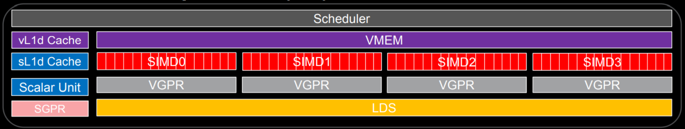
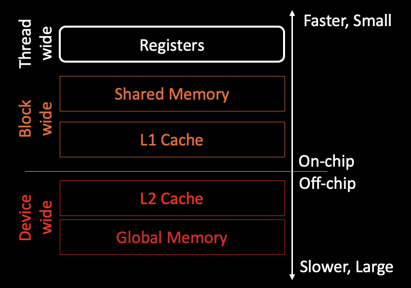
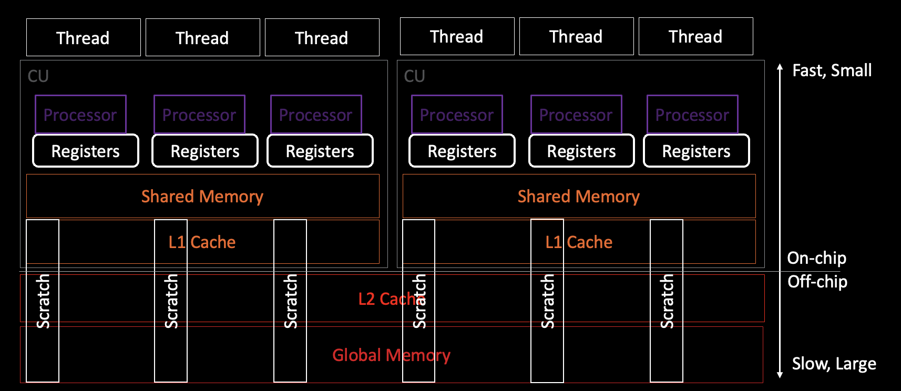

<!---
Copyright (c) 2024 Advanced Micro Devices, Inc. (AMD)

Permission is hereby granted, free of charge, to any person obtaining a copy
of this software and associated documentation files (the "Software"), to deal
in the Software without restriction, including without limitation the rights
to use, copy, modify, merge, publish, distribute, sublicense, and/or sell
copies of the Software, and to permit persons to whom the Software is
furnished to do so, subject to the following conditions:

The above copyright notice and this permission notice shall be included in all
copies or substantial portions of the Software.

THE SOFTWARE IS PROVIDED "AS IS", WITHOUT WARRANTY OF ANY KIND, EXPRESS OR
IMPLIED, INCLUDING BUT NOT LIMITED TO THE WARRANTIES OF MERCHANTABILITY,
FITNESS FOR A PARTICULAR PURPOSE AND NONINFRINGEMENT. IN NO EVENT SHALL THE
AUTHORS OR COPYRIGHT HOLDERS BE LIABLE FOR ANY CLAIM, DAMAGES OR OTHER
LIABILITY, WHETHER IN AN ACTION OF CONTRACT, TORT OR OTHERWISE, ARISING FROM,
OUT OF OR IN CONNECTION WITH THE SOFTWARE OR THE USE OR OTHER DEALINGS IN THE
SOFTWARE.
--->
# Reading AMD GPU ISA

For an application developer it is often helpful to read the Instruction
Set Architecture (ISA) for the GPU architecture that is used to perform its
computations. Understanding the instructions of the pertinent code
regions of interest can help in debugging and achieving performance
optimization of the application.

In this blog post, we will discuss how to read and understand the
ISA for AMD's Graphics Core Next (AMDGCN)
architecture used in the AMD Instinct&trade; and AMD Radeon&trade; line of GPUs.
AMDGCN ISA contains the instructions that AMDGCN architecture
processes to perform compute tasks.
While we will cover several important topics and examples in this post,
for more details the readers are encouraged to refer to the relevant ISA
documentation,
e.g., [CDNA2&trade; ISA](https://www.amd.com/content/dam/amd/en/documents/instinct-tech-docs/instruction-set-architectures/instinct-mi200-cdna2-instruction-set-architecture.pdf)
for AMD Instinct&trade; MI200&trade; GPUs, or
[RDNA2&trade; ISA](https://www.amd.com/content/dam/amd/en/documents/radeon-tech-docs/instruction-set-architectures/rdna2-shader-instruction-set-architecture.pdf)
for AMD NAVI&trade; 20s GPUs.
We will discuss the following:

- AMDGCN architecture overview.
- AMDGCN ISA supported instruction and register types.
- Few examples to read and understand basic ISA instructions.

## Prerequisite knowledge

Understanding the following AMDGCN architecture concepts will be
helpful when we discuss reading its ISA.

### Terminology

Let us define a few commonly used terminology in this blog post.

- **Instruction Set Architecture (ISA)**: The language of a processor (CPUs,
GPUs, or FPGAs) that defines what operations the processor is capable of
performing. The ISA acts as an interface between operations defined in the
processors system software and how those operations are mapped to execution
on the hardware. x86, ARM, RISC-V, GCN are all processor specific ISAs.

- **AMD Graphics Core Next (AMDGCN)**: The ISA specific to AMD GPUs. Southern Islands,
Vega&trade;, RDNA&trade; (Radeon&trade;) are all architecture specific implementations of
**AMDGCN ISA**.

Generally, ISA refers to all possible instructions that the specific processor
is capable of issuing. Whereas, "assembly" (ASM) refers to the actual
programming language that makes use of the ISA. However, they are often used
interchangeably.

### Computer architecture tidbits

A select few computer architecture concepts are discussed here.

- **Bits, Bytes and Words**:
A byte is 8 bits, a word is 16 bits (2 bytes), and a dword (double word) is
32 bits (4 bytes).
Assuming C/C++ as the program implementation language
and a 64 bit system: a `char` is 1 byte, an `int` is 4 bytes, a `float` is
4 bytes, and a `double` is 8 bytes.
It is common in AMDGCN ISA to see `DWORD`, `DWORDX2`, and `DWORDX4`
instructions. These indicate that the instructions will operate on 4 bytes
(1 dword), 8 bytes (2 dwords), and 16 bytes (4 dwords) of data respectively.

- **Instructions types**:
AMDGCN is implemented as a load and store architecture, which is distinct from
the register-memory architecture of x86. As such, instructions are separated
into two categories: i) memory operations (load and stores between memory and
registers) and, ii) Arithmetic Logic Unit (ALU) and Floating Point Unit (FPU)
operations (which only occur between registers).

- **High/low bits**:
In an ISA the high order bit is the most significant bit (MSb) of a number.
High order bits are the left most bits, while the low order
bits (right most bits) are the least significant bits (LSb) of the number.

- **Carry ins/outs**:
A carry in or out refers to bits used in an arithmetic operations that can
overflow or underflow. For example, if an arithmetic operation on two 32-bit
numbers yields bits that exceeds 32 bits, those bits would be "carry out"
since those bits do not fit a 32-bit register.
These bits would propagated as "carry in" for the next more significant
position in the 32-bit register representing the higher order bits. Thus
the "carry in/out" operations facilitate multi-precision arithmetic
operations even with a smaller precision register. For example,
64-bit operations can be achieved even with 32-bit registers.

- **Execute mask**:
The execute (`EXEC`) mask is a 64-bit mask which determines which threads
(threads) in a wavefront are executed: 1 = execute, 0 = do not execute.
All vector instructions support an execute mask. In GPU kernels this mask is
often used to handle process branching, where only a subset of threads are active in each branch.
More details can be read from Sec 3.3 from
[CDNA2&trade; ISA](https://www.amd.com/content/dam/amd/en/documents/instinct-tech-docs/instruction-set-architectures/instinct-mi200-cdna2-instruction-set-architecture.pdf).

## Processor subunits

A kernel is run on a wavefront with 64 threads in lockstep in CDNA2&trade;
ISA. The wavefront size can switch between 32 and 64 threads in
[RDNA2&trade; ISA (Sec 2.1)](https://www.amd.com/content/dam/amd/en/documents/radeon-tech-docs/instruction-set-architectures/rdna2-shader-instruction-set-architecture.pdf).
The processor operates on the kernels using the following subunits:

- **Scalar arithmetic logic unit (SALU)**:
SALU operates on one value per wavefront that is common to all threads.
All kernel flow is handled using SALU instructions, which includes
if/else, branches, and looping.

- **Vector arithmetic logic unit (VALU)**:
VALU operates on a unique value per thread, but the instructions operate on
all the threads in a wavefront together in one pass. Every wavefront has
a 64 bit `EXEC` bit-mask that marks each thread as 1 (active - process the instructions)
or 0 (dormant - instruction is a no-op).

- **Scalar memory (SMEM)**:
SMEM transfers data between scalar registers and memory through scalar data
cache. The SMEM instruction reads/writes consecutive DWORDs between SGPRs and
memory.

- **Vector memory (VMEM)**:
VMEM transfers data between vector registers and memory with each thread
can provide a unique memory address. VMEM instructions also support the `EXEC` mask.

- **Local Data Share (LDS)**:
The Local Data Share (LDS) in AMD GPUs is a high speed, register-adjacent
memory analogous to shared memory in CUDA. This memory space can be thought
of as an explicitly managed cache.

## Types of instructions and registers

Registers are high speed memory storage located close to the
processing unit on the chip. Almost all computation uses registers.
Data is **loaded** into them, operations are performed and data is **stored**
out.

Instructions and registers are split into two forms: scalar and vector. In the ISA
language, scalar instructions begin with "s_" while vector instructions begin with "v_".
Scalar instructions are for any operation that is provably uniform across the
wavefront. Uniform in this case refers to every thread in the wavefront using
identical data, i.e., there is no need to duplicate effort across threads.
Vector instructions are for anything the compiler can not prove to be
uniform. The most common example is where each thread in a wavefront
operates on using data from unique locations in memory.

Scalar instructions can only operate on data in scalar registers (SGPRs).
Vector instructions can operator on data in vector registers (VGPRs), but can
read data stored in SGPRs.
Both scalar and vector registers are double words (32 bits) in size, but can
be concatenated to accommodate larger data types. For example, a single double precision floating
point value or pointer (64 bits) would be stored in two
consecutive 32 bit registers.

On a MI200 series GPU, each compute unit is made up of one SALU and four VALU.
There are 800 SGPRs available per VALU for a total of 12.8 KB per compute unit.
A single thread in a wavefront can use up to 256 VGPRs and 256 accumulate VGPRs
(AGPRs) for a total 2 kB. In total, a compute unit has 524 KB of VGPRs and AGPRs.
The following diagram schematically represents the CU internal. Here SIMDs are
the VALUs. See the [ORNL slides](https://www.olcf.ornl.gov/wp-content/uploads/03-MemoryHierarchy.pdf) for details.



## Common instructions

Below are some common instructions in HPC applications:

### Arithmetic instructions

The instructions include Integer Arithmetic instructions on SALU or
VALU subunits. For example, `s_add_i32`, `s_sub_i32` are scalar operations
addition and subtraction, respectively, done using SALU units.
Similarly, `v_add_i32`, `v_sub_i32` are those same operations done using VALU units.

### Move

This type of instruction includes moving an input to a scalar or vector
register. For example, `v_mov_b32` moves a 32 bit vector input to a vector
register. Similarly, `s_mov_b64` moves a 64 bit scalar input to a scalar
register.

### Compare

Instructions that preform compare operations on scalar (`SOPC`) or
vector (`VOPC`) inputs. The instructions have `*_cmp_*` formats. The vector
compare instructions perform the same compare operations on _each_ lane (or
thread).
A scalar compare operation sets the Scalar Condition Code (SCC), which is
used as a conditional branch condition. Vector compare operations set the Vector Condition Code (VCC)
mask.

### Conditionals

Conditional instructions essentially use SCC value (0 or 1) to perform an
operation, or which source operand to use. For example, `s_cmove_b32` moves a
scalar 32 bit input to a scalar register.

### Loads/stores

Loads and stores are the main type of memory operation. These operations load
data from memory and store it back to memory from registers where arithmetic
operations are performed. For example, the scalar load instructions (`s_load_dword`)
loads a single double word of data from memory into a SGPR. Similarly, the vector
load instructions `global_load_dword` loads a double word of data per thread
from HBM into vector registers. See [CDNA2&trade; ISA](https://www.amd.com/content/dam/amd/en/documents/instinct-tech-docs/instruction-set-architectures/instinct-mi200-cdna2-instruction-set-architecture.pdf) for more details.

## Instructions and their relation to memory

Here are some important points regarding instructions and memory:

### Memory hierarchy

While not explicitly necessary for reading AMDGCN ISA, having a reasonable
understanding of the GPU memory spaces and hierarchy can be helpful.
For example, on a single graphics compute die of the MI250X GPU, the memory hierarchy can be broken down into:



Diagram remarks:

1. A block is made up of multiple wavefronts, which are then made up of
multiple threads. Threads within a
wavefront can issue cross-lane instructions to another thread's registers.
2. Shared memory and the L1 cache are located in the compute unit, while the
L2 cache is shared between compute units.

As a side note, to learn about efficient use of memory spaces on MI200 GPUs
please refer to
[MI200 GPU memory space blog post](https://rocm.blogs.amd.com/software-tools-optimization/mi200-memory-space/README.html).

### Scratch/stack memory

In the event of high register pressure in a kernel some of its data is stored
in a special memory space, _Scratch_ memory, that is private to the thread but
belongs to the global memory. This means the data access is slower than
using register memory. Scratch memory does not use LDS and therefore
scratch instructions do not use LDS bandwidth. These instructions only use
`vm_cnt` (used for global memory access) and not `lgmk_cnt`. The following
diagram shows the scratch memory access by threads.



Diagram remarks:

1. The link between threads and processors is through the wavefront. There is
not really a 1-1 thread per processor mapping but instead a processor per
quarter wave that executes in four phases to process a full wavefront.
2. Compiler register usage and scratch diagnostics are reported per thread.

## ISA examples

This section discusses ISA instructions through several simple examples.
The ISA source files (including `*.s`) can be generated using the
`--save-temps` flag with the compiler. For example:

```bash
hipcc -c --save-temps -g example.cpp
```

While `--save-temps` is sufficient to generate relevant ISA source files,
adding the debug symbols flag `-g` will further annotate the ISA with the lines of the corresponding kernel code.

To generate kernel resource usage, such as SGPR, VGPR, scratch, LDS, and
occupancy (active waves per SIMD), use:

```bash
hipcc -c example.cpp -Rpass-analysis=kernel-resource-usage
```

Note that this report will only contain _compile-time_ information. If
runtime-defined, dynamic shared memory or dynamic stack allocations are used,
then the `-Rpass-analysis=kernel-resource-usage` will not report the correct
scratch, LDS, and/or occupancy information.

### Load and store

Several code samples and their corresponding ISAs are shown below:

#### Naive load and store

The following code snippet shows a naive HIP kernel with a load and a store:

```c++
__global__
void load_store(int n, float* in, float* out)
{
  int tid = threadIdx.x + blockDim.x * blockIdx.x;
  out[tid] = in[tid];
}
```

The (annotated) ISA for this kernel is:

```bash
; %bb.0:
    s_load_dword s7, s[4:5], 0x24          # SGPRs s[4:5] saves kernel arguments
                                           # and kernel dispatch packet.
                                           # Save blockDim.x in s7 reading from
                                           # offset 36 (=0x24) of s[4:5]
    s_load_dwordx4 s[0:3], s[4:5], 0x8     # Save in[] in SGPR pair s[0:1] and 
                                           # out[] in SGPR pair s[2:3]
    s_waitcnt lgkmcnt(0)                   # Wait for scalar memory to load
                                           # until the counter (lgkmcnt) value 
                                           # decrements to 0.
    s_and_b32 s4, s7, 0xffff               # Retain lower order bits of
                                           # blockDim.x (s7) and set all higher
                                           # order bit word to 0. Save in s4.

    s_mul_i32 s6, s6, s4                   # s6=blockDim.x* blockIdx.x (s4*s6) 
    v_add_u32_e32 v0, s6, v0               # tid (v0)=threadIdx.x (v0) + s6 

                                           # --- Int ops for in[] and out[] ---
    v_ashrrev_i32_e32 v1, 31, v0           # Save 32 bit v0 in 64-bit pair v[0:1]
    v_lshlrev_b64 v[0:1], 2, v[0:1]        # tid<<2 (tid =* 4), offset for tid'th
                                           # elm is tid*4 bytes from 0'th elm
    v_mov_b32_e32 v3, s1                   # Move higher order in[] addr (s1) 
                                           # to higher order bits VGPR v3
    v_add_co_u32_e32 v2, vcc, s0, v0       # Add base addr of in[] (s0) with 
                                           # tid*4 (v0) for every tid.
    v_addc_co_u32_e32 v3, vcc, v3, v1, vcc # Add the carry over to the higher 
                                           # order bit of tid*4, save in v3
                                           # Now, VGPR pair v[2:3] has the right
                                           # address of in[] for every thread

    global_load_dword v2, v[2:3], off      # Load in[] (v[2:3]) to v2.
    v_mov_b32_e32 v3, s3                   # While v2 data is being loaded and 
                                           # available to be used, let's do
                                           # some pointer arithmetic for out[]
                     
    v_add_co_u32_e32 v0, vcc, s2, v0       # Ops similar to in[] array above
    v_addc_co_u32_e32 v1, vcc, v3, v1, vcc # v[0:1] = correct address of out[] 
                                           # for every thread

    s_waitcnt vmcnt(0)                     # Wait for 'global memory' counter
                                           # vmcnt to decrement to value 0.
                                           # It waits for global_load_dword 
                                           # to complete before it stores.
    global_store_dword v[0:1], v2, off     # Store global data v2 in v[0:1] 
    s_endpgm                               # Implicit wait for the global store
                                           # to complete before program ends.
                                           # This instruction tells the hardware 
                                           # the wavefront is done.
```

Note the explicit requirement of the AMDGCN calling
convention that kernel arguments must be passed in through SGPRs.
This is distinct from x86 which passes
function arguments by pushing them onto the stack.

#### Load and store with conditional

Let us introduce a conditional in the above kernel to ensure that the memory
access by the threads are kept within the array bounds. The following code
snippet shows the updated kernel.

```c++
__global__
void load_store(int n, float* in, float* out)
{
  int tid = threadIdx.x + blockDim.x * blockIdx.x;
  if (n > tid)
    out[tid] = in[tid];
}
```

The ISA for the above load and store HIP kernel with conditional statement is
shown below:

```bash
; %bb.0:
                                           # --- Part 1: see naive kernel ---
  s_load_dword s0, s[4:5], 0x24
  s_load_dword s1, s[4:5], 0x0
  s_waitcnt lgkmcnt(0)
  s_and_b32 s0, s0, 0xffff
  s_mul_i32 s6, s6, s0
  v_add_u32_e32 v0, s6, v0                 # Save tid in v0 for each thread.

                                           # --- Part 2: conditional ---
  v_cmp_gt_i32_e32 vcc, s1, v0             # 64-bit register pair vector cond
                                           # code 'vcc' holds the boolean value 
                                           # (0 or 1) of "n (s1) > tid (v0)";
  s_and_saveexec_b64 s[0:1], vcc           # 64-bit register pair s[0:1] stores 
                                           # execution mask 'exec' indicating 
                                           # active/masked (1/0) lanes of 64.
                                           # SGPR register pair (exec mask) 
                                           # stores 1 for all tids for which 
                                           # "tid < n" is true, 0 otherwise.
  s_cbranch_execz .LBB0_2                  # If all the execution masks have
                                           # 0 bits, go to end of the program.
                                           # See LBB0_2 below.

                                           # --- Part3: Global load/store ---
                                           # The interger arithmetic and global
                                           # load/store instructions are the 
                                           # same as the naive kernel.
                                           # Note: Part3 is executed only 
                                           # for threads with s[0:1] of bit 
                                           # values 1.
; %bb.1:
  s_load_dwordx4 s[0:3], s[4:5], 0x8       # s[0:1]: in[], s[2:3]: out[]
  v_ashrrev_i32_e32 v1, 31, v0             # ...
  v_lshlrev_b64 v[0:1], 2, v[0:1]
  s_waitcnt lgkmcnt(0)
  v_mov_b32_e32 v3, s1
  v_add_co_u32_e32 v2, vcc, s0, v0
  v_addc_co_u32_e32 v3, vcc, v3, v1, vcc
  global_load_dword v2, v[2:3], off        # Load global data in[tid] in v2
  v_mov_b32_e32 v3, s3                     # Pointer arithmetic for out[]
  v_add_co_u32_e32 v0, vcc, s2, v0         # ...
  v_addc_co_u32_e32 v1, vcc, v3, v1, vcc   # ...
  s_waitcnt vmcnt(0)                       # Wait for global load to complete
                                           # and be available in VGPR v2.
  global_store_dword v[0:1], v2, off       # Store loaded global data v2 
                                           # in VGPR pair v[0:1].
.LBB0_2:
  s_endpgm                                 # Implicit wait till global store 
                                           # completes before the end of the 
                                           # program. Wavefront is done.
```

### Scratch memory space

An example of using scratch space in a kernel can be accomplished by simply
allocating an array inside of a kernel that is too large to fit in registers.
For example:

```c++
__global__ void kernel(int* x, int len)
{
  int y[16] = {0}; //64 bytes
  int i = blockDim.x * blockIdx.x + threadIdx.x;
  if (i < len) {
    x[i] = y[i];
  }
}
```

Resource usage of the above kernel:

```bash
SGPRs: 11 [-Rpass-analysis=kernel-resource-usage]
VGPRs: 3 [-Rpass-analysis=kernel-resource-usage]
AGPRs: 0 [-Rpass-analysis=kernel-resource-usage]
ScratchSize [bytes/lane]: 0 [-Rpass-analysis=kernel-resource-usage]
Occupancy [waves/SIMD]: 8 [-Rpass-analysis=kernel-resource-usage]
SGPRs Spill: 0 [-Rpass-analysis=kernel-resource-usage]
VGPRs Spill: 0 [-Rpass-analysis=kernel-resource-usage]
LDS Size [bytes/block]: 0 [-Rpass-analysis=kernel-resource-usage]
```

Here `y` can be placed in vector registers (VGPRs). However, if the register
array size is incremented further:

```c++
__global__ void kernel(int* x, int len)
{
  int y[17] = {0}; //68 bytes
  int i = blockDim.x * blockIdx.x + threadIdx.x;
  if (i < len) {
    x[i] = y[i];
  }
}
```

the resource usage for this kernel now is as follows:

```bash
SGPRs: 14 [-Rpass-analysis=kernel-resource-usage]
VGPRs: 4 [-Rpass-analysis=kernel-resource-usage]
AGPRs: 0 [-Rpass-analysis=kernel-resource-usage]
ScratchSize [bytes/lane]: 96 [-Rpass-analysis=kernel-resource-usage]
Occupancy [waves/SIMD]: 8 [-Rpass-analysis=kernel-resource-usage]
SGPRs Spill: 0 [-Rpass-analysis=kernel-resource-usage]
VGPRs Spill: 0 [-Rpass-analysis=kernel-resource-usage]
LDS Size [bytes/block]: 0 [-Rpass-analysis=kernel-resource-usage]
```

`y` is no longer placed in vector registers because it is too large, and are now spilled into scratch memory.
Physical memory on a machine isn’t infinitely granular and we can see stack is allocated in 96 byte "chunks".
The following ISA code shows the scratch memory is stored in 17 buffer stacks,
using the instruction `buffer_store_dword`:

```C++
buffer_store_dword v1, off, s[0:3], 0 offset:76
buffer_store_dword v1, off, s[0:3], 0 offset:72
buffer_store_dword v1, off, s[0:3], 0 offset:68
buffer_store_dword v1, off, s[0:3], 0 offset:64
buffer_store_dword v1, off, s[0:3], 0 offset:60
buffer_store_dword v1, off, s[0:3], 0 offset:56
buffer_store_dword v1, off, s[0:3], 0 offset:52
buffer_store_dword v1, off, s[0:3], 0 offset:48
buffer_store_dword v1, off, s[0:3], 0 offset:44
buffer_store_dword v1, off, s[0:3], 0 offset:40
buffer_store_dword v1, off, s[0:3], 0 offset:36
buffer_store_dword v1, off, s[0:3], 0 offset:32
buffer_store_dword v1, off, s[0:3], 0 offset:28
...
buffer_store_dword v1, off, s[0:3], 0 offset:24
buffer_store_dword v1, off, s[0:3], 0 offset:20
buffer_store_dword v1, off, s[0:3], 0 offset:16
buffer_store_dword v1, off, s[0:3], 0 offset:80
```

Note that the spillage of regsiters to scratch memory is heavily dependent on the GPU architecture and version of ROCm&trade;.

### Shifted copy

<table>
<tr>
<th> Shifted Copy </th>
</tr>
<tr>
<td>

```C++
__global__ void shifted_copy (float *in, float *out) {
  size_t gid = blockDim.x * blockIdx.x + threadIdx.x
  out[gid] = in[gid+4];
}
```

</td>
</tr>
</table>

The notable ISA instructions for the above `shifted_copy` kernel are:

```bash
s_load_dwordx4 s[0:3], s[4:5], 0x0          # s[0:1] 64bit: in[], s[2:3] 64bit: out[]
                                            # read from kernel arguments s[4:5]
v_lshlrev_b64 v[0:1], 2, v[0:1]             # gid is stored in v[0:1] 64 bit.
                                            # v[0:1] left shifted by 2, to
                                            # account for accessing 4 bytes
                                            # per float elm of in[].
                                            # Ex: gid[lane=0] at 0 and
                                            # gid[lane=1] at 4

v_add_co_u32_e32 v2, vcc, s0, v0            # Add base addr of in[]
                                            # stored in s[0:1]
v_addc_co_u32_e32 v3, vcc, v3, v1, vcc      # to each thread's vgpr v[0:1] 
                                            # to access the addr corr to [gid],
                                            # and save in v[2:3]

global_load_dword v2, v[2:3], off offset:16 # global load float, offset addr by
                                            # 16=(4-shifts)*(4 bytes/float),
                                            # save in v2 64bit
v_add_co_u32_e32 v0, vcc, s2, v0            # int ops to access out[] pointer
v_addc_co_u32_e32 v1, vcc, v3, v1, vcc      # at [gid] by each thread,
                                            # and store it in v[0:1]

s_waitcnt vmcnt(0)                          # wave waits for vmem instruction
                                            # until all loads complete,
                                            # or until load wait counter
                                            # reaches 0. That is, wait till
                                            # loading of data in v2 is complete
                                            # and available for use in the wave
global_store_dword v[0:1], v2, off          # After load is complete, store
                                            # data in array out[] at v[0:1]
```

Note that the  shifted copy by 4 indices is reflected in the
instruction: `global_load_dword v2, v[2:3], off offset:16`. Here 16 refers to
4 bytes per float times total 4 shifts. If we were to use double type, the
corresponding instruction would be: `global_load_dword2 v2, v[2:3], off offset:32`.
Here total offset is 8 bytes per double times total 4 shifts, i.e., 32. Also
note the use of `dwordx2` for loading double type.

### Pragma unroll

Compiler directive `pragma unroll <unroll_factor>` can be very effective in
optimizing a kernel performance by controlling the `<unroll_factor>`.
Larger `unroll_factor` potentially can yield lower execution time, but
it can lead to larger register pressure and reduced occupancy.
For example, let us compare unroll factors of 8 with 32 on the first loop in
an unroll kernel example below.

<table>
<tr>
<th>Baseline kernel (unroll factor=8)</th>
<th>Optimized kernel (unroll factor=32) </th>
</tr>
<tr>
<td>

```C++
__global__ void kernel_unroll(float* in, size_t fac)
{
  size_t tid = threadIdx.x;

  if (tid >= N)
    return;

  float temp[NITER];
  #pragma unroll 8
  for (size_t it = 0; it < NITER; ++it)
    temp[it] = in[tid + it*fac];

  for (size_t it = 0; it < NITER; ++it)
    if (temp[it] < 0.0)
      in[tid + it*fac] = 0.0;
}
```

</td>
<td>

```C++
__global__ void kernel_unroll(float* in, size_t fac)
{
  size_t tid = threadIdx.x;

  if (tid >= N)
    return;

  float temp[NITER];
  #pragma unroll 32
  for (size_t it = 0; it < NITER; ++it)
    temp[it] = in[tid + it*fac];

  for (size_t it = 0; it < NITER; ++it)
    if (temp[it] < 0.0)
      in[tid + it*fac] = 0.0;
}
```

</td>
</tr>
</table>

The values of several variables common in these kernels are:

```c++
#define N 1024 * 1024 * 8
#define NITER 128
```

The kernel usage from the baseline kernel (unroll factor of 8) is shown below:

```bash
SGPRs: 22 [-Rpass-analysis=kernel-resource-usage]
VGPRs: 21 [-Rpass-analysis=kernel-resource-usage]
AGPRs: 0 [-Rpass-analysis=kernel-resource-usage]
ScratchSize [bytes/lane]: 528 [-Rpass-analysis=kernel-resource-usage]
Occupancy [waves/SIMD]: 8 [-Rpass-analysis=kernel-resource-usage]
SGPRs Spill: 0 [-Rpass-analysis=kernel-resource-usage]
VGPRs Spill: 0 [-Rpass-analysis=kernel-resource-usage]
LDS Size [bytes/block]: 0 [-Rpass-analysis=kernel-resource-usage]
```

With unroll factor of 32, we notice about two-fold increase in VGPRs.

```bash
SGPRs: 22 [-Rpass-analysis=kernel-resource-usage]
VGPRs: 42 [-Rpass-analysis=kernel-resource-usage]
AGPRs: 0 [-Rpass-analysis=kernel-resource-usage]
ScratchSize [bytes/lane]: 528 [-Rpass-analysis=kernel-resource-usage]
Occupancy [waves/SIMD]: 8 [-Rpass-analysis=kernel-resource-usage]
SGPRs Spill: 0 [-Rpass-analysis=kernel-resource-usage]
VGPRs Spill: 0 [-Rpass-analysis=kernel-resource-usage]
LDS Size [bytes/block]: 0 [-Rpass-analysis=kernel-resource-usage]
```

If we look at the ISA source code `*.s` of the baseline code, the biggest
`global_load_dword` VGPR index is v20, which corresponds to 21 VGPRs.

```bash
...
global_load_dword v20, v[8:9], off
...
```

On the other hand, the kernel with pragma unroll size of 32 has largest VGPR
index as v41, corresponding to 42 VGPRs.

```bash
...
global_load_dword v41, v[10:11], off
...
```

Please note that with the pragma unroll of size 32, the ISA will show only
32 global loads. However, the there has to be a total 128 global loads since
the loop has `niter = 128`. The pragma unrolled kernel simply performs the 128
global loads over 4 such passes with 32 global loads in each pass.

Continueing the loop unroll discussion,
we have to be careful about too large a pragma unroll size.
For example, an unroll size of 64 leads to greater register (VGPRs) usage and
reduced occupancy of 6 waves/SIMD compared to an unroll size of 32. This is
clear from its kernel usage summary shown below:

```bash
SGPRs: 22 [-Rpass-analysis=kernel-resource-usage]
VGPRs: 74 [-Rpass-analysis=kernel-resource-usage]
AGPRs: 0 [-Rpass-analysis=kernel-resource-usage]
ScratchSize [bytes/lane]: 528 [-Rpass-analysis=kernel-resource-usage]
Occupancy [waves/SIMD]: 6 [-Rpass-analysis=kernel-resource-usage]
SGPRs Spill: 0 [-Rpass-analysis=kernel-resource-usage]
VGPRs Spill: 0 [-Rpass-analysis=kernel-resource-usage]
LDS Size [bytes/block]: 0 [-Rpass-analysis=kernel-resource-usage]
```

The largest VPGR index for the global load from the ISA source file observed
is v73, corresponding to 74 VPGRs:

```bash
...
global_load_dword v73, v[10:11], off
...
```

> **Warning**
> Sometimes a compiler might use loop unrolling by default for optimization.
> This may lead to large register usage and potentially lower occupancy.
> In the above example, not including any pragma unroll directive
> still leads to pragma unroll factor of 128 due to compiler optimization
> with rocm/6.1.0 on MI250, for example.
> This results in larger register usage of 85 VGPRs and lower
> occupancy of 5 waves/SIMD.

Note that the above example has large scratch allocations (528 bytes/thread).
This is not surprising since the kernel uses a large stack array
`temp[NITER]`. This was discussed in the scratching example earlier. Ideally
such large stack allocations should be avoided in a kernel to improve its
performance further.
This is also discussed in the blog post
[register-pressure](https://rocm.blogs.amd.com/software-tools-optimization/register-pressure/README.html).

## Summary

In this blog we discussed how to read ISA for AMDGCN
architecture. We discussed a few basic instruction types, their relationship
to the processor subunits and memory hierarchy. To familiarize the reader
with the ISA, we made use of several examples. While this serves as a good
introduction to reading AMDGCN ISA, the reader is encouraged to refer to the
specific AMDGCN ISA documentation. If you have any questions or comments,
please reach out to us on GitHub
[Discussions](https://github.com/ROCm/rocm-blogs/discussions)

## Additional resources

- [AMDGCN Assembly](https://gpuopen.com/learn/amdgcn-assembly/)
- [LLVM-AMDGPU-Assembler-Extra](https://github.com/ROCm-Developer-Tools/LLVM-AMDGPU-Assembler-Extra)
- [Assembly cross lane operation](https://gpuopen.com/learn/amd-gcn-assembly-cross-lane-operations/)
- [AMD ISA Doc](https://gpuopen.com/amd-isa-documentation/)
- [RDNA3&trade; ISA guide](https://gpuopen.com/rdna3-isa-guide-now-available/)
