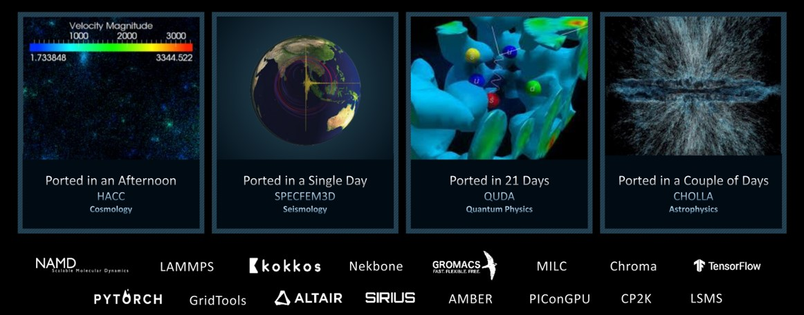
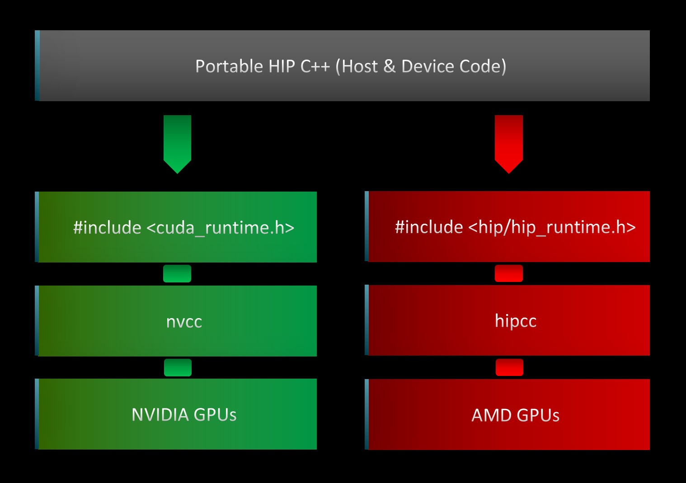
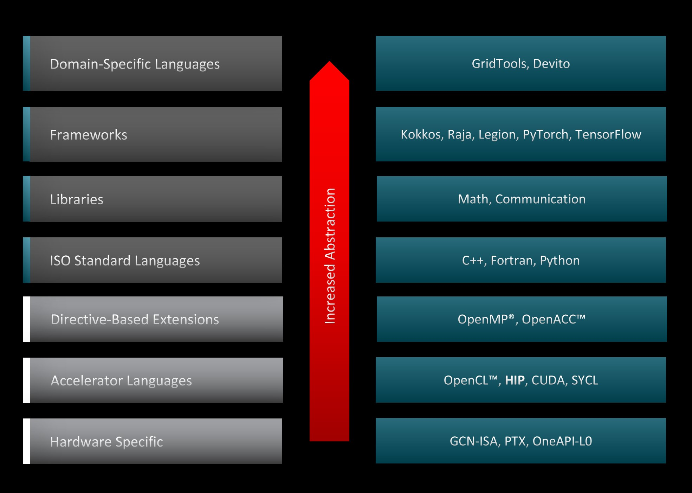

<!---
Copyright (c) 2024 Advanced Micro Devices, Inc. (AMD)

Permission is hereby granted, free of charge, to any person obtaining a copy
of this software and associated documentation files (the "Software"), to deal
in the Software without restriction, including without limitation the rights
to use, copy, modify, merge, publish, distribute, sublicense, and/or sell
copies of the Software, and to permit persons to whom the Software is
furnished to do so, subject to the following conditions:

The above copyright notice and this permission notice shall be included in all
copies or substantial portions of the Software.

THE SOFTWARE IS PROVIDED "AS IS", WITHOUT WARRANTY OF ANY KIND, EXPRESS OR
IMPLIED, INCLUDING BUT NOT LIMITED TO THE WARRANTIES OF MERCHANTABILITY,
FITNESS FOR A PARTICULAR PURPOSE AND NONINFRINGEMENT. IN NO EVENT SHALL THE
AUTHORS OR COPYRIGHT HOLDERS BE LIABLE FOR ANY CLAIM, DAMAGES OR OTHER
LIABILITY, WHETHER IN AN ACTION OF CONTRACT, TORT OR OTHERWISE, ARISING FROM,
OUT OF OR IN CONNECTION WITH THE SOFTWARE OR THE USE OR OTHER DEALINGS IN THE
SOFTWARE.
--->
# Application portability with HIP

Many scientific applications run on AMD-equipped computing platforms and supercomputers,
including [Frontier](https://www.olcf.ornl.gov/frontier/), the first Exascale system in
the world. These applications, coming from a myriad of science domains, were ported to
run on AMD GPUs using the Heterogeneous-compute Interface for Portability (HIP)
abstraction layer. HIP enables these High-Performance Computing (HPC) facilities to
transition their legacy CUDA codes to run and take advantage of the latest AMD GPUs.
The effort involved in porting these scientific applications varies from a few hours
to a few weeks and largely depends on the complexity of the original source code.
Figure 1 shows several examples of applications that have been ported and the
corresponding porting effort.

In this post, we introduce the HIP portability layer, the tools in the AMD ROCm&trade;
stack that can be used to automatically convert CUDA code to HIP, and show how
we can run the same code in both AMD and NVIDIA GPUs with a portable HIP build system.

<!-- 
================
 ### Figure 1
================ -->


<p style="text-align:center">
Figure 1: Porting scientific applications to support AMD Instinct&trade; GPUs wih HIP
</p>

## HIP API

The Heterogeneous-compute Interface for Portability (HIP) is a C++ runtime API and kernel
language that enables developers to design platform-independent GPU programs that can run
on both AMD and NVIDIA GPUs. HIP interface and syntax are very similar to CUDA, which
facilitates its adoption by GPU programmers and enables fast translation of CUDA API calls.
Most of such calls can be converted in place by simply replacing `cuda` with `hip`, as
HIP supports a strong subset of the CUDA runtime functionality. Furthermore, as illustrated
in Figure 2, HIP code provides the ease of maintaining a single code base which can be
run on both AMD and NVIDIA platforms.

<!-- 
================
 ### Figure 2
================ -->


<p style="text-align:center">
Figure 2: HIP to device flowchart illustrating the platform-independent abstraction layer.
</p>

Figure 3 shows the various programming paradigms and tools that could be used to accelerate
codes on the GPUs and the corresponding abstraction level across the system stack. HIP
sits closer to the hardware than other GPU programming abstraction layers, and as such,
it is capable of accelerating codes with minimal overhead. This feature results in HIP
code that runs on NVIDIA accelerators with similar performance as the original CUDA code.
Furthermore, both AMD and NVIDIA share the host-device architecture, where the CPU is the
host and the GPU is the device. The host supports C++, C, Fortran, and Python. C++ is the
most common and best-supported language, with the entry point being the `main()` function.
The host runs the HIP API and HIP function calls that map to either CUDA or HIP. Kernels
run on the device, which supports C-like syntax. Lastly, the HIP API provides many
useful functions for device and memory management, and error handling. HIP is
open-source and you can contribute to it.

<!-- 
================
 ### Figure 3
================ -->


<p style="text-align:center">
Figure 3: GPU programming abstraction levels.
</p>

## Converting CUDA applications to HIP

Manually converting large and complex existing CUDA code projects to HIP is an
error-prone and time-consuming process. Given the syntactic similarity between HIP and
CUDA, it is possible to build automated conversion tools to translate CUDA code to
portable HIP C++. The AMD ROCm&trade; stack has translation utilities and scripts
that significantly speed up the process. These utilities can be used in isolation or combined
as part of an iterative process to port larger, more complex CUDA applications, thus reducing
manual effort and time to deployment of CUDA applications on AMD-based systems.

### What tools to use?

The final choice of the tool or strategy to translate legacy CUDA to HIP depends on
multiple factors, including the code complexity and the developer's design choices.
To elucidate, we encourage developers to use the following questionnaire as a template
to gather more information about their project:

1. *How complex is the code structure*?
    - Uses object-oriented programming?
    - Relies on templated classes?
    - Dependencies on other libraries and packages?
    - Has device-specific code?
2. *What are the design considerations*?
    - Should we maintain separate backends for CUDA and HIP?
3. *Is the code base under active development*?
    - What is the frequency of updates?
    - Are the development efforts focused on a particular feature?

Once the requirements and objectives assessment is complete, developers can choose one
of the following strategies to translate their CUDA code to HIP.

### A unified wrapper/header

In scenarios where maintaining separate code repositories for CUDA and HIP is not
desired and the application does not have any device specific code, one can create a
header file with macro definitions that creates an alias of HIP API calls and links it
to the existing CUDA APIs. Consider the following snippet as an example:

```c++
...
#define cudaFree hipFree
#define cudaFreeArray hipFreeArray
#define cudaFreeHost hipHostFree
#define cudaMalloc hipMalloc
#define cudaMallocArray hipMallocArray
#define cudaMallocHost hipHostMalloc
#define cudaMallocManaged hipMallocManaged
#define cudaMemcpy hipMemcpy
...
```

Here is a [header file](https://github.com/amd/amd-lab-notes/tree/release/hipify/src/gpu_macros.h)
that you can use as a starting point for your porting project.

Alternatively, one can also use macro definitions to build a unified wrapper as
illustrated in the code snippet below. Depending on the architecture the code is
compiled for, the wrappers framework calls the corresponding CUDA or HIP APIs under
the hood.

```c++
...
#ifdef _CUDA_ENABLED
	using deviceStream_t = cudaStream_t;
#elif _HIP_ENABLED
	using deviceStream_t = hipStream_t;
#endif
...
```

|Pros                | Cons                                              |
|:----------------:  | :------------------------------------------------:|
| Easy to maintain   | Can take several iterations to link all CUDA APIs |
| Highly portable    | Existing optimizations in CUDA may not apply to HIP|
| Add new features easily | Requires manual intervention where CUDA APIs do not have any HIP equivalents |

#### General tips

- Starting the port on an NVIDIA GPU is often the easiest approach since you can
incrementally port pieces of the code to HIP while leaving the rest in CUDA. Recall
that on NVIDIA GPUs, HIP is just a thin layer over CUDA, so the two code types can
interoperate on *nvcc* platforms. Also, the HIP port can be compared with the original
CUDA code for function and performance.
- Once the CUDA code is ported to HIP and is running on NVIDIA GPUs, compile the HIP
code using the HIP compiler on an AMD GPU.

### Hipify tools

AMD's ROCm&trade; software stack includes utilities that can help translate CUDA APIs
into HIP APIs. The following two utilities can be found:

- [*hipify-clang*](#hipify-clang): a preprocessor that operates within the
HIP/​Clang compiler tool chain, converting the code as a preliminary step within
the compilation process
- [*hipify-perl*](#hipify-perl): a perl-based script that relies on regular expressions
for translation

The *hipify* tools can scan code to identify any unsupported CUDA functions. A list of
supported CUDA APIs can be found in [ROCm's HIPIFY Documentation website](https://rocm.docs.amd.com/projects/HIPIFY/en/latest/supported_apis.html).

#### Hipify-clang

[hipify-clang](https://github.com/ROCm-Developer-Tools/HIPIFY/tree/master#clang) is a
preprocessor that uses the Clang compiler to parse the CUDA code and perform semantic
translation. It translates CUDA source into an abstract syntax tree, which is traversed
by transformation matchers. After applying all the matchers, the output HIP source is
produced.

|Pros                | Cons                                              |
|:-----------------: | :------------------------------------------------:|
| Clang-based translator, thus even complicated contructs are parsed successfully | Input CUDA code should be correct, incorrect code will not be translated to HIP |
| Supports [Clang options](https://llvm.org/docs/CompileCudaWithLLVM.html#compiling-cuda-code) like `-I`, `-D`, `--cuda-path`, etc.   | CUDA should be installed and provided in case of multiple installations by `--cuda-path` option |
| Seamless support of new CUDA versions as it is Clang's responsibility | All the includes and defines should be provided to transform code successfully |

General usage of *hipify-clang* is given as:

```bash
hipify-clang [options] <source0> [... <sourceN>]
```

where, the available options can be identified by using the command:

```bash
hipify-clang --help
```

Consider a simple [vectorAdd](https://github.com/olcf-tutorials/simple_HIP_examples/blob/master/vector_addition/vector_addition.cu) example,
where the original CUDA code takes two vectors A and B and performs elementwise
addition and stores the values in a new vector C:

```c++
C[i] = A[i] + B[i],                where i=0,1,.....,N-1
```

To convert the CUDA code to HIP, one can use *hipify-clang* as follows:

```bash
hipify-clang --cuda-path=/your-path/to/cuda -I /your-path/to/cuda/include -o /your-path/to/desired-output-dir/vectorAdd_hip.cpp vectorAdd.cu
```

The translated HIP code `vectorAdd_hip.cpp` looks like:

```c++
#include <hip/hip_runtime.h>    
#include <stdio.h>

// Macro for checking errors in CUDA API calls
#define cudaErrorCheck(call)                                                             \
do{                                                                                       \
    hipError_t cuErr = call;                                                             \
    if(hipSuccess != cuErr){                                                             \
      printf("CUDA Error - %s:%d: '%s'\n", __FILE__, __LINE__, hipGetErrorString(cuErr));\
      exit(0);                                                                            \
    }                                                                                     \
}while(0)

// Size of array
#define N 1048576

// Kernel
__global__ void add_vectors_cuda(double *a, double *b, double *c)
{
    int id = blockDim.x * blockIdx.x + threadIdx.x;
    if(id < N) c[id] = a[id] + b[id];
}

// Main program
int main()
{
    // Number of bytes to allocate for N doubles
    size_t bytes = N*sizeof(double);

    // Allocate memory for arrays A, B, and C on host
    double *A = (double*)malloc(bytes);
    double *B = (double*)malloc(bytes);
    double *C = (double*)malloc(bytes);

    // Allocate memory for arrays d_A, d_B, and d_C on device
    double *d_A, *d_B, *d_C;
    cudaErrorCheck( hipMalloc(&d_A, bytes) );
    cudaErrorCheck( hipMalloc(&d_B, bytes) );
    cudaErrorCheck( hipMalloc(&d_C, bytes) );
    ...
```

A quick inspection of the translated code shows:

1. The HIP runtime header has been introduced automatically at the top.
2. CUDA types and APIs such as `cudaError_t`, `cudaMalloc`, etc. have been replaced
with HIP counterparts.
3. User definitions, function names, and variables remain the same.
4. From ROCm 5.3, the default HIP kernel launch syntax is the same as that in CUDA.
The previous `hipLaunchKernelGGL` syntax continues to be supported and can be used by
specifiying the `--hip-kernel-execution-syntax` option to *hipify-clang*.

#### Hipify-perl

[hipify-perl](https://github.com/ROCm-Developer-Tools/HIPIFY/tree/master#perl) script
modifies the CUDA source code directly using a series of simple string replacements.

|Pros                | Cons                                              |
|:-----------------: | :------------------------------------------------:|
| Ease of use | Current disability of transforming the following constructs: macros expansion, namespaces, some templates, host/device function calls, complex argument list parsing |
| It doesn't check the input source CUDA code for correctness | Can take several iterations along with manual intervention |
| It doesn't have dependencies on 3rd party tools, including CUDA | No compiler support to check if includes and defines exists |

General usage of *hipify-perl* is given as:

```bash
hipify-perl [OPTIONS] INPUT_FILE
```

where, the available options can be identified by using the command:

```bash
hipify-perl --help
```

Using the same  [vectorAdd](https://github.com/olcf-tutorials/simple_HIP_examples/blob/master/vector_addition/vector_addition.cu) example,
we can use *hipify-perl* to convert the CUDA code to HIP as follows:

```bash
$ hipify-perl -o=your-path/to/desired-output-dir/vectorAdd_hip.cpp vectorAdd.cu 
  warning: vectorAdd.cu:#4 : #define cudaErrorCheck(call)                                                              \
  warning: vectorAdd.cu:#36 :     cudaErrorCheck( hipMalloc(&d_A, bytes) );
  warning: vectorAdd.cu:#37 :     cudaErrorCheck( hipMalloc(&d_B, bytes) );
  warning: vectorAdd.cu:#38 :     cudaErrorCheck( hipMalloc(&d_C, bytes) );
  warning: vectorAdd.cu:#49 :     cudaErrorCheck( hipMemcpy(d_A, A, bytes, hipMemcpyHostToDevice) );
  warning: vectorAdd.cu:#50 :     cudaErrorCheck( hipMemcpy(d_B, B, bytes, hipMemcpyHostToDevice) );
  warning: vectorAdd.cu:#71 :     cudaErrorCheck( hipMemcpy(C, d_C, bytes, hipMemcpyDeviceToHost) );
  warning: vectorAdd.cu:#90 :     cudaErrorCheck( hipFree(d_A) );
  warning: vectorAdd.cu:#91 :     cudaErrorCheck( hipFree(d_B) );
  warning: vectorAdd.cu:#92 :     cudaErrorCheck( hipFree(d_C) );
```

In contrast to [hipify-clang](#hipify-clang), running the *hipify-perl* script
generates a lot of warnings. Since *hipify-perl* uses string matching and replacements
to translate the supported CUDA APIs to corresponding HIP APIs, it is unable to find a
replacement for the user-defined `cudaErrorCheck()` function and prints out warnings
for each line where it finds this function call. A quick inspection of the translated
code stored in the specified output directory shows:

1. The translated code generated by *hipify-perl* is the same as that translated by
*hipify-clang*.
2. User-defined functions, macros, and variables are not changed.
3. From ROCm v5.3, the default HIP kernel launch syntax is the same as that in CUDA.
The previous `hipLaunchKernelGGL` syntax continues to be supported and can be used by
specifiying the `--hip-kernel-execution-syntax` option to *hipify-perl*.

#### General tips for using Hipify tools

- *hipify-perl* is easier to use and does not rely on third-party libraries like CUDA.
- Translating code with *hipify-perl* may need several iterations. After the first
pass, build the code using `hipcc`. Correct any compiler errors or warnings and compile
again. Continue this cycle until a working HIP code is achieved.
- Other pre-packaged utilities can also be used to help gather information about the
CUDA to HIP code translation. For example, you could use:
  - The [hipexamine-perl.sh](https://github.com/ROCm-Developer-Tools/HIPIFY/blob/master/bin/hipexamine-perl.sh) tool
to scan a source directory to determine which files contain CUDA code and how much of
that code can be automatically hipified.
  - The [hipconvertinplace-perl.sh](https://github.com/ROCm-Developer-Tools/HIPIFY/blob/master/bin/hipconvertinplace-perl.sh)
script to perform in-place conversion for all code files in the specified directory.
- The "in-place" conversion may not always be the right choice, especially if you wish
to have both CUDA and HIP code side-by-side.
- The similarity seen in *hipify-perl* and *hipify-clang* translated codes may hold
true for simple examples such as the one considered here. However, *hipify-perl* has
known limitations and its use should call for caution.

## Portable HIP build system

One of the most powerful features of HIP is that, if the original code is using
[HIP supported CUDA API](https://rocm.docs.amd.com/projects/HIPIFY/en/latest/supported_apis.html),
then the HIP translated code can run on both AMD and NVIDIA GPUs. Currently,
many applications that target both platforms have dual repositories and a build
system for HIP and CUDA, respectively. With ROCm&trade; we can have a portable HIP
build system to avoid maintaining two separate code bases for the same project.

In a portable HIP build system, it is possible to select either an `amd` or an `nvidia`
platform to run on. By setting the `HIP_PLATFORM` environment variable, we can
[choose the path hipcc targets](https://rocm.docs.amd.com/projects/HIP/en/latest/user_guide/faq.html#hip-detected-my-platform-hip-clang-vs-nvcc-incorrectly-what-should-i-do).
If `HIP_PLATFORM=amd`, then `hipcc` will call the clang compiler and the
[ROCclr](https://rocm.docs.amd.com/projects/HIP/en/latest/user_guide/faq.html#what-is-rocclr)
runtime to compile code for AMD GPUs. If `HIP_PLATFORM=nvidia`, then `hipcc` will call `nvcc`,
the [CUDA compiler driver](https://docs.nvidia.com/cuda/cuda-compiler-driver-nvcc/index.html),
to compile
code for NVIDIA GPUs. The platform selection also determines which headers are included
and which libraries are used for linking.

This section shows how to achieve portability with two widely known build systems, Make and CMake.

### Portable Make build system

In the Makefile example below, we can choose to build for either AMD or NVIDIA GPUs by
simply setting `HIP_PLATFORM` to the desired default device, `amd` or `nvidia`. Setting
the `-x` flag to either `cu` or `hip` will instruct the build system to compile to the
desired device regardless of the file extension. However, it should be noted that in
the end, both compilers map to LLVM.

```bash
EXECUTABLE = vectoradd

all: $(EXECUTABLE) test
.PHONY: test

SOURCE = vectorAdd_hip.cpp
CXXFLAGS = -g -O2 -fPIC
HIPCC_FLAGS = -O2 -g
HIP_PLATFORM ?= amd
HIP_PATH ?= $(shell hipconfig --path)

ifeq ($(HIP_PLATFORM), nvidia)
	HIPCC_FLAGS += -x cu -I${HIP_PATH}/include/
	LDFLAGS = -lcudadevrt -lcudart_static -lrt
endif

ifeq ($(HIP_PLATFORM), amd)
   HIPCC_FLAGS += -x hip
   LDFLAGS = -L${ROCM_PATH}/hip/lib -lamdhip64
endif

$(EXECUTABLE):
	hipcc $(HIPCC_FLAGS) $(LDFLAGS) -o $(EXECUTABLE) $(SOURCE)
test:
	./$(EXECUTABLE)
clean:
	rm -f $(EXECUTABLE)
```

For code that will run on an AMD platform, we need to have ROCm&trade; installed, and
set the `CXX` variable to the recommended clang++, e.g.
`export CXX=${ROCM_PATH}/llvm/bin/clang++`, then build with `make` and run the same
[vectorAdd](https://github.com/olcf-tutorials/simple_HIP_examples/blob/master/vector_addition/vector_addition.cu)
application as in the previous section.

```bash
make
./vectoradd
```

For code that will run on an NVIDIA platform, we need to install both CUDA and
ROCm&trade;, which provides the HIP portability layer, and set `HIP_PLATFORM=nvidia`
to override the default and instead compile for NVIDIA GPUs.

```bash
HIP_PLATFORM=nvidia
make
./vectoradd
```

### Portable CMake build system

Similarly to the previous Make example, the idea is to have a build system that allows
users to switch between the two GPU runtimes, HIP and CUDA. The code below shows how to
implement the switching in `CMakeLists.txt`

```bash
...
if (NOT CMAKE_GPU_RUNTIME)
   set(GPU_RUNTIME "HIP" CACHE STRING "Switches between HIP and CUDA")
else (NOT CMAKE_GPU_RUNTIME)
   set(GPU_RUNTIME "${CMAKE_GPU_RUNTIME}" CACHE STRING "Switches between HIP and CUDA")
endif (NOT CMAKE_GPU_RUNTIME)
```

Next, to build the HIP code on both AMD and NVIDIA systems, it is necessary to enable HIP
language support in CMake and setup `hipcc` as the compiler along with corresponding compile
device flags:

```bash
enable_language(HIP)

if (${GPU_RUNTIME} MATCHES "HIP")
   set (VECTORADD_CXX_FLAGS "-fPIC")
elseif (${GPU_RUNTIME} MATCHES "CUDA")
   set (VECTORADD_CXX_FLAGS "-I $ENV{ROCM_PATH}/include")
else ()
   message (FATAL_ERROR "GPU runtime not supported!")
endif ()

set(CMAKE_CXX_COMPILER hipcc)

set (CMAKE_CXX_FLAGS "${CMAKE_CXX_FLAGS} ${VECTORADD_CXX_FLAGS}")
set (CMAKE_CXX_FLAGS_RELEASE "${CMAKE_CXX_FLAGS_RELEASE} ${VECTORADD_CXX_FLAGS}")
set (CMAKE_CXX_FLAGS_DEBUG "${CMAKE_CXX_FLAGS_DEBUG} ${VECTORADD_CXX_FLAGS} -ggdb")
```

Finally, an executable is created and the target must be linked with the corresponding runtime
on AMD and NVIDIA systems:

```bash
set (SOURCE vectorAdd_hip.cpp)

add_executable(vectoradd ${SOURCE})
if (${GPU_RUNTIME} MATCHES "HIP")
   target_link_libraries (vectoradd "-L$ENV{ROCM_PATH}/lib" amdhip64)
elseif (${GPU_RUNTIME} MATCHES "CUDA")
   target_link_libraries (vectoradd cudadevrt cudart_static rt)   
endif ()
```

Provided that ROCm&trade; and CMake are installed, the code can be configured to run on AMD GPUs
with `cmake` and the executable can be built and launched by running the following commands:

```bash
mkdir build && cd build
cmake ..
make
./vectoradd
```

For code intended to run on NVIDIA GPUs, both CUDA and ROCm&trade; stacks must be installed in
addition to CMake. Similar to the Make example, `HIP_PLATFORM` must be setup and the code
must be configured with the `CUDA` GPU runtime instead:

```bash
mkdir build && cd build
export HIP_PLATFORM=nvidia
cmake -DCMAKE_GPU_RUNTIME=CUDA ..
make
./vectoradd
```

If `HIP_PLATFORM` is not properly setup on NVIDIA systems, CMake and Make will still configure and
build the code, however, run-time errors may be observed, such as this:

```bash
./vectoradd
CUDA Error - vectorAdd_hip.cpp:38: 'invalid device ordinal'
```

On both AMD and NVIDIA GPUs, CMake will detect and build GPU targets for the underlying architecture
automatically, however, in cases where the target must be built for a different architecture, users
can explicitly specify `CMAKE_HIP_ARCHITECTURES` or `CMAKE_CUDA_ARCHITECTURES`. For more details,
refer to CMake [documentation](https://cmake.org/cmake/help/latest/index.html).

## Additional porting considerations

During the porting process, it is important to check for inline PTX assembly code,
CUDA instrinsics, hardcoded dependencies, unsupported functions, any code that limits
the size of the register file on NVIDIA hardware, and any other constructs that the
*hipify* tools cannot convert. Since the hipify tools do not run the application, it
is necessary to manually change any hardcoded constructs, an example being the warp
size set to `32`. For this reason, it is recommended to avoid hardcoding the warp size,
and instead rely on the `WarpSize` device definition, `#define WARPSIZE size`, or
`props.warpSize` to get the right value from the runtime. THe *hipify* tools do not
convert build scripts either. Setting the appropriate flags and paths to build the
newly converted HIP code has to be done manually.

Additional code examples that convert CUDA code to HIP and accompanying portable build
systems are found in the [HIP training series repository](https://github.com/olcf/hip-training-series/tree/master).

## Conclusion

We have shown a variety of ROCm&trade; tools that developers can leverage to convert
their codes from CUDA to HIP. These tools speed up and ease the conversion process
significantly. We have also illustrated one of the most powerful features of HIP, which
is its ability to run on both AMD and NVIDIA GPUs, by showing examples of portable
build systems with both Make and CMake.

Unlike many other GPU-programmming paradigms, the HIP API is a thin layer that sits
close to the hardware, enabling HIP code to run with the same performance as its
counterpart on NVIDIA GPUs.

## Next time

Stay tuned as we release further posts in this series that will cover more advanced
topics. If you have any questions or comments, you can reach out to us on
[GitHub Discussions](https://github.com/amd/amd-lab-notes/discussions).
