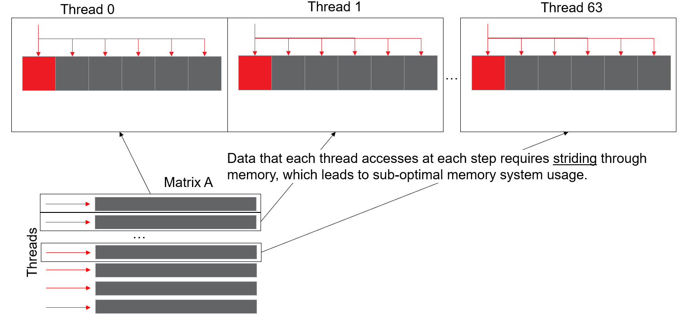
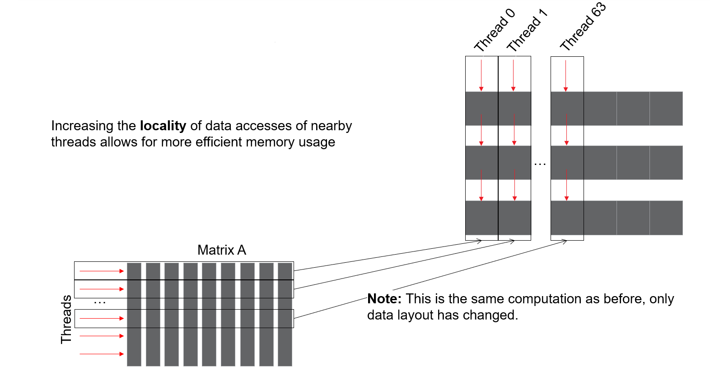
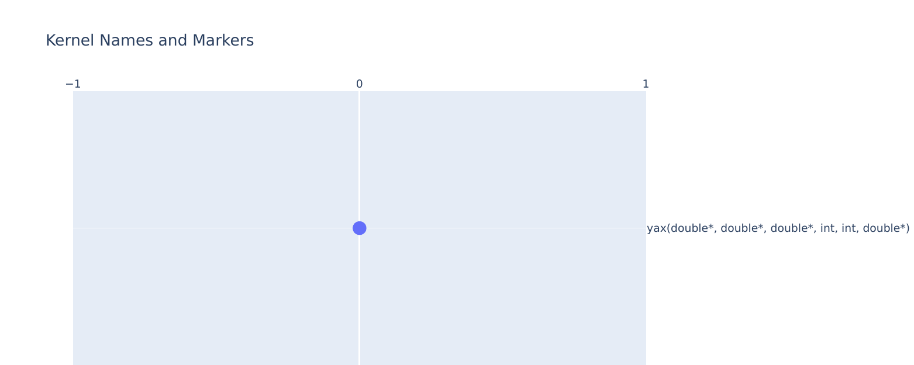
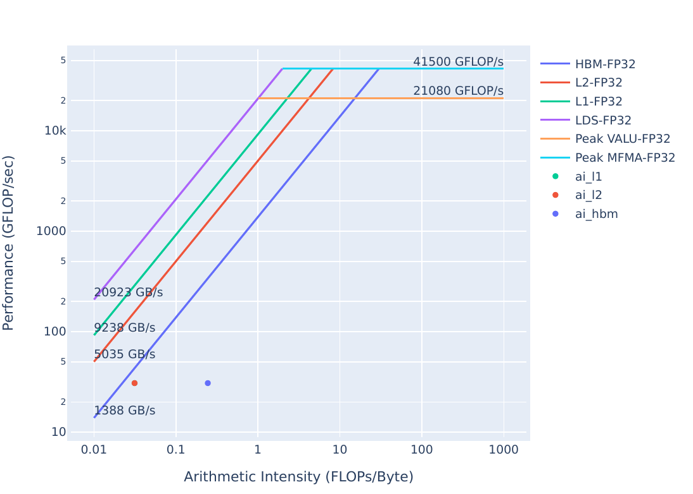
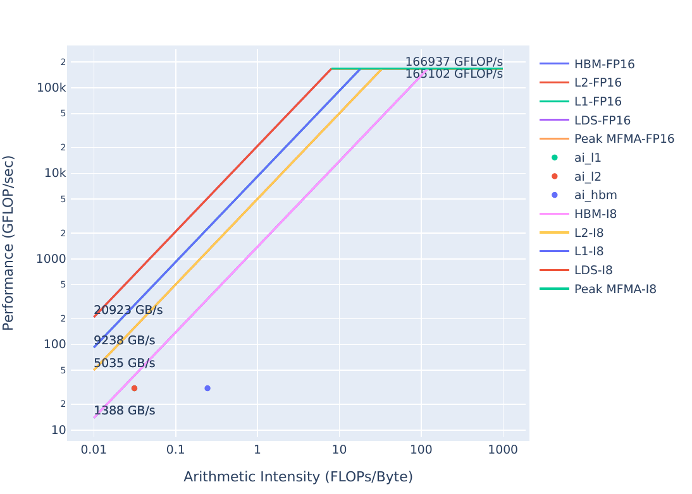
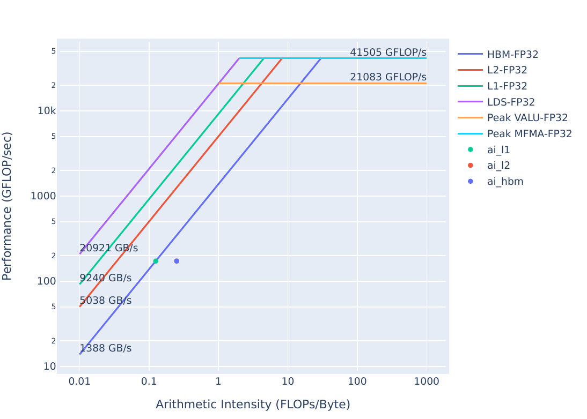

# Exercise 4: Strided Data Access Patterns (and how to find them)

This exercise uses a simple implementation of a yAx kernel to show how difficult strided data access patterns can be to spot in code,
and demonstrates how to use rocprof-compute to begin to diagnose them.

<details>
<summary><h3>Background: Acronyms and terms used in this exercise</h3></summary>
     <ul>
          <li><strong>L1:</strong> Level 1 Cache, the first level cache local to the Compute Unit (CU). If requested data is not found in the L1, the request goes to the L2</li>
          <li><strong>L2:</strong> Level 2 Cache, the second level cache, which is shared by all Compute Units (CUs) on a GPU. If requested data is not found in the L2, the request goes to HBM</li>
          <li><strong>HBM:</strong> High Bandwidth Memory is globally accessible from the GPU, and is a level of memory above the L2 cache</li>
          <li><strong>CU:</strong> The Compute Unit is responsible for executing the User's kernels </li> 
          <li><strong>yAx:</strong> a vector-matrix-vector product, y*A*x, where y and x are vectors, and A is a matrix</li>
          <li><strong>FP(32/16):</strong> 32- or 16-bit Floating Point numeric types</li>
     </ul>
</details>

<details>
<summary><h3>Background: What is a "Strided Data Access Pattern"?</h3></summary>
 Strided data patterns happen when each thread in a wavefront has to access data locations which have a lot of space between them.
 For instance, in the algorithm we've been using, each thread works on a row, and those rows are contiguous in device memory.
 This scenario is depicted below:
 
 Here the memory addresses accessed by threads at each step of the computation have a lot of space between them, 
 which is suboptimal for memory systems, especially on GPUs. To fix this, we have to re-structure the matrix A so 
 that the columns of the matrix are contiguous, which will result in the rows striding, as seen below:
 
 This new data layout has each block of threads accessing a contiguous chunk of device memory, and will use the memory 
 system of the device much more efficiently. Importantly, the only thing that changed is the physical layout of the memory,
 so the result of this computation will be the same as the result of the previous data layout.
</details>

## Results on MI210

**Note:** This exercise was tested on a system with MI210s, on rocprof-compute version `2.0.0` and ROCm `6.0.2`
**ROCperf-compute `2.0.0` is incompatible with ROCm versions lesser than `6.0.0`**

### Initial Roofline Analysis
To start, we want to check the roofline of `problem.exe`, to make sure we are able to improve it.
These plots can be generated with:

```
rocprof-compute profile -n problem_roof_only --roof-only --kernel-names -- ./problem.exe
```
The plots will appear as PDF files in the `./workloads/problem_roof_only/MI200` directory, if generated on MI200 hardware.

They are also provided below for easy reference:

| Roofline Type | Roofline Legend                                                  | Roofline Plot                                                      |
|---------------|------------------------------------------------------------------|--------------------------------------------------------------------|
|FP32/FP64      ||      |
|FP16/INT8      || |

We have plenty of space to improve this kernel, the next step is profiling.

### Exercise Instructions:

To start, let's build and run the problem executable:

```
make
./problem.exe
```
(*simulated output*)
```
yAx time: 70 ms
```

From our other experiments, this time seems reasonable. Let's look closer at the memory system usage with rocprof-compute:

```
rocprof-compute profile -n problem --no-roof -- ./problem.exe
```
(*omitted output*)
```
rocprof-compute analyze -p workloads/problem/MI200 --dispatch 1 --block 16.1 17.1
```
>Previous examples have used specific fields inside metrics, but we can also request a group of metrics with just two numbers (i.e. 16.1 vs. 16.1.1)

These requested metrics are:
- `16.1` L1 memory speed-of-light stats
- `17.1` L2 memory speed-of-light stats

The speed-of-light stats are a more broad overview of how the memory systems are used throughout execution of your kernel.
As such, they're great statistics for seeing if the memory system is generally being used efficiently or not.
Output from the `analyze` command should look like this:

```
 _ __ ___   ___ _ __  _ __ ___  / _|       ___ ___  _ __ ___  _ __  _   _| |_ ___
| '__/ _ \ / __| '_ \| '__/ _ \| |_ _____ / __/ _ \| '_ ` _ \| '_ \| | | | __/ _ \
| | | (_) | (__| |_) | | | (_) |  _|_____| (_| (_) | | | | | | |_) | |_| | ||  __/
|_|  \___/ \___| .__/|_|  \___/|_|        \___\___/|_| |_| |_| .__/ \__,_|\__\___|
               |_|                                           |_|

Analysis mode = cli
[analysis] deriving ROCperf-compute metrics...

--------------------------------------------------------------------------------
0. Top Stats
0.1 Top Kernels
╒════╤══════════════════════════════════════════╤═════════╤═════════════╤═════════════╤══════════════╤════════╕
│    │ Kernel_Name                              │   Count │     Sum(ns) │    Mean(ns) │   Median(ns) │    Pct │
╞════╪══════════════════════════════════════════╪═════════╪═════════════╪═════════════╪══════════════╪════════╡
│  0 │ yax(double*, double*, double*, int, int, │    1.00 │ 70270856.00 │ 70270856.00 │  70270856.00 │ 100.00 │
│    │  double*) [clone .kd]                    │         │             │             │              │        │
╘════╧══════════════════════════════════════════╧═════════╧═════════════╧═════════════╧══════════════╧════════╛
0.2 Dispatch List
╒════╤═══════════════╤═══════════════════════════════════════════════════════════════╤══════════╕
│    │   Dispatch_ID │ Kernel_Name                                                   │   GPU_ID │
╞════╪═══════════════╪═══════════════════════════════════════════════════════════════╪══════════╡
│  0 │             1 │ yax(double*, double*, double*, int, int, double*) [clone .kd] │        8 │
╘════╧═══════════════╧═══════════════════════════════════════════════════════════════╧══════════╛


--------------------------------------------------------------------------------
16. Vector L1 Data Cache
16.1 Speed-of-Light
╒═════════════╤═════════════╤═══════╤═════════════╕
│ Metric_ID   │ Metric      │   Avg │ Unit        │
╞═════════════╪═════════════╪═══════╪═════════════╡
│ 16.1.0      │ Hit rate    │  0.00 │ Pct of peak │
├─────────────┼─────────────┼───────┼─────────────┤
│ 16.1.1      │ Bandwidth   │  8.64 │ Pct of peak │
├─────────────┼─────────────┼───────┼─────────────┤
│ 16.1.2      │ Utilization │ 87.71 │ Pct of peak │
├─────────────┼─────────────┼───────┼─────────────┤
│ 16.1.3      │ Coalescing  │ 25.00 │ Pct of peak │
╘═════════════╧═════════════╧═══════╧═════════════╛


--------------------------------------------------------------------------------
17. L2 Cache
17.1 Speed-of-Light
╒═════════════╤═══════════════════════════════╤════════╤════════╕
│ Metric_ID   │ Metric                        │    Avg │ Unit   │
╞═════════════╪═══════════════════════════════╪════════╪════════╡
│ 17.1.0      │ Utilization                   │  98.66 │ Pct    │
├─────────────┼───────────────────────────────┼────────┼────────┤
│ 17.1.1      │ Bandwidth                     │  28.10 │ Pct    │
├─────────────┼───────────────────────────────┼────────┼────────┤
│ 17.1.2      │ Hit Rate                      │  93.45 │ Pct    │
├─────────────┼───────────────────────────────┼────────┼────────┤
│ 17.1.3      │ L2-Fabric Read BW             │ 125.05 │ Gb/s   │
├─────────────┼───────────────────────────────┼────────┼────────┤
│ 17.1.4      │ L2-Fabric Write and Atomic BW │   0.00 │ Gb/s   │
╘═════════════╧═══════════════════════════════╧════════╧════════╛

```
Looking at this data, we see:
- L1 Cache Hit (`16.1.0`) is 0%, so the kernel's memory requests are never found in the L1.
- L2 Cache Hit (`17.1.2`) is 93.46%, so most requests are found in the L2, with about 7% needing to go out to HBM.
- We are never finding data in the L1 and generating a lot of requests to the L2, so restructuring our data accesses should provide better performance

Since our implementation of yAx simply uses 1 for all values in y, A, and x, we do not have to change how we populate our data.
Since A is implemented as a flat array, we don't need to change our allocation either.
>In real-world use-cases, these considerations add non-trivial development overhead, so data access patterns may be non-trivial to change. 

To observe the performance effects of a different data access pattern, we simply need to change our indexing scheme.
Let's see how this performs by running `solution`:

```
cd solution
make
./solution.exe
```
(*simulated output*)
```
yAx time: 12 ms
```

We see the runtime here is significantly better than our previous kernel, but we need to check how the caches behave now:

```
rocprof-compute profile -n solution --no-roof -- ./solution.exe
```
(*output omitted*)
```
rocprof-compute analyze -p workloads/solution/MI200 --dispatch 1 --block 16.1 17.1
```
The output from this analyze command should look like:
```
 _ __ ___   ___ _ __  _ __ ___  / _|       ___ ___  _ __ ___  _ __  _   _| |_ ___
| '__/ _ \ / __| '_ \| '__/ _ \| |_ _____ / __/ _ \| '_ ` _ \| '_ \| | | | __/ _ \
| | | (_) | (__| |_) | | | (_) |  _|_____| (_| (_) | | | | | | |_) | |_| | ||  __/
|_|  \___/ \___| .__/|_|  \___/|_|        \___\___/|_| |_| |_| .__/ \__,_|\__\___|
               |_|                                           |_|

Analysis mode = cli
[analysis] deriving ROCperf-compute metrics...

--------------------------------------------------------------------------------
0. Top Stats
0.1 Top Kernels
╒════╤══════════════════════════════════════════╤═════════╤═════════════╤═════════════╤══════════════╤════════╕
│    │ Kernel_Name                              │   Count │     Sum(ns) │    Mean(ns) │   Median(ns) │    Pct │
╞════╪══════════════════════════════════════════╪═════════╪═════════════╪═════════════╪══════════════╪════════╡
│  0 │ yax(double*, double*, double*, int, int, │    1.00 │ 12364156.00 │ 12364156.00 │  12364156.00 │ 100.00 │
│    │  double*) [clone .kd]                    │         │             │             │              │        │
╘════╧══════════════════════════════════════════╧═════════╧═════════════╧═════════════╧══════════════╧════════╛
0.2 Dispatch List
╒════╤═══════════════╤═══════════════════════════════════════════════════════════════╤══════════╕
│    │   Dispatch_ID │ Kernel_Name                                                   │   GPU_ID │
╞════╪═══════════════╪═══════════════════════════════════════════════════════════════╪══════════╡
│  0 │             1 │ yax(double*, double*, double*, int, int, double*) [clone .kd] │        8 │
╘════╧═══════════════╧═══════════════════════════════════════════════════════════════╧══════════╛


--------------------------------------------------------------------------------
16. Vector L1 Data Cache
16.1 Speed-of-Light
╒═════════════╤═════════════╤═══════╤═════════════╕
│ Metric_ID   │ Metric      │   Avg │ Unit        │
╞═════════════╪═════════════╪═══════╪═════════════╡
│ 16.1.0      │ Hit rate    │ 49.98 │ Pct of peak │
├─────────────┼─────────────┼───────┼─────────────┤
│ 16.1.1      │ Bandwidth   │ 12.29 │ Pct of peak │
├─────────────┼─────────────┼───────┼─────────────┤
│ 16.1.2      │ Utilization │ 98.12 │ Pct of peak │
├─────────────┼─────────────┼───────┼─────────────┤
│ 16.1.3      │ Coalescing  │ 25.00 │ Pct of peak │
╘═════════════╧═════════════╧═══════╧═════════════╛


--------------------------------------------------------------------------------
17. L2 Cache
17.1 Speed-of-Light
╒═════════════╤═══════════════════════════════╤════════╤════════╕
│ Metric_ID   │ Metric                        │    Avg │ Unit   │
╞═════════════╪═══════════════════════════════╪════════╪════════╡
│ 17.1.0      │ Utilization                   │  98.56 │ Pct    │
├─────────────┼───────────────────────────────┼────────┼────────┤
│ 17.1.1      │ Bandwidth                     │  10.03 │ Pct    │
├─────────────┼───────────────────────────────┼────────┼────────┤
│ 17.1.2      │ Hit Rate                      │   0.52 │ Pct    │
├─────────────┼───────────────────────────────┼────────┼────────┤
│ 17.1.3      │ L2-Fabric Read BW             │ 694.86 │ Gb/s   │
├─────────────┼───────────────────────────────┼────────┼────────┤
│ 17.1.4      │ L2-Fabric Write and Atomic BW │   0.00 │ Gb/s   │
╘═════════════╧═══════════════════════════════╧════════╧════════╛

```
Looking at this data, we see:
- L1 Cache Hit (`16.1.0`) is around 50%, so half the requests to the L1 need to go to the L2.
- L2 Cache Hit (`17.1.2`) is 0.52%, so almost all the requests to the L2 have to go out to HBM.
- L2-Fabric Read BW (`17.1.3`) has increased significantly, due to the increase in L2 cache misses requiring HBM reads.

### Solution Roofline Analysis
We should check where our new kernel stands on the roofline.
These plots can be generated with:

```
rocprof-compute profile -n solution_roof_only --roof-only --kernel-names -- ./solution.exe
```
The plots will appear as PDF files in the `./workloads/problem_roof_only/MI200` directory, if generated on MI200 hardware.

They are also provided below for easy reference:

| Roofline Type | Roofline Legend                                                  | Roofline Plot                                                       |
|---------------|------------------------------------------------------------------|---------------------------------------------------------------------|
|FP32/FP64      ||      |
|FP16/INT8      || |

We appear to be very close to being bound by the HBM bandwidth from the fp32 roofline. 
To get more performance we need to look closer at our algorithm.

### Roofline Comparison

| Roofline Type | Problem Roofline                                                   | Solution Roofline                                                    |
|---------------|--------------------------------------------------------------------|----------------------------------------------------------------------|
| FP32/FP6      |      |       |
| FP16/INT8     | |  |

We see that the HBM roofline point moves up, while the L1/L2 points move up and to the right from problem to solution. This means that our arithmetic intensity is increasing for the caches, so we are moving less data through the caches to do the same computation.

### Summary and Take-aways

This exercise illustrates the at times insidious nature of strided data access patterns. 
They can be difficult to spot in code, but profiling more readily shows when adversarial 
access patterns occur, by showing poor cache hit rates, low cache bandwidth, and potentially low utilization. 
Data access patterns can be non-trivial to change, so these sorts of optimizations can involve significant development and validation overhead.

## Results on MI300A

**Note: Roofline is not available on MI300A at the time of this writing**

For MI300A, if we run the problem.exe and solution.exe, we see different performance.

Running the problem:
```
./problem.exe
```
Shows a runtime like this:
```
9.64 milliseconds
```

While running solution:
```
./solution.exe
```
Shows a runtime like this:
```
12.17 milliseconds
```

Now, if we use rocprof-compute to profile these executables we see much the same stats for MI300A as MI200:
```
rocprof-compute analyze -p workloads/problem/MI300A_A1 --dispatch 1 --block 16.1 17.1
```
Shows
```
 _ __ ___   ___ _ __  _ __ ___  / _|       ___ ___  _ __ ___  _ __  _   _| |_ ___
| '__/ _ \ / __| '_ \| '__/ _ \| |_ _____ / __/ _ \| '_ ` _ \| '_ \| | | | __/ _ \
| | | (_) | (__| |_) | | | (_) |  _|_____| (_| (_) | | | | | | |_) | |_| | ||  __/
|_|  \___/ \___| .__/|_|  \___/|_|        \___\___/|_| |_| |_| .__/ \__,_|\__\___|
               |_|                                           |_|

   INFO Analysis mode = cli
   INFO [analysis] deriving ROCperf-compute metrics...

--------------------------------------------------------------------------------
0. Top Stats
0.1 Top Kernels
╒════╤══════════════════════════════════════════╤═════════╤════════════╤════════════╤══════════════╤════════╕
│    │ Kernel_Name                              │   Count │    Sum(ns) │   Mean(ns) │   Median(ns) │    Pct │
╞════╪══════════════════════════════════════════╪═════════╪════════════╪════════════╪══════════════╪════════╡
│  0 │ yax(double*, double*, double*, int, int, │    1.00 │ 9599042.00 │ 9599042.00 │   9599042.00 │ 100.00 │
│    │  double*) [clone .kd]                    │         │            │            │              │        │
╘════╧══════════════════════════════════════════╧═════════╧════════════╧════════════╧══════════════╧════════╛
0.2 Dispatch List
╒════╤═══════════════╤═══════════════════════════════════════════════════════════════╤══════════╕
│    │   Dispatch_ID │ Kernel_Name                                                   │   GPU_ID │
╞════╪═══════════════╪═══════════════════════════════════════════════════════════════╪══════════╡
│  0 │             1 │ yax(double*, double*, double*, int, int, double*) [clone .kd] │        4 │
╘════╧═══════════════╧═══════════════════════════════════════════════════════════════╧══════════╛


--------------------------------------------------------------------------------
16. Vector L1 Data Cache
16.1 Speed-of-Light
╒═════════════╤═════════════╤═══════╤═════════════╕
│ Metric_ID   │ Metric      │   Avg │ Unit        │
╞═════════════╪═════════════╪═══════╪═════════════╡
│ 16.1.0      │ Hit rate    │  0.00 │ Pct of peak │
├─────────────┼─────────────┼───────┼─────────────┤
│ 16.1.1      │ Bandwidth   │ 23.36 │ Pct of peak │
├─────────────┼─────────────┼───────┼─────────────┤
│ 16.1.2      │ Utilization │ 85.90 │ Pct of peak │
├─────────────┼─────────────┼───────┼─────────────┤
│ 16.1.3      │ Coalescing  │ 25.00 │ Pct of peak │
╘═════════════╧═════════════╧═══════╧═════════════╛


--------------------------------------------------------------------------------
17. L2 Cache
17.1 Speed-of-Light
╒═════════════╤═══════════════════════════════╤════════╤════════╕
│ Metric_ID   │ Metric                        │    Avg │ Unit   │
╞═════════════╪═══════════════════════════════╪════════╪════════╡
│ 17.1.0      │ Utilization                   │  96.87 │ Pct    │
├─────────────┼───────────────────────────────┼────────┼────────┤
│ 17.1.1      │ Bandwidth                     │  55.52 │ Pct    │
├─────────────┼───────────────────────────────┼────────┼────────┤
│ 17.1.2      │ Hit Rate                      │  93.67 │ Pct    │
├─────────────┼───────────────────────────────┼────────┼────────┤
│ 17.1.3      │ L2-Fabric Read BW             │ 908.10 │ Gb/s   │
├─────────────┼───────────────────────────────┼────────┼────────┤
│ 17.1.4      │ L2-Fabric Write and Atomic BW │   0.01 │ Gb/s   │
╘═════════════╧═══════════════════════════════╧════════╧════════╛
```

While analyzing the solution with:
```
rocprof-compute analyze -p workloads/solution/MI300A_A1 --dispatch 1 --block 16.1 17.1
```
Shows:
```
 _ __ ___   ___ _ __  _ __ ___  / _|       ___ ___  _ __ ___  _ __  _   _| |_ ___
| '__/ _ \ / __| '_ \| '__/ _ \| |_ _____ / __/ _ \| '_ ` _ \| '_ \| | | | __/ _ \
| | | (_) | (__| |_) | | | (_) |  _|_____| (_| (_) | | | | | | |_) | |_| | ||  __/
|_|  \___/ \___| .__/|_|  \___/|_|        \___\___/|_| |_| |_| .__/ \__,_|\__\___|
               |_|                                           |_|

   INFO Analysis mode = cli
   INFO [analysis] deriving ROCperf-compute metrics...

--------------------------------------------------------------------------------
0. Top Stats
0.1 Top Kernels
╒════╤══════════════════════════════════════════╤═════════╤═════════════╤═════════════╤══════════════╤════════╕
│    │ Kernel_Name                              │   Count │     Sum(ns) │    Mean(ns) │   Median(ns) │    Pct │
╞════╪══════════════════════════════════════════╪═════════╪═════════════╪═════════════╪══════════════╪════════╡
│  0 │ yax(double*, double*, double*, int, int, │    1.00 │ 12104495.00 │ 12104495.00 │  12104495.00 │ 100.00 │
│    │  double*) [clone .kd]                    │         │             │             │              │        │
╘════╧══════════════════════════════════════════╧═════════╧═════════════╧═════════════╧══════════════╧════════╛
0.2 Dispatch List
╒════╤═══════════════╤═══════════════════════════════════════════════════════════════╤══════════╕
│    │   Dispatch_ID │ Kernel_Name                                                   │   GPU_ID │
╞════╪═══════════════╪═══════════════════════════════════════════════════════════════╪══════════╡
│  0 │             1 │ yax(double*, double*, double*, int, int, double*) [clone .kd] │        4 │
╘════╧═══════════════╧═══════════════════════════════════════════════════════════════╧══════════╛


--------------------------------------------------------------------------------
16. Vector L1 Data Cache
16.1 Speed-of-Light
╒═════════════╤═════════════╤════════╤═════════════╕
│ Metric_ID   │ Metric      │    Avg │ Unit        │
╞═════════════╪═════════════╪════════╪═════════════╡
│ 16.1.0      │ Hit rate    │  75.00 │ Pct of peak │
├─────────────┼─────────────┼────────┼─────────────┤
│ 16.1.1      │ Bandwidth   │   4.63 │ Pct of peak │
├─────────────┼─────────────┼────────┼─────────────┤
│ 16.1.2      │ Utilization │ 100.00 │ Pct of peak │
├─────────────┼─────────────┼────────┼─────────────┤
│ 16.1.3      │ Coalescing  │  25.00 │ Pct of peak │
╘═════════════╧═════════════╧════════╧═════════════╛


--------------------------------------------------------------------------------
17. L2 Cache
17.1 Speed-of-Light
╒═════════════╤═══════════════════════════════╤════════╤════════╕
│ Metric_ID   │ Metric                        │    Avg │ Unit   │
╞═════════════╪═══════════════════════════════╪════════╪════════╡
│ 17.1.0      │ Utilization                   │  98.72 │ Pct    │
├─────────────┼───────────────────────────────┼────────┼────────┤
│ 17.1.1      │ Bandwidth                     │   2.77 │ Pct    │
├─────────────┼───────────────────────────────┼────────┼────────┤
│ 17.1.2      │ Hit Rate                      │   0.68 │ Pct    │
├─────────────┼───────────────────────────────┼────────┼────────┤
│ 17.1.3      │ L2-Fabric Read BW             │ 710.06 │ Gb/s   │
├─────────────┼───────────────────────────────┼────────┼────────┤
│ 17.1.4      │ L2-Fabric Write and Atomic BW │   0.01 │ Gb/s   │
╘═════════════╧═══════════════════════════════╧════════╧════════╛

```

So we see a slowdown despite increasing our L1 hit rate (`16.1.0`) by a large amount. Let's see how the runtime compares to the number of cycles required for problem and solution, as well as atomic latencies per channel for both approaches:

```
rocprof-compute analyze -p workloads/problem/MI300A_A1 -p workloads/solution/MI300A_A1 --dispatch 1 --block 7.2.0 7.2.1 17.2.11 18.8
```
Which shows:
```
 _ __ ___   ___ _ __  _ __ ___  / _|       ___ ___  _ __ ___  _ __  _   _| |_ ___
| '__/ _ \ / __| '_ \| '__/ _ \| |_ _____ / __/ _ \| '_ ` _ \| '_ \| | | | __/ _ \
| | | (_) | (__| |_) | | | (_) |  _|_____| (_| (_) | | | | | | |_) | |_| | ||  __/
|_|  \___/ \___| .__/|_|  \___/|_|        \___\___/|_| |_| |_| .__/ \__,_|\__\___|
               |_|                                           |_|

   INFO Analysis mode = cli
   INFO [analysis] deriving ROCperf-compute metrics...

--------------------------------------------------------------------------------
0. Top Stats
0.1 Top Kernels
╒════╤══════════════════════════════════════════╤═════════╤════════════╤════════════╤════════════╤════════════════════╤════════════╤════════════════════╤══════════════╤════════════════════╤════════╤══════════════╕
│    │ Kernel_Name                              │   Count │ Count      │   Abs Diff │    Sum(ns) │ Sum(ns)            │   Mean(ns) │ Mean(ns)           │   Median(ns) │ Median(ns)         │    Pct │ Pct          │
╞════╪══════════════════════════════════════════╪═════════╪════════════╪════════════╪════════════╪════════════════════╪════════════╪════════════════════╪══════════════╪════════════════════╪════════╪══════════════╡
│  0 │ yax(double*, double*, double*, int, int, │    1.00 │ 1.0 (0.0%) │       0.00 │ 9599042.00 │ 12104495.0 (26.1%) │ 9599042.00 │ 12104495.0 (26.1%) │   9599042.00 │ 12104495.0 (26.1%) │ 100.00 │ 100.0 (0.0%) │
│    │  double*) [clone .kd]                    │         │            │            │            │                    │            │                    │              │                    │        │              │
╘════╧══════════════════════════════════════════╧═════════╧════════════╧════════════╧════════════╧════════════════════╧════════════╧════════════════════╧══════════════╧════════════════════╧════════╧══════════════╛
0.2 Dispatch List
╒════╤═══════════════╤═══════════════════════════════════════════════════════════════╤══════════╕
│    │   Dispatch_ID │ Kernel_Name                                                   │   GPU_ID │
╞════╪═══════════════╪═══════════════════════════════════════════════════════════════╪══════════╡
│  0 │             1 │ yax(double*, double*, double*, int, int, double*) [clone .kd] │        4 │
╘════╧═══════════════╧═══════════════════════════════════════════════════════════════╧══════════╛


--------------------------------------------------------------------------------
7. Wavefront
7.2 Wavefront Runtime Stats
╒═════════════╤═══════════════════════╤═════════════╤═════════════════════╤════════════╤═════════════╤═════════════════════╤═════════════╤═════════════════════╤════════╕
│ Metric_ID   │ Metric                │         Avg │ Avg                 │   Abs Diff │         Min │ Min                 │         Max │ Max                 │ Unit   │
╞═════════════╪═══════════════════════╪═════════════╪═════════════════════╪════════════╪═════════════╪═════════════════════╪═════════════╪═════════════════════╪════════╡
│ 7.2.0       │ Kernel Time (Nanosec) │  9599042.00 │ 12104495.0 (26.1%)  │ 2505453.00 │  9599042.00 │ 12104495.0 (26.1%)  │  9599042.00 │ 12104495.0 (26.1%)  │ Ns     │
├─────────────┼───────────────────────┼─────────────┼─────────────────────┼────────────┼─────────────┼─────────────────────┼─────────────┼─────────────────────┼────────┤
│ 7.2.1       │ Kernel Time (Cycles)  │ 19350602.00 │ 25141619.0 (29.93%) │ 5791017.00 │ 19350602.00 │ 25141619.0 (29.93%) │ 19350602.00 │ 25141619.0 (29.93%) │ Cycle  │
╘═════════════╧═══════════════════════╧═════════════╧═════════════════════╧════════════╧═════════════╧═════════════════════╧═════════════╧═════════════════════╧════════╛


--------------------------------------------------------------------------------
17. L2 Cache
17.2 L2 - Fabric Transactions
╒═════════════╤════════════════╤═════════╤══════════════════╤════════════╤═════════╤══════════════════╤═════════╤══════════════════╤════════╕
│ Metric_ID   │ Metric         │     Avg │ Avg              │   Abs Diff │     Min │ Min
│     Max │ Max              │ Unit   │
╞═════════════╪════════════════╪═════════╪══════════════════╪════════════╪═════════╪══════════════════╪═════════╪══════════════════╪════════╡
│ 17.2.11     │ Atomic Latency │ 6406.73 │ 9547.67 (49.03%) │    3140.94 │ 6406.73 │ 9547.67 (49.03%) │ 6406.73 │ 9547.67 (49.03%) │ Cycles │
╘═════════════╧════════════════╧═════════╧══════════════════╧════════════╧═════════╧══════════════════╧═════════╧══════════════════╧════════╛
```

Atomic Latency `17.2.11` shows that our solution is more stressful on atomics, likely due to our more highly optimized cache access. Fixing striding ironically caused our threads to issue atomics more quickly, degrading our performance!

To fix this, we can attempt to mitigate contention by doing what is called a "shuffle reduction" on each wavefront. This utilizes a HIP intrinsic called `__shfl_down` to reduce numbers across threads in a wavefront without requiring atomics. These implementations can be found in `mi300a_problem` and mi300a_solution`. The code contained in those subdirectories simply implements this shuffle reduction, which allows both problem and solution to only have the first thread of each wavefront issue the atomic add, rather than all threads.

Let's run mi300a_problem.exe and mi300a_solution.exe to see if this addresses our problem:
```
./mi300a_problem.exe
```
shows:
```
yAx time: 9.577708 milliseconds
```
While
```
./mi300a_solution.exe
```
Shows:
```
yAx time: 12.381036 milliseconds
```

Strangely, this seems to have little effect on our runtimes. The reader may notice that these problems are running very quickly, and the reader would be right. The mi300a_problem.exe and mi300a_solution.exe both provide an argument to test different problem sizes. Since we assume our matrix in question is square (for the time being this is an arbitrary assumption -- the kernel is capable of handling rectangular matrices as well), increasing the argument by one increases the problem size nonlinearly. Let's try running at problem size 15:

```
./mi300a_problem.exe 15
```
Shows
```
yAx time: 312.857488 milliseconds
```
And
```
./mi300a_solution.exe 15
```
Shows
```
yAx time: 25.878859 milliseconds
```

It appears that at a smaller problem size, this kernel is more bounded by atomic contention than efficient cache memory usage. It is important to test different problem sizes to ensure that a run of a code being profiled is representative, otherwise the limiters shown in profiling may point optimizations in the wrong direction for a full scale run. As proof of this, you can try manually setting the problem.cpp and solution.cpp problem size to 15, and see that they run in a similar amount of time to mi300a_problem and mi300a_solution. At scale, the memory bandwidth dominates this specific kernel.

