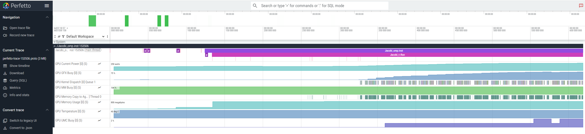
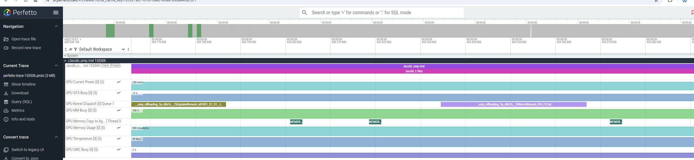
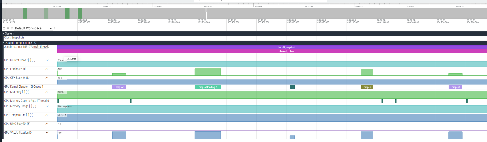

# ROCm&trade; Systems Profiler aka `rocprof-sys`

Note that extensive documentation on how to use `rocprof-sys` (formerly `Omnitrace`) for the [GhostExchange examples](https://github.com/amd/HPCTrainingExamples/tree/main/MPI-examples/GhostExchange) is also available as `README.md` in this exercises repo. The examples there still use the older version of the tool named `Omnitrace`, but basic functionalities did not change.

In the example here we show how to use `rocprof-sys` tools considering the example in [C++ OpenMP Jacobi](https://github.com/amd/HPCTrainingExamples/tree/main/Pragma_Examples/OpenMP/CXX/8_jacobi).

Note that the focus of this exercise is on the `rocprof-sys` profiler, not on how to achieve optimal performance. This exercise was last tested with ROCm 7.0.1 on the MI300A AAC6 cluster.

First, start by cloning the HPCTrainingExamples repository:

```
git clone https://github.com/amd/HPCTrainingExamples.git
```

## Environment setup

Follow the environment setup for the OpenMP C++ Jacobi training example (if not done already previously). Load a rocm module that contains `rocprof-sys`. If necessary, load any additional modules, as how `rocprof-sys` is set up may depend on the system you are using.

```
module load rocm/7.0.1
rocprof-sys-run --version
```

## Build and run the application

Build according to the Jacobi exercise instructions. No profiling yet, just check that the code compiles and runs correctly:

```
cd HPCTrainingExamples/Pragma_Examples/OpenMP/CXX/8_jacobi/2_jacobi_targetdata
make COMPILER_OMP=amdclang++
./Jacobi_omp -m 1024 1024
```

The above run should show output that looks like this:

```
Domain size : 1024 x 1024
Starting Jacobi run
Iteration:0 - Residual:0.0442805
Iteration:100 - Residual:0.0012517
Iteration:200 - Residual:0.000743772
Iteration:300 - Residual:0.000548562
Iteration:400 - Residual:0.000441992
Iteration:500 - Residual:0.000373802
Iteration:600 - Residual:0.000325969
Iteration:700 - Residual:0.00029033
Iteration:800 - Residual:0.000262622
Iteration:900 - Residual:0.000240382
Iteration:1000 - Residual:0.000222088
Stopped after 1000 with residue:0.000222088
Total Jacobi run time: 0.1656 sec.
Measured lattice updates: 6.33 GLU/s
Measured FLOPS: 107.65 GFLOPS
Measured device bandwidth: 607.92 GB/s
Measured AI=0.177083
```

Note that the reported measured performance data will vary depending on the system, environment setup and compiler used. Moreover, the problem size specified with `-m` has a large influence on the measured performance.

## Simple (default) approach

Run:
```
rocprof-sys-run --profile --trace --include ompt -- ./Jacobi_omp -m 1024 1024
```

This should create a new folder within the current directory containing the profiling output.
Inspect the `wall_clock*` files and visualize the `.proto` files in `Perfetto` using the instructions below.

**DONE!**

However, if you need more control over what you want to profile and analyze, check the following steps.

## `rocprof-sys` config (optional)

First, generate the `rocprof-sys` configuration file, and ensure that this file is known to `rocprof-sys`. 

```
rocprof-sys-avail -G ~/.rocprofsys.cfg
export ROCPROFSYS_CONFIG_FILE=~/.rocprofsys.cfg
```

Second, you can inspect the configuration file and possibly change some variables:

```
vi $ROCPROFSYS_CONFIG_FILE
```
For example, one can modify the following lines to:

```
ROCPROFSYS_PROFILE                                  = true
```

You can see what flags can be included in the config file by doing:

```
rocprof-sys-avail --categories rocprofsys
```

To add brief descriptions, use the `-bd` option:

```
rocprof-sys-avail -bd --categories rocprofsys
```

Note that the list of flags displayed by the commands above may not include all actual flags that can be set in the config. For a full list of options, please read the [rocprof-sys documentation](https://rocm.docs.amd.com/projects/rocprofiler-systems/en/latest/index.html).

You can also create a configuration file with description per option. Beware, this is quite verbose:

```
rocprof-sys-avail -G ~/rocprofsys_all.cfg --all
```

## Instrument application binary (optional)

You can instrument the binary and inspect which functions were instrumented (note that you need to change `<TIMESTAMP>` according to your generated folder path). 

```
rocprof-sys-instrument -o ./Jacobi_omp.inst -- ./Jacobi_omp
```

Currently `rocprof-sys` will instrument by default only the functions with >1024 instructions, so you may need to change it by using `-i #inst` or by adding `--function-include function_name` to select the functions you are interested in. Check more options using `rocprof-sys-instrument --help` or by reading the [rocprof-sys documentation](https://rocm.docs.amd.com/projects/rocprofiler-systems/en/latest/index.html).

Let's instrument one of the most important Jacobi functions.

```
rocprof-sys-instrument --function-include 'Jacobi_t::Run' -o ./Jacobi_omp.inst -- ./Jacobi_omp
```

The output should show that only these functions have been instrumented:

```
...
[rocprof-sys][exe] Finding instrumentation functions...
[rocprof-sys][exe]    1 instrumented funcs in /shared/midgard/home/johanna_potyka_q6m/HPCTrainingExamples/Pragma_Examples/OpenMP/CXX/8_jacobi/2_jacobi_targetdata/build/omp/Jacobi.cpp
...
```

This can also be verified with:

```
$ cat rocprofsys-Jacobi_omp.inst-output/<TIMESTAMP>/instrumentation/instrumented.txt

    StartAddress   AddressRange  #Instructions  Ratio Linkage Visibility  Module                                                                                   Function              FunctionSignature
      0x218910           1343            286   4.70  unknown    unknown /shared/midgard/home/johanna_potyka_q6m/HPCTrainingExamples/Pragma_Examples/O...         Jacobi_t::Run         Jacobi_t::Run
```

## Run instrumented binary

Now that we have a new application binary where the most important function is instrumented, we can profile it using `rocprof-sys-run`:

```
rocprof-sys-run -- ./Jacobi_omp.inst -m 1024 1024
```

Running with the tool will take a few milliseconds longer. There is an overhead of the tool, but note that we are exploring a very small problem size here for educational reasons. Experiment with the problem size to see the overhead impact for larger problem sizes.

Check the command line output generated by `rocprof-sys-run`, it contains some useful overviews and **paths to generated files**. Observe in the reported performance numbers that the overhead to the application runtime is small. If you had previously set `ROCPROFSYS_PROFILE=true`, inspect `wall_clock-0.txt` which includes information on the function calls made in the code, such as how many times these calls have been called (`COUNT`) and the time in seconds they took in total (`SUM`).

```
cat rocprofsys-Jacobi_omp.inst-output/<TIMESTAMP>/wall_clock-<pid>.txt

|-----------------------------------------------------------------------------------------------------------------------------------------------------------------------------------------------------|
|                                                                               REAL-CLOCK TIMER (I.E. WALL-CLOCK TIMER)                                                                              |
|-----------------------------------------------------------------------------------------------------------------------------------------------------------------------------------------------------|
|                                      LABEL                                       | COUNT  | DEPTH  |   METRIC   | UNITS  |   SUM    |   MEAN   |   MIN    |   MAX    |   VAR    | STDDEV   | % SELF |
|----------------------------------------------------------------------------------|--------|--------|------------|--------|----------|----------|----------|----------|----------|----------|--------|
| |0>>> mbind                                                                      |     17 |      0 | wall_clock | sec    | 0.000216 | 0.000013 | 0.000003 | 0.000091 | 0.000000 | 0.000022 |  100.0 |
| |0>>> pthread_create                                                             |      3 |      0 | wall_clock | sec    | 0.011804 | 0.003935 | 0.003717 | 0.004326 | 0.000000 | 0.000340 |    0.0 |
| |2>>> |_start_thread                                                             |      1 |      1 | wall_clock | sec    | 0.000013 | 0.000013 | 0.000013 | 0.000013 | 0.000000 | 0.000000 |  100.0 |
| |3>>> |_start_thread                                                             |      1 |      1 | wall_clock | sec    | 0.551036 | 0.551036 | 0.551036 | 0.551036 | 0.000000 | 0.000000 |  100.0 |
| |1>>> |_start_thread                                                             |      1 |      1 | wall_clock | sec    | 0.594270 | 0.594270 | 0.594270 | 0.594270 | 0.000000 | 0.000000 |  100.0 |
| |0>>> Jacobi_omp.inst                                                            |      1 |      0 | wall_clock | sec    | 0.504237 | 0.504237 | 0.504237 | 0.504237 | 0.000000 | 0.000000 |    3.0 |
| |0>>> |_pthread_create                                                           |      1 |      1 | wall_clock | sec    | 0.003763 | 0.003763 | 0.003763 | 0.003763 | 0.000000 | 0.000000 |    0.0 |
| |4>>>   |_start_thread                                                           |      1 |      2 | wall_clock | sec    | 0.514166 | 0.514166 | 0.514166 | 0.514166 | 0.000000 | 0.000000 |  100.0 |
| |0>>> |_Jacobi_t::Run                                                            |      1 |      1 | wall_clock | sec    | 0.485399 | 0.485399 | 0.485399 | 0.485399 | 0.000000 | 0.000000 |   99.9 |
| |0>>>   |_mbind                                                                  |     11 |      2 | wall_clock | sec    | 0.000204 | 0.000019 | 0.000004 | 0.000073 | 0.000000 | 0.000021 |  100.0 |
| |0>>>   |_MEMORY_COPY_DEVICE_TO_DEVICE                                           |   3016 |      2 | wall_clock | sec    | 0.000135 | 0.000000 | 0.000000 | 0.000000 | 0.000000 | 0.000000 |  100.0 |
| |0>>>   |___omp_offloading_3a_d8d1b__Z4NormR6mesh_tPd_l13.kd                     |   1001 |      2 | wall_clock | sec    | 0.000047 | 0.000000 | 0.000000 | 0.000001 | 0.000000 | 0.000000 |  100.0 |
| |0>>>   |___omp_offloading_3a_d8d18__Z9LaplacianR6mesh_tddPdS1__l19.kd           |   1000 |      2 | wall_clock | sec    | 0.000045 | 0.000000 | 0.000000 | 0.000000 | 0.000000 | 0.000000 |  100.0 |
| |0>>>   |___omp_offloading_3a_d8d0e__Z18BoundaryConditionsR6mesh_tddPdS1__l18.kd |   1000 |      2 | wall_clock | sec    | 0.000047 | 0.000000 | 0.000000 | 0.000001 | 0.000000 | 0.000000 |  100.0 |
| |0>>>   |___omp_offloading_3a_d8d1c__Z6UpdateR6mesh_tdPdS1_S1_S1__l17.kd         |   1000 |      2 | wall_clock | sec    | 0.000045 | 0.000000 | 0.000000 | 0.000000 | 0.000000 | 0.000000 |  100.0 |
|-----------------------------------------------------------------------------------------------------------------------------------------------------------------------------------------------------|
```

**In many cases, simply checking the wall_clock files might be sufficient for your profiling!**

If it is not, continue by visualizing the trace.

## Visualizing traces using `Perfetto`

Copy the generated `perfetto-trace-0.proto` file to your local machine, and using the Chrome browser open the web page [https://ui.perfetto.dev/](https://ui.perfetto.dev/):

Click `Open trace file` and select the `perfetto-trace-<pid>.proto` file. Below, you can see an example of how the trace file would be visualized in `Perfetto`:



If you zoom in, you can see the kernels (use WASD keys to zoom and move, or press Ctrl + scroll mouse):


If there is an error opening trace file, try using an older `Perfetto` version, e.g., by opening the web page [https://ui.perfetto.dev/v46.0-35b3d9845/#!/](https://ui.perfetto.dev/v46.0-35b3d9845/#!/).

## Additional features
### Flat profiles

Append the advanced option `ROCPROFSYS_FLAT_PROFILE=true` to `~/.rocprofsys.cfg` or prepend it to the run command:

```
ROCPROFSYS_FLAT_PROFILE=true rocprof-sys-run -- ./Jacobi_omp.inst -m 1024 1024
```

The `rocprofsys-Jacobi_omp.inst-output/<TIMESTAMP>/wall_clock-<pid>.txt` file now shows the overall time in seconds for each function without hierarchy (which may be easier to look at).

```
cat rocprofsys-Jacobi_omp.inst-output/<TIMESTAMP>/wall_clock-<pid>.txt
|-------------------------------------------------------------------------------------------------------------------------------------------------------------------------------------------------|
|                                                                             REAL-CLOCK TIMER (I.E. WALL-CLOCK TIMER)                                                                            |
|-------------------------------------------------------------------------------------------------------------------------------------------------------------------------------------------------|
|                                    LABEL                                     | COUNT  | DEPTH  |   METRIC   | UNITS  |   SUM    |   MEAN   |   MIN    |   MAX    |   VAR    | STDDEV   | % SELF |
|------------------------------------------------------------------------------|--------|--------|------------|--------|----------|----------|----------|----------|----------|----------|--------|
| |0>>> mbind                                                                  |     28 |      0 | wall_clock | sec    | 0.000482 | 0.000017 | 0.000003 | 0.000146 | 0.000000 | 0.000031 |  100.0 |
| |0>>> pthread_create                                                         |      4 |      0 | wall_clock | sec    | 0.015467 | 0.003867 | 0.003737 | 0.004205 | 0.000000 | 0.000226 |  100.0 |
| |0>>> Jacobi_omp.inst                                                        |      1 |      0 | wall_clock | sec    | 0.508704 | 0.508704 | 0.508704 | 0.508704 | 0.000000 | 0.000000 |  100.0 |
| |0>>> Jacobi_t::Run                                                          |      1 |      0 | wall_clock | sec    | 0.490124 | 0.490124 | 0.490124 | 0.490124 | 0.000000 | 0.000000 |  100.0 |
| |2>>> start_thread                                                           |      1 |      0 | wall_clock | sec    | 0.000011 | 0.000011 | 0.000011 | 0.000011 | 0.000000 | 0.000000 |  100.0 |
| |4>>> start_thread                                                           |      1 |      0 | wall_clock | sec    | 0.519817 | 0.519817 | 0.519817 | 0.519817 | 0.000000 | 0.000000 |  100.0 |
| |3>>> start_thread                                                           |      1 |      0 | wall_clock | sec    | 0.556519 | 0.556519 | 0.556519 | 0.556519 | 0.000000 | 0.000000 |  100.0 |
| |1>>> start_thread                                                           |      1 |      0 | wall_clock | sec    | 0.600203 | 0.600203 | 0.600203 | 0.600203 | 0.000000 | 0.000000 |  100.0 |
| |0>>> MEMORY_COPY_DEVICE_TO_DEVICE                                           |   3016 |      0 | wall_clock | sec    | 0.000138 | 0.000000 | 0.000000 | 0.000000 | 0.000000 | 0.000000 |  100.0 |
| |0>>> __omp_offloading_3a_d8d1b__Z4NormR6mesh_tPd_l13.kd                     |   1001 |      0 | wall_clock | sec    | 0.000046 | 0.000000 | 0.000000 | 0.000000 | 0.000000 | 0.000000 |  100.0 |
| |0>>> __omp_offloading_3a_d8d18__Z9LaplacianR6mesh_tddPdS1__l19.kd           |   1000 |      0 | wall_clock | sec    | 0.000045 | 0.000000 | 0.000000 | 0.000000 | 0.000000 | 0.000000 |  100.0 |
| |0>>> __omp_offloading_3a_d8d1c__Z6UpdateR6mesh_tdPdS1_S1_S1__l17.kd         |   1000 |      0 | wall_clock | sec    | 0.000046 | 0.000000 | 0.000000 | 0.000001 | 0.000000 | 0.000000 |  100.0 |
| |0>>> __omp_offloading_3a_d8d0e__Z18BoundaryConditionsR6mesh_tddPdS1__l18.kd |   1000 |      0 | wall_clock | sec    | 0.000046 | 0.000000 | 0.000000 | 0.000000 | 0.000000 | 0.000000 |  100.0 |
|-------------------------------------------------------------------------------------------------------------------------------------------------------------------------------------------------|
```

Depending on what you try to investigate this may be an option to find out how much time is spent in each routine independent of th ceall tree.

### Hardware counters

To see a list of all the counters for all the devices on the node, do:

```
rocprof-sys-avail --all
```

Note that the output is very verbose. Select the counter you are interested in, and then declare them in your configuration file (or prepend to your run command):

```
ROCPROFSYS_ROCM_EVENTS = VALUUtilization,FetchSize
```

Run the instrumented binary, and you will observe an output file for each hardware counter specified. You should also see a row for each hardware counter in the `Perfetto` trace generated by `rocprof-sys`. Note that the files are generated as a flat profile if ```ROCPROFSYS_FLAT_PROFILE=true``` is still in the config.

Note that you do not have to instrument again after making changes to the config file. Just running the instrumented binary picks up the changes.

```
ROCPROFSYS_ROCM_EVENTS=VALUUtilization,FetchSize rocprof-sys-run -- ./Jacobi_omp.inst -m 1024 1024
cat rocprof-sys-Jacobi_omp.inst-output/<TIMESTAMP>/rocprof-device-0-VALUUtilization-<pid>.txt
```

This will show you the output of one of the selected counters in the text file. `Perfetto` output should look like the following:



### Sampling

To reduce the overhead of profiling and inspect call stack, one can use sampling. Set the following in your configuration file (or prepend to your run command):

```
ROCPROFSYS_USE_SAMPLING = true
ROCPROFSYS_SAMPLING_FREQ = 100
```

Execute the instrumented binary, inspect `sampling*` files and visualize the `Perfetto` trace:

```
rocprof-sys-run -- ./Jacobi_omp.inst -m 1024 1024
```

The following will show you the files now generated with sampling:

```
ls rocprofsys-Jacobi_omp.inst-output/<TIMESTAMP>/* | grep sampling
```

In the `Perfetto` trace, search for the `Thread X (S) PID` rows.

### Profiling multiple MPI processes

If you have an MPI application, you can run the instrumented binary with multiple MPI ranks. Note separate output files for each rank, including `perfetto-trace-*.proto` and `wall_clock-*.txt` files. This is not further addressed in this exercise, but it is described in detail in [GhostExchange examples](https://github.com/amd/HPCTrainingExamples/tree/main/MPI-examples/GhostExchange).


## Next steps

Try to use `rocprof-sys` to profile [GhostExchange examples](https://github.com/amd/HPCTrainingExamples/tree/main/MPI-examples/GhostExchange). Note that the Ghost Exchange OpenMP example is still for older rocm with`Omnitrace`.

**Finally, try to profile your own application!**

