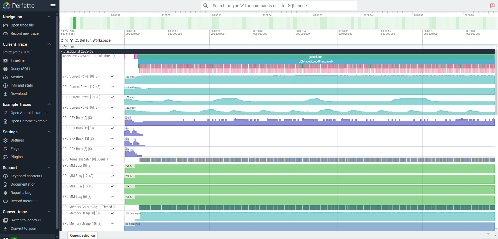
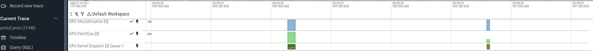

# ROCm&trade; Systems Profiler aka `rocprof-sys`

Note that extensive documentation on how to use `rocprof-sys` (formerly `Omnitrace`) for the [GhostExchange examples](https://github.com/amd/HPCTrainingExamples/tree/main/MPI-examples/GhostExchange) is also available as `README.md` in this exercises repo. The examples there still use the older version of the tool named `Omnitrace`, but basic functionalities did not change.

In the example here we show how to use `rocprof-sys` tools considering the example in [Fortran OpenMP Jacobi](https://github.com/amd/HPCTrainingExamples/tree/main/Pragma_Examples/OpenMP/Fortran/8_jacobi).

Note that the focus of this exercise is on the `rocprof-sys` profiler, not on how to achieve optimal performance. This exercise was last tested with ROCm 7.1.0 on the MI300A AAC6 cluster.

First, start by cloning the HPCTrainingExamples repository:

```
git clone https://github.com/amd/HPCTrainingExamples.git
```

## Environment setup

Follow the environment setup for the OpenMP Fortran Jacobi training example (if not done already previously). Load a rocm module that contains `rocprof-sys`. If necessary, load any additional modules, as how `rocprof-sys` is set up may depend on the system you are using. For this example, amdflang compiler provided in rocm/7.1 is sufficient, but for some other exercises or your code you might also want to additionally load the latest rocm-afar module containing the latest compiler version.

```
module load rocm/7.1.0
rocprof-sys-run --version
```

For now unset the `HSA_XNACK` environment variable:

```
export HSA_XNACK=0
```

## Build and run the application

Build according to the Jacobi exercise instructions. No profiling yet, just check that the code compiles and runs correctly:

```
cd HPCTrainingExamples/Pragma_Examples/OpenMP/Fortran/8_jacobi/1_jacobi_usm
make clean
make FC=amdflang
./jacobi -m 1024
```

The above run should show output that looks like this:

```
Domain size:  1024 x  1024
Starting Jacobi run
Iteration:    0 - Residual: 4.42589E-02
Iteration:  100 - Residual: 1.25109E-03
Iteration:  200 - Residual: 7.43407E-04
Iteration:  300 - Residual: 5.48292E-04
Iteration:  400 - Residual: 4.41773E-04
Iteration:  500 - Residual: 3.73617E-04
Iteration:  600 - Residual: 3.25807E-04
Iteration:  700 - Residual: 2.90186E-04
Iteration:  800 - Residual: 2.62490E-04
Iteration:  900 - Residual: 2.40262E-04
Iteration: 1000 - Residual: 2.21976E-04
Stopped after 1000 iterations with residue: 2.21976E-04
Total Jacobi run time: ***** sec.
Measured lattice updates: 0.087 LU/s
Effective Flops:   1.5 GFlops
Effective device bandwidth: 0.008 TB/s
Effective AI=0.177
```

Note that the reported measured performance data will vary depending on the system, environment setup and compiler used. Moreover, the problem size specified with `-m` has a large influence on the measured performance.

## Simple (default) approach

Run:
```
rocprof-sys-run --profile --trace --include ompt -- ./jacobi -m 1024
```

This should create a new folder within the current directory containing the profiling output.
Inspect the `wall_clock*` files and visualize the `.proto` files in `Perfetto` using the instructions below.

**DONE!**

However, if you need more control over what you want to profile and analyze, check the following steps.

## `rocprof-sys` config (optional)

First, generate the `rocprof-sys` configuration file, and ensure that this file is known to `rocprof-sys`. 

```
rocprof-sys-avail -G ~/.rocprofsys.cfg
export ROCPROFSYS_CONFIG_FILE=~/.rocprofsys.cfg
```

Second, you can inspect the configuration file and possibly change some variables:

```
vi $ROCPROFSYS_CONFIG_FILE
```
For example, one can modify the following lines to:

```
ROCPROFSYS_PROFILE                                  = true
```

You can see what flags can be included in the config file by doing:

```
rocprof-sys-avail --categories rocprofsys
```

To add brief descriptions, use the `-bd` option:

```
rocprof-sys-avail -bd --categories rocprofsys
```

Note that the list of flags displayed by the commands above may not include all actual flags that can be set in the config. For a full list of options, please read the [rocprof-sys documentation](https://rocm.docs.amd.com/projects/rocprofiler-systems/en/latest/index.html).

You can also create a configuration file with description per option. Beware, this is quite verbose:

```
rocprof-sys-avail -G ~/rocprofsys_all.cfg --all
```

## Instrument application binary (optional)

You can instrument the binary and inspect which functions were instrumented (note that you need to change `<TIMESTAMP>` according to your generated folder path). 

```
rocprof-sys-instrument -o ./jacobi.inst -- ./jacobi
```

Currently `rocprof-sys` will instrument by default only the functions with >1024 instructions, so you may need to change it by using `-i #inst` and/or by adding `--function-include function_name` to select the functions you are interested in. Check more options using `rocprof-sys-instrument --help` or by reading the [rocprof-sys documentation](https://rocm.docs.amd.com/projects/rocprofiler-systems/en/latest/index.html).

Let's instrument few most important Jacobi functions.

```
rocprof-sys-instrument --function-include 'norm' 'run_jacobi' -i 6000 -o ./jacobi.inst -- ./jacobi
```

The output should show that only the following functions have been instrumented:

```
...
[rocprof-sys][exe] Finding instrumentation functions...
[rocprof-sys][exe]    1 instrumented funcs in /shared/prerelease/home/luka_stanisic_q6m/rocprofiler-sys/HPCTrainingExamples/Pragma_Examples/OpenMP/Fortran/8_jacobi/1_jacobi_usm/jacobi.f90
[rocprof-sys][exe]    3 instrumented funcs in /shared/prerelease/home/luka_stanisic_q6m/rocprofiler-sys/HPCTrainingExamples/Pragma_Examples/OpenMP/Fortran/8_jacobi/1_jacobi_usm/norm.f90
...
```

This can also be verified with:

```
$ cat rocprofsys-jacobi.inst-output/<TIMESTAMP>/instrumentation/instrumented.txt

  StartAddress   AddressRange  #Instructions  Ratio Linkage Visibility  Module                                                                                   Function                                                           FunctionSignature
      0x22d550           3324            570   5.83  unknown    unknown /shared/prerelease/home/luka_stanisic_q6m/rocprofiler-sys/HPCTrainingExamples...         _QMjacobi_modPrun_jacobi                                           _QMjacobi_modPrun_jacobi
      0x22ad10            775            129   6.01  unknown    unknown /shared/prerelease/home/luka_stanisic_q6m/rocprofiler-sys/HPCTrainingExamples...         _QMnorm_modPnorm                                                   _QMnorm_modPnorm
      0x22b0a0            499            126   3.96  unknown    unknown /shared/prerelease/home/luka_stanisic_q6m/rocprofiler-sys/HPCTrainingExamples...         __omp_offloading_2f_5a9c9d__QMnorm_modPnorm_l23..omp_par.2         __omp_offloading_2f_5a9c9d__QMnorm_modPnorm_l23..omp_par.2
      0x22b020            115             31   3.71  unknown    unknown /shared/prerelease/home/luka_stanisic_q6m/rocprofiler-sys/HPCTrainingExamples...         __omp_offloading_2f_5a9c9d__QMnorm_modPnorm_l23..omp_par.3         __omp_offloading_2f_5a9c9d__QMnorm_modPnorm_l23..omp_par.3
```

## Run instrumented binary

Now that we have a new application binary where the most important functions are instrumented, we can profile it using `rocprof-sys-run`:

```
rocprof-sys-run -- ./jacobi.inst -m 1024
```

Running with the tool will take a few milliseconds longer. There is an overhead of the tool, but note that we are exploring a very small problem size here for educational reasons. Experiment with the problem size to see the overhead impact for larger problem sizes.

Check the command line output generated by `rocprof-sys-run`, it contains some useful overviews and **paths to generated files**. Observe in the reported performance numbers that the overhead to the application runtime is small. If you had previously set `ROCPROFSYS_PROFILE=true`, inspect `wall_clock-<pid>.txt` which includes information on the function calls made in the code, such as how many times these calls have been called (`COUNT`) and the time in seconds they took in total (`SUM`).

```
cat rocprofsys-jacobi.inst-output/<TIMESTAMP>/wall_clock-<pid>.txt

|----------------------------------------------------------------------------------------------------------------------------------------------------------------------------------------------------|
|                                                                              REAL-CLOCK TIMER (I.E. WALL-CLOCK TIMER)                                                                              |
|----------------------------------------------------------------------------------------------------------------------------------------------------------------------------------------------------|
|                                     LABEL                                       | COUNT  | DEPTH  |   METRIC   | UNITS  |   SUM    |   MEAN   |   MIN    |   MAX    |   VAR    | STDDEV   | % SELF |
|---------------------------------------------------------------------------------|--------|--------|------------|--------|----------|----------|----------|----------|----------|----------|--------|
| |0>>> mbind                                                                     |     79 |      0 | wall_clock | sec    | 0.000728 | 0.000009 | 0.000002 | 0.000142 | 0.000000 | 0.000020 |  100.0 |
| |0>>> pthread_create                                                            |      3 |      0 | wall_clock | sec    | 0.011366 | 0.003789 | 0.003387 | 0.004242 | 0.000000 | 0.000430 |    0.0 |
| |2>>> |_start_thread                                                            |      1 |      1 | wall_clock | sec    | 0.000016 | 0.000016 | 0.000016 | 0.000016 | 0.000000 | 0.000000 |  100.0 |
| |1>>> |_start_thread                                                            |      1 |      1 | wall_clock | sec    | 8.524168 | 8.524168 | 8.524168 | 8.524168 | 0.000000 | 0.000000 |  100.0 |
| |3>>> |_start_thread                                                            |      1 |      1 | wall_clock | sec    | 8.506869 | 8.506869 | 8.506869 | 8.506869 | 0.000000 | 0.000000 |  100.0 |
| |0>>> jacobi.inst                                                               |      1 |      0 | wall_clock | sec    | 8.447321 | 8.447321 | 8.447321 | 8.447321 | 0.000000 | 0.000000 |    0.8 |
| |0>>> |__QMjacobi_modPrun_jacobi                                                |      1 |      1 | wall_clock | sec    | 8.380557 | 8.380557 | 8.380557 | 8.380557 | 0.000000 | 0.000000 |   85.7 |
| |0>>>   |__QMnorm_modPnorm                                                      |   1001 |      2 | wall_clock | sec    | 1.155503 | 0.001154 | 0.000886 | 0.042903 | 0.000003 | 0.001770 |   98.6 |
| |0>>>     |_mbind                                                               |   1012 |      3 | wall_clock | sec    | 0.006509 | 0.000006 | 0.000004 | 0.000041 | 0.000000 | 0.000004 |  100.0 |
| |0>>>     |_MEMORY_COPY_DEVICE_TO_DEVICE                                        |  63014 |      3 | wall_clock | sec    | 0.009789 | 0.000000 | 0.000000 | 0.000032 | 0.000000 | 0.000000 |  100.0 |
| |0>>>   |_mbind                                                                 |   8003 |      2 | wall_clock | sec    | 0.039557 | 0.000005 | 0.000002 | 0.000069 | 0.000000 | 0.000005 |  100.0 |
| |0>>>   |___omp_offloading_2f_5a9c9d__QMnorm_modPnorm_l23.kd                    |   1001 |      2 | wall_clock | sec    | 0.000174 | 0.000000 | 0.000000 | 0.000017 | 0.000000 | 0.000001 |  100.0 |
| |0>>>   |___omp_offloading_2f_5a9c9a__QMlaplacian_modPlaplacian_l22.kd          |   1000 |      2 | wall_clock | sec    | 0.000152 | 0.000000 | 0.000000 | 0.000000 | 0.000000 | 0.000000 |  100.0 |
| |0>>>   |___omp_offloading_2f_5a9c96__QMboundary_modPboundary_conditions_l24.kd |   1000 |      2 | wall_clock | sec    | 0.000153 | 0.000000 | 0.000000 | 0.000000 | 0.000000 | 0.000000 |  100.0 |
| |0>>>   |___omp_offloading_2f_5a9c9e__QMupdate_modPupdate_l22.kd                |   1000 |      2 | wall_clock | sec    | 0.000153 | 0.000000 | 0.000000 | 0.000000 | 0.000000 | 0.000000 |  100.0 |
|----------------------------------------------------------------------------------------------------------------------------------------------------------------------------------------------------|
```

**In many cases, simply checking the wall_clock files might be sufficient for your profiling!**

If it is not, continue by visualizing the trace.

## Visualizing traces using `Perfetto`

Copy the generated `perfetto-trace-0.proto` file to your local machine, and using the Chrome browser open the web page [https://ui.perfetto.dev/](https://ui.perfetto.dev/):

Click `Open trace file` and select the `perfetto-trace-<pid>.proto` file. Below, you can see an example of how the trace file would be visualized in `Perfetto`:



If you zoom in, you can see the kernels (use WASD keys to zoom and move, or press Ctrl + scroll mouse):


If there is an error opening trace file, try using an older `Perfetto` version, e.g., by opening the web page [https://ui.perfetto.dev/v46.0-35b3d9845/#!/](https://ui.perfetto.dev/v46.0-35b3d9845/#!/).

## Additional features
### Flat profiles

Append the advanced option `ROCPROFSYS_FLAT_PROFILE=true` to `~/.rocprofsys.cfg` or prepend it to the run command:

```
ROCPROFSYS_FLAT_PROFILE=true rocprof-sys-run -- ./jacobi.inst -m 1024
```

The `rocprofsys-jacobi.inst-output/<TIMESTAMP>/wall_clock-<pid>.txt` file now shows the overall time in seconds for each function without hierarchy (which may be easier to look at).

```
cat rocprofsys-jacobi.inst-output/<TIMESTAMP>/wall_clock-<pid>.txt
|----------------------------------------------------------------------------------------------------------------------------------------------------------------------------------------------------|
|                                                                              REAL-CLOCK TIMER (I.E. WALL-CLOCK TIMER)                                                                              |
|----------------------------------------------------------------------------------------------------------------------------------------------------------------------------------------------------|
|                                   LABEL                                     | COUNT  | DEPTH  |   METRIC   | UNITS  |   SUM     |   MEAN    |   MIN     |   MAX     |   VAR    | STDDEV   | % SELF |
|-----------------------------------------------------------------------------|--------|--------|------------|--------|-----------|-----------|-----------|-----------|----------|----------|--------|
| |0>>> mbind                                                                 |   9094 |      0 | wall_clock | sec    |  0.047982 |  0.000005 |  0.000002 |  0.000188 | 0.000000 | 0.000006 |  100.0 |
| |0>>> pthread_create                                                        |      3 |      0 | wall_clock | sec    |  0.015274 |  0.005091 |  0.002787 |  0.006449 | 0.000004 | 0.002006 |  100.0 |
| |0>>> jacobi.inst                                                           |      1 |      0 | wall_clock | sec    | 11.319014 | 11.319014 | 11.319014 | 11.319014 | 0.000000 | 0.000000 |  100.0 |
| |0>>> _QMjacobi_modPrun_jacobi                                              |      1 |      0 | wall_clock | sec    | 11.252453 | 11.252453 | 11.252453 | 11.252453 | 0.000000 | 0.000000 |  100.0 |
| |0>>> _QMnorm_modPnorm                                                      |   1001 |      0 | wall_clock | sec    |  1.496389 |  0.001495 |  0.000924 |  0.038975 | 0.000002 | 0.001451 |  100.0 |
| |2>>> start_thread                                                          |      1 |      0 | wall_clock | sec    |  0.000019 |  0.000019 |  0.000019 |  0.000019 | 0.000000 | 0.000000 |  100.0 |
| |3>>> start_thread                                                          |      1 |      0 | wall_clock | sec    | 11.380185 | 11.380185 | 11.380185 | 11.380185 | 0.000000 | 0.000000 |  100.0 |
| |0>>> MEMORY_COPY_DEVICE_TO_DEVICE                                          |  63014 |      0 | wall_clock | sec    |  0.009603 |  0.000000 |  0.000000 |  0.000023 | 0.000000 | 0.000000 |  100.0 |
| |1>>> start_thread                                                          |      1 |      0 | wall_clock | sec    | 11.399230 | 11.399230 | 11.399230 | 11.399230 | 0.000000 | 0.000000 |  100.0 |
| |0>>> __omp_offloading_2f_5a9c9d__QMnorm_modPnorm_l23.kd                    |   1001 |      0 | wall_clock | sec    |  0.000151 |  0.000000 |  0.000000 |  0.000000 | 0.000000 | 0.000000 |  100.0 |
| |0>>> __omp_offloading_2f_5a9c9a__QMlaplacian_modPlaplacian_l22.kd          |   1000 |      0 | wall_clock | sec    |  0.000150 |  0.000000 |  0.000000 |  0.000000 | 0.000000 | 0.000000 |  100.0 |
| |0>>> __omp_offloading_2f_5a9c96__QMboundary_modPboundary_conditions_l24.kd |   1000 |      0 | wall_clock | sec    |  0.000151 |  0.000000 |  0.000000 |  0.000000 | 0.000000 | 0.000000 |  100.0 |
| |0>>> __omp_offloading_2f_5a9c9e__QMupdate_modPupdate_l22.kd                |   1000 |      0 | wall_clock | sec    |  0.000152 |  0.000000 |  0.000000 |  0.000000 | 0.000000 | 0.000000 |  100.0 |
|----------------------------------------------------------------------------------------------------------------------------------------------------------------------------------------------------|
```

Depending on what you try to investigate this may be an option to find out how much time is spent in each routine independent of the call tree.

### Hardware counters

To see a list of all the counters for all the devices on the node, do:

```
rocprof-sys-avail --all
```

Note that the output is very verbose. Select the counter you are interested in, and then declare them in your configuration file (or prepend to your run command):

```
ROCPROFSYS_ROCM_EVENTS = VALUUtilization,FetchSize
```

Run the instrumented binary, and you will observe an output file for each hardware counter specified. You should also see a row for each hardware counter in the `Perfetto` trace generated by `rocprof-sys`. Note that the files are generated as a flat profile if ```ROCPROFSYS_FLAT_PROFILE=true``` is still in the config.

Note that you do not have to instrument again after making changes to the config file. Just running the instrumented binary picks up the changes.

```
ROCPROFSYS_ROCM_EVENTS=VALUUtilization,FetchSize rocprof-sys-run -- ./jacobi.inst -m 1024
cat rocprof-sys-jacobi.inst-output/<TIMESTAMP>/rocprof-device-0-VALUUtilization-<pid>.txt
```

This will show you the output of one of the selected counters in the text file. `Perfetto` output should look like the following:



### Sampling

To reduce the overhead of profiling and inspect call stack, one can use sampling. Set the following in your configuration file (or prepend to your run command):

```
ROCPROFSYS_USE_SAMPLING = true
ROCPROFSYS_SAMPLING_FREQ = 100
```

Execute the instrumented binary, inspect `sampling*` files and visualize the `Perfetto` trace:

```
rocprof-sys-run -- ./jacobi.inst -m 1024
```

The following will show you the files now generated with sampling:

```
ls rocprofsys-jacobi.inst-output/<TIMESTAMP>/* | grep sampling
```

In the `Perfetto` trace, search for the `Thread X (S) PID` rows.

### Profiling multiple MPI processes

If you have an MPI application, you can run the instrumented binary with multiple MPI ranks. Note separate output files for each rank, including `perfetto-trace-*.proto` and `wall_clock-*.txt` files. This is not further addressed in this exercise, but it is described in detail in [GhostExchange examples](https://github.com/amd/HPCTrainingExamples/tree/main/MPI-examples/GhostExchange).


## Next steps

Try to use `rocprof-sys` to profile [GhostExchange examples](https://github.com/amd/HPCTrainingExamples/tree/main/MPI-examples/GhostExchange). Note that the Ghost Exchange OpenMP example is still for older rocm with`Omnitrace`.

**Finally, try to profile your own application!**

